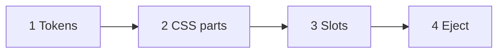

# Override ladder

**Status:** Stub. Detail deferred; see [`README.md`](README.md) open question 6 (eject and token normativity). **Parent:** [`README.md`](README.md).

Four override levels, weakest to strongest.



## Tier 1: Tokens

Two routes, and they compose.

**Server-side (the tenant's own branding).** Liquid maps branding into `--zl-*` on `:host` ([`tokens.md`](tokens.md)). Either put the `:host { ... }` block in `branding.liquid_template`, or (if the structured extension in [`schema.md`](schema.md) lands) let a bundled master template emit it from `branding.palette` / `branding.shape` / `branding.typography`.

**Host-page (the app that embedded the widget).** A plain rule in the embedding app's stylesheet sets the same variables on the element:

```css
zitadel-login {
  --zl-color-text-primary-white: #101828;
  --zl-radius-m: 0.25rem;
}
```

Custom properties inherit across shadow boundaries, so these reach the atoms' internal stylesheets, which no outside selector can otherwise address.

**Host-page beats server-side.** The CSS cascade's encapsulation-context step gives normal declarations from the outer tree precedence over the `:host` rules the orchestrator adopts into its shadow root — both the design-system base layer and the tenant branding layer. That ordering is intended: an app embedding its own login matches its design system without a server round-trip, while an app that sets no tokens gets centrally-managed branding unchanged. It also means the orchestrator must never express token defaults as `!important` or as inline styles on the host element — either would silently invert this tier. `packages/components/src/orchestrator/customization.browser.spec.ts` pins the precedence.

## Tier 2: CSS parts

Use `::part()` to restyle internals of a named atom without forking it. Two scopes:

**Through the orchestrator** — the page embedding `<zitadel-login>` addresses atom internals as `<atom>-<part>`: the atom's tag minus `zl-`, a hyphen, the part name. The orchestrator stamps the forwarding (`exportparts`, derived from the manifest registry in `packages/components/src/orchestrator/exportparts.ts`) on every atom it renders — template-rendered and gate-patched alike — so the mapping holds for tenant templates too. Templates cannot author their own forwarding; the sanitiser strips `exportparts`.

```css
zitadel-login::part(field-input) {
  letter-spacing: 0.02em;
  text-transform: uppercase;
}
zitadel-login::part(button-root)::after {
  content: " →";
}
```

The orchestrator additionally exposes its own chrome parts directly: `form`, `attribution`, `attribution-pill`.

**Directly composed atoms** — a page using atoms without the orchestrator addresses bare part names: `zl-field::part(input)`.

Each atom's manifest is the canonical part catalogue ([`validator.md`](validator.md)). Part names and the `<atom>-<part>` forwarding rule are public contract and follow the same stability rules as token names.

## Tier 3: Named slots

Inject content into well-defined slots on atoms:

```html
<zl-field name="email">
  <span slot="prefix">@</span>
  <span slot="help">We'll never share this.</span>
</zl-field>
```

Slots are declared per-atom; the set of available slots is part of each atom's manifest (see [`validator.md`](validator.md)).

## Tier 4: Eject

When tiers 1–3 don't cover it, the customer runs:

```bash
npx zitadel add zl-field
```

The atom source lands in their repo. They own the code. Protocol-version pinning (see [`../platform/overview.md`](../platform/overview.md)) ensures ejected atoms stay compatible with the backend through a declared version window.

Open question 6 in [`README.md`](README.md): after eject, do atoms keep reading `--zl-*` (Console branding still applies) or is the fork fully owned?

## Out of scope for this ladder

- Inline `style` on atom internals (use tokens / parts).
- Styling via random DOM props (atoms use data attrs for behaviour, not theme).
- Per-instance `className` on atoms.
- `advanced.custom_css` (project-level hatch; see [`schema.md`](schema.md)).
- Replacing `branding.liquid_template` (structural edit; see [`templates.md`](templates.md)).

## See also

- [`tokens.md`](tokens.md): tier 1.
- [`validator.md`](validator.md): manifests list parts and slots.
- [`../platform/overview.md`](../platform/overview.md): `npx zitadel add`, protocol pin.
