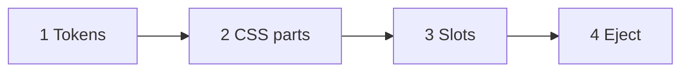

# Override ladder

**Status:** Stub. Detail deferred; see [`README.md`](README.md) open question 6 (eject and token normativity). **Parent:** [`README.md`](README.md).

Four override levels, weakest to strongest.



## Tier 1: Tokens

Liquid maps branding into `--zl-*` on `:host` ([`tokens.md`](tokens.md)). Either put the `:host { ... }` block in `branding.liquid_template`, or (if the structured extension in [`schema.md`](schema.md) lands) let a bundled master template emit it from `branding.palette` / `branding.shape` / `branding.typography`.

## Tier 2: CSS parts

Use `::part()` to restyle internals of a named atom without forking it.

```css
zl-field::part(input) {
  letter-spacing: 0.02em;
  text-transform: uppercase;
}
zl-submit::part(button)::after {
  content: " →";
}
```

Every atom exposes a documented part set (`input`, `label`, `button`, `divider`, …). Part names are part of the public contract and follow the same stability rules as token names.

## Tier 3: Named slots

Inject content into well-defined slots on atoms:

```html
<zl-field name="email">
  <span slot="prefix">@</span>
  <span slot="help">We'll never share this.</span>
</zl-field>
```

Slots are declared per-atom; the set of available slots is part of each atom's manifest (see [`validator.md`](validator.md)).

## Tier 4: Eject

When tiers 1–3 don't cover it, the customer runs:

```bash
npx zitadel add zl-field
```

The atom source lands in their repo. They own the code. Protocol-version pinning (see [`../platform/overview.md`](../platform/overview.md)) ensures ejected atoms stay compatible with the backend through a declared version window.

Open question 6 in [`README.md`](README.md): after eject, do atoms keep reading `--zl-*` (Console branding still applies) or is the fork fully owned?

## Out of scope for this ladder

- Inline `style` on atom internals (use tokens / parts).
- Styling via random DOM props (atoms use data attrs for behaviour, not theme).
- Per-project `className` on atoms.
- `advanced.custom_css` (project-level hatch; see [`schema.md`](schema.md)).
- Replacing `branding.liquid_template` (structural edit; see [`templates.md`](templates.md)).

## See also

- [`tokens.md`](tokens.md): tier 1.
- [`validator.md`](validator.md): manifests list parts and slots.
- [`../platform/overview.md`](../platform/overview.md): `npx zitadel add`, protocol pin.
