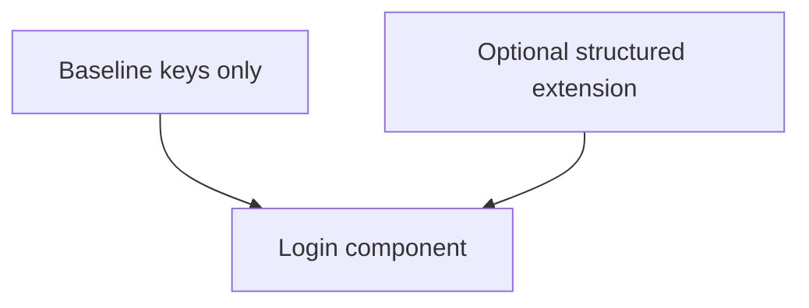

# Branding object

**Status:** Draft. Extension notes on top of the baseline `Branding` shape shipped under [`api/openapi/endpoints/branding/`](../../../api/openapi/endpoints/branding/). **Parent:** [`README.md`](README.md). **Scope:** JSON the login component reads. Storage, admin APIs, and server-side validation are out of scope here.

`<zitadel-login>` reads branding as data: layout, URLs, optional Liquid string, optional theme keys. No user-facing copy in this blob. Optional `advanced.custom_css` is gated (see end of doc).

## Baseline (flow API)

The v1 `Branding` object is specified under [`api/openapi/endpoints/branding/`](../../../api/openapi/endpoints/branding/) (historical design excerpt below):

```yaml
Branding:
  type: object
  properties:
    layout:
      type: string
      enum: [centered, split]
      default: centered
    liquid_template:
      type: string
    logo_url: { type: string, format: uri }
    font_url: { type: string, format: uri }
    hero_url: { type: string, format: uri }
```

**Read-only projection**, resolved per step response as the **latest branding revision for the project** (falling back to built-in defaults). Written via the Branding API / `zitadel apply`, never via the Flow API; audience overrides on the app → team → project ladder are a later resolution-rule evolution ([ADR 040](../../adrs/040-tenant-login-templates-editable-config.md)). Widget must accept the five-field shape as-is.



Extra keys below are optional. If we never add them, tenants can still set `:host { --zl-* }` inside `liquid_template` ([`tokens.md`](tokens.md)). Structured fields trade more schema surface for easier Console validation and fewer half-set token bugs.

## Proposed structured extension

Tracked as open in [`README.md`](README.md) question 1.

### Proposed shape (v2)

Every field is optional; omitting a field falls back to the built-in default. A complete example combining baseline + proposed fields is in [`branding.example.json`](branding.example.json).

```json
{
  "layout": "centered",
  "liquid_template": null,
  "logo_url": "https://cdn.example.com/logo.svg",
  "font_url": "https://fonts.googleapis.com/css2?family=Arimo:wght@400;500;700&display=swap",
  "hero_url": null,

  "palette": {
    "primary": "#4A90D9",
    "on_primary": "#FFFFFF",
    "background": "#FFFFFF",
    "surface": "#FFFFFF",
    "muted": "#F1F5F9",
    "border": "#E2E8F0",
    "text": "#0F172A",
    "text_muted": "#64748B",
    "link": null,
    "success": "#10B981",
    "warning": "#F59E0B",
    "error": "#EF4444"
  },

  "typography": {
    "font_family": "Arimo, ui-sans-serif, system-ui, sans-serif",
    "font_family_mono": "ui-monospace, SFMono-Regular, monospace",
    "scale": 1.0
  },

  "shape": {
    "radius": "md",
    "density": "regular"
  },

  "assets": {
    "logo_dark": "https://cdn.example.com/logo-dark.svg",
    "favicon": "https://cdn.example.com/favicon.ico",
    "background_image": null
  },

  "theme": {
    "mode": "auto",
    "dark": {
      "palette": {
        "background": "#0A0A0A",
        "surface": "#111111",
        "text": "#FAFAFA",
        "border": "#262626"
      }
    }
  }
}
```

## Field reference

### Baseline fields (flow API)

#### `layout` (string, `centered | split`)

Master Liquid branches on this; ejected templates may ignore it. Default `centered`. Extra enum values (`muted`, `minimal`, ADR-033) are open; see README q2.

#### `liquid_template` (string)

The LiquidJS template string for the current step. When present, the orchestrator uses it instead of the bundled default. Validated at authoring time by the `@zitadel/config` validator and gated lexically on save ([`../flowengine/template-security.md`](../flowengine/template-security.md)); the structural contract lives in [`validator.md`](validator.md). Authored locally as a sibling `.liquid` file that the CLI inlines on upload ([`templates.md`](templates.md) § Authoring workflow).

#### `logo_url`, `font_url`, `hero_url` (URIs, optional)

Asset URLs are HTTPS by default. `logo_url` and `hero_url` may use canonical
loopback HTTP (`localhost`, dotted-decimal `127.0.0.0/8`, or `[::1]`) for local
development; the component preserves those URLs only while its embedding
document also runs on loopback HTTP. `font_url` remains HTTPS-only and is
injected as a `<link rel="stylesheet">` before the widget paints. `hero_url` is
consumed by the `split` layout.

Shape validation cannot tell a live asset from a dead one, and a well-formed
URL that serves nothing renders as a 0×0 `` — invisible in the design and
silent in the console. Two layers cover that gap, neither of them a gate:
`zitadel plan` / `apply` probe each URL and warn (`apps/cli/src/lib/sync/asset-probe.ts`),
and the component hides an asset whose load fails, restoring either the split
designs' decorative placeholder or a shipped design's authored no-asset content
(`packages/components/src/orchestrator/asset-fallback.ts`). Templates cannot do
the latter themselves: DOMPurify strips inline `onerror` along with every other
event handler, so the listener has to be orchestrator-side. The CLI side only
contacts public HTTPS destinations and validates every redirect; loopback,
private, and internal targets remain inconclusive so repo config cannot make
the planning host scan its own network.

`font_url` is **read-only in v1**: because the component must inject it at document level (shadow-scoped `@font-face` never registers faces), a writable value would give `branding.write` page-wide CSS control over the embedding application. `POST /branding` rejects it and the local config dialect omits it; safe delivery is an [ADR 040](../../adrs/040-tenant-login-templates-editable-config.md) follow-up. Until then, load fonts from the embedding page.

### Proposed extensions

#### `palette` (object)

Each value is any valid CSS `<color>` (hex, `rgb()`, etc.). Null uses built-in default. Empty string rejected at render.

`link` falls back to `primary` when null. `on_primary` must have adequate contrast against `primary`; the component warns in dev builds when it doesn't.

#### `typography` (object)

- **`font_family`**: CSS stack; include a generic family (`serif` / `sans-serif` / `monospace`).
- **`font_family_mono`**: optional mono stack (OTP, keys).
- **`scale`**: multiplier on `--zl-font-size-*`; default `1.0`, clamp `0.75`–`1.25`.

The baseline `font_url` stays in effect for loading the family; this block just names what the atoms render with.

#### `shape` (object)

- **`radius`**: `none` \| `sm` \| `md` \| `lg` \| `full`; expands to `--zl-radius-*`.
- **`density`**: `compact` \| `regular` \| `comfortable`; expands to spacing and control height tokens.

#### `assets` (object)

Additional asset URLs alongside the baseline `logo_url` / `hero_url`. The consumer hosts them; the component references them by URL.

#### `theme` (object)

- **`mode`**: `light` \| `dark` \| `auto` (`auto` uses `prefers-color-scheme`). Resolved value on root `data-theme`.
- **`dark`**: optional `palette` overrides when dark; missing keys inherit light. Omit `theme` or set `mode: light` to disable.

Both modes carry real token values ([ADR 014 §5](../../adrs/014-design-tokens-and-ui-react-pairs.md)). `mode` is one input among three; resolution runs strongest-first: the embedding page's `<zitadel-login theme="…">` property → this `branding.theme.mode` → a variant-derived default (`dark` for `variant="page"`, `auto` for the embeddable `variant="widget"`). The element wins because the page hosting the widget knows its own surface better than stored tenant branding does.

#### ~~`advanced.custom_css`~~ (removed)

Dropped. The override ladder covers all CSS customization needs:

1. **Tokens** — orchestrator-owned from `Branding` (`adoptedStyleSheets`)
2. **Inline styles** — `<zitadel-login style="--zl-*">` (host override)
3. **`::part()`** — parent page styles atom internals
4. **Eject** — full template ownership, put whatever you need

No need for a separate `custom_css` escape hatch. Eliminates a security surface (sandboxing arbitrary CSS) and a schema field to maintain.

## Shape invariants enforced by the component

Beyond field-level types, the component refuses to render a branding object unless:

1. Every referenced URL is HTTPS, except `logo_url` / `hero_url` may use the
   canonical loopback-development exception above; the render gate drops that
   exception on non-loopback documents.
2. `liquid_template`, when present, passes both the security validator ([`../flowengine/template-security.md`](../flowengine/template-security.md)) and the structural validator ([`validator.md`](validator.md)).
3. Dark-mode overrides only override keys that exist on `palette` (proposed extension only).
4. `advanced.custom_css`, when present, matches the sandbox allowlist (proposed extension only).

The component surfaces invariant failures as a dev-build console error and falls back to the nearest safe default (baseline `layout: centered`, light palette). A broken branding object degrades; it does not brick the widget.

## Runtime validation

Every branding payload the component receives passes through:

1. **Shape validation**: types, enums, URLs, invariants. Every paint, cheap.
2. **Template validation**: if `liquid_template` is set, structural AST pass vs flow ([`validator.md`](validator.md)). Once per load, cached.
3. **Runtime safety net**: `` appends missing required UI so a bad template still yields a submittable step.
4. **Asset degradation**: an `` that fails to load is hidden and, in the split designs, replaced by the decorative brand-pane placeholder. Armed per commit; a failure is warned about once on the console.

Stages 1 and 2 run in the component. Stage 3 runs as part of Liquid rendering. The security pipeline in [`../flowengine/template-security.md`](../flowengine/template-security.md) runs on save server-side; this doc assumes it. The widget does not re-check security at paint time.

## Open questions (shape-specific)

- Keep structured extension vs minimal baseline + `:host` in Liquid only (README q1).
- One `liquid_template` string per step vs map keyed by purpose (README q3).
- `attribution` / powered-by: branding flag, server policy, or fixed (README q9).
- Where `locale` for `| t` comes from: branding, step payload, or host (README q8).
