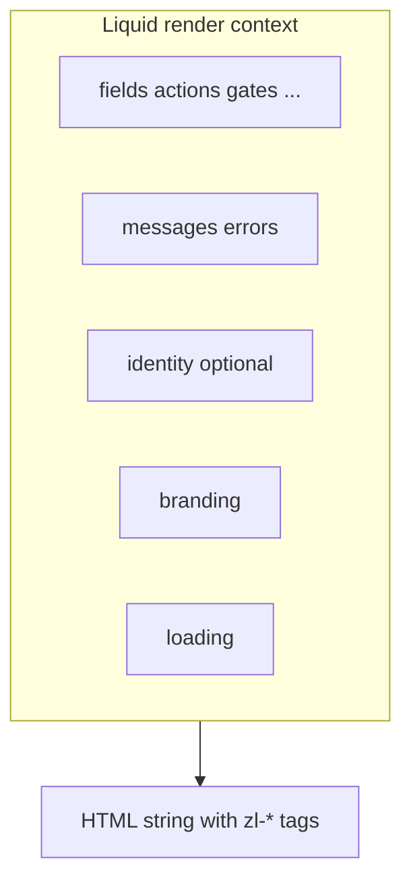

# Templates

**Status:** Draft. Storage, validation, and authoring workflow decided in [ADR 040](../../adrs/040-tenant-login-templates-editable-config.md); grouping settled below. **Parent:** [`README.md`](README.md). **Placement:** a Liquid template is *widget structure* — not page chrome and not radii. The category map is [`customization-strategy.md`](customization-strategy.md) / [ADR 056](../../adrs/056-login-customization-categories.md). **See also:** [`../flowengine/template-security.md`](../flowengine/template-security.md) (escape, CSP, banned filters); [`../glossary.md`](../glossary.md#6-config-terms) (branding / template / design / layout / page chrome vocabulary).

A template is a Liquid string the component evaluates against the flow payload. It composes `<zl-*>` atoms in a chosen order and grouping, resolves labels through the i18n filter, and calls `` as the safety net. Nothing more.

Templates are carried on the branding projection as `branding.liquid_template` (see [`schema.md`](schema.md)); omitting it falls back to the bundled default for the current `branding.layout`.



## Scope

Templates own:

- The order of `<zl-*>` atoms on a step.
- Structural grouping (fields inside a form, SSO providers inside a block, secondary actions in a footer).
- Layout chrome (headings, descriptions, dividers, logo placement).
- Step-conditional branches (show different content on `identifier` vs `password` vs `mfa_totp`).

Out of scope for Liquid authors: colour/spacing tokens ([`tokens.md`](tokens.md)); which fields exist ([`../flowengine/flow-engine-nodes.md`](../flowengine/flow-engine-nodes.md)); copy (use `text_key` + `| t`); powered-by policy ([`README.md`](README.md) q9); security pipeline ([`../flowengine/template-security.md`](../flowengine/template-security.md)).

## The payload the template receives

Every render has access to the capability dictionaries from [`../flowengine/flow-engine-nodes.md`](../flowengine/flow-engine-nodes.md):

| Binding    | Shape                                                                        | Source                  |
| ---------- | ---------------------------------------------------------------------------- | ----------------------- |
| `step`     | `{ name, type, texts: { title_key, description_key } }`                      | Flow payload            |
| `fields`   | `Record<string, FlowField>` (keyed dict)                                     | Flow payload            |
| `actions`  | `Record<string, FlowAction>` (keyed dict, `primary: boolean` flag per entry) | Flow payload            |
| `gates`    | `Record<string, Gate>` (keyed dict)                                          | Flow payload            |
| `messages` | `FlowMessage[]`                                                              | Flow payload            |
| `identity` | `FlowIdentity \| null`                                                       | Flow payload            |
| `errors`   | `FlowError[]`                                                                | Flow payload            |
| `branding` | Branding projection (see [`schema.md`](schema.md))                           | Inline on flow response |
| `loading`  | `boolean`                                                                    | Component state         |

Templates iterate these bindings. They never mutate them.

## Canonical template skeleton

```liquid
<div class="zl-shell">
  <div class="zl-card">
    <h2 class="zl-heading">{{ step.texts.title_key | t }}</h2>
    
      <p class="zl-description">
        {{ step.texts.description_key | t: identity.display_name }}
      </p>
    

    
      <zl-field
        name="{{ field[0] }}"
        label="{{ field[1].text_key | t }}"
        type="{{ field[1].type }}"
        value="{{ field[1].value }}"
        autocomplete="{{ field[1].autocomplete }}"
        required
      ></zl-field>
    

    
      
        <zl-submit
          action="{{ action[0] }}"
          label="{{ action[1].text_key | t }}"
          loading
        ></zl-submit>
      
    

    
      <zl-sso-providers
        providers="{{ actions.sso.providers | json }}"
      ></zl-sso-providers>
    

    
      <zl-action
        ghost
        action="register"
        label="{{ actions.register.text_key | t }}"
      ></zl-action>
    

    
  </div>
</div>
```

Notes:

- The `font_url` stylesheet is injected by the orchestrator; the template does not emit the `<link>` tag itself.
- `actions` is an ordered array of entries carrying `name` and a `primary: true` flag on the primary entry ([ADR 021](../../adrs/021-ordered-arrays-for-step-fields-actions-gates.md)); look an action up with ``. There is no `actions.primary` alias. Exactly one entry must be `primary`.
- `` appends missing required UI. Structural validator requires this tag.

## Built-in set and the design catalog

Two built-in `layout` values ship with the component package (the bundled `default.liquid` branches on them):

| `layout`             | Sketch                                                                                                              |
| -------------------- | ------------------------------------------------------------------------------------------------------------------- |
| `centered` (default) | Card centred on page. Fields stacked, primary action full-width, SSO below a divider.                               |
| `split`              | Brand panel on the left (logo, `hero_url` background), form on the right. Maps to the legacy `side-by-side` layout. |

The `layout` enum stays this small on purpose. This file is the **widget
template** (structure inside the widget, both deployments). Hosted **page
templates** (`page.liquid` + ``) are a different artifact — see
[`customization-strategy.md`](customization-strategy.md#what-the-shipped-designs-really-are)
and [ADR 056](../../adrs/056-login-customization-categories.md). The five
named files below are what `zitadel branding eject --design` / `setup --design`
still write today; that catalog is the setup path to retire, not the
destination:

| Design        | Descriptor `layout` | Sketch                                                                  |
| ------------- | ------------------- | ----------------------------------------------------------------------- |
| `centered`    | `centered`          | The bundled default, ejected verbatim.                                  |
| `split`       | `split`             | Brand panel left (logo, `hero_url`), form right.                        |
| `split-right` | `split`             | Mirrored: form left, brand panel right.                                 |
| `hero`        | `split`             | Landing-style brand pane left (nav, headline, feature bullets — editable copy on token-styled `zl-hero__*` classes), form right. |
| `minimal`     | `centered`          | Chrome stripped to heading, fields, and actions.                        |

Those five files still pass the authoring validator and a component-level
render test. They remain a supported *render* path for already-ejected
revisions. They are not the setup destination: page looks move to app
wrappers (embedders) and hosted-shell layouts (hosted login).

### Split chrome: mobile fallback and knobs

On viewports ≤48rem the chrome collapses `.zl-split` to one column and hides `.zl-split__brand`; the shipped split-family designs render a `.zl-split__compact` node inside the form pane (logo, or a text brand line in `hero`) that only shows there, so the tenant's identity survives the collapse. Three custom properties tune the chrome — set them on the template's root element via its `style` attribute (inline `style=""` passes the sanitiser; the values cascade into the orchestrator's shadow chrome):

| Property                  | Default                            | Effect                                                     |
| ------------------------- | ---------------------------------- | ---------------------------------------------------------- |
| `--zl-split-columns`      | `minmax(0, 1fr) minmax(0, 1fr)`    | Grid template — e.g. `7fr 5fr` for a wider brand pane.      |
| `--zl-split-align`        | `center`                           | Vertical alignment of the two panes (`start` for tall brand content). |
| `--zl-split-brand-mobile` | `none`                             | `flex` keeps the full brand pane on mobile, stacked above the form. |

Widget-level sizing belongs to the **embedding page**, not the template:
`<zitadel-login>` defaults to `variant="widget"` (content-sized, no page
chrome) and dedicated login routes set `variant="page"` for the full-page
shape. `--zl-page-min-height` remains the fine-grained height override in
both modes, and the split-family collapse responds to the widget's own width
(container queries), not the viewport — see the embedding section in the
`@zitadel/components` README.

## Authoring workflow (eject → edit → plan → apply)

```
zitadel branding eject --design split   # writes .zitadel/branding/{branding.json, login.liquid}
$EDITOR .zitadel/branding/login.liquid  # real Liquid, not JSON-escaped strings
zitadel plan                            # authoritative validation + diff (revise on edit)
zitadel apply                           # publishes an immutable branding revision
```

`branding.json` references the template via `liquid_template_file`; the CLI inlines it into the wire `liquid_template` on upload. Flow responses resolve the latest revision per project — see [ADR 040](../../adrs/040-tenant-login-templates-editable-config.md).

## Contract every template must satisfy

Regardless of grouping decision (open question 3 in [`README.md`](README.md)), every template must render:

- One `<zl-field>` per entry in the `fields` array, with `name` matching the entry's `name`.
- One consumer per required entry in `gates` (`<zl-captcha>` for `captcha`, `<zl-passkey>` for `passkey_ceremony`, `<zl-fingerprint>` for `fingerprint`).
- Exactly one `<zl-submit>` wired to the action with `primary: true`.
- A consumer for every secondary action declared (`<zl-action>` for navigation, `<zl-sso-providers>` for SSO).
- A `<zl-error>` outlet for step-level errors.
- A single trailing `` tag.

The runtime `` tag appends any missing required element to the rendered output as a safety net. See [`validator.md`](validator.md) for the static structural-validation equivalent, and [`../flowengine/template-security.md`](../flowengine/template-security.md) for the orthogonal security validator.

## Grouping (decided: one global template)

v1 stores **one template per project** with step-conditional branches inside (option C — the shape the bundled `default.liquid` already has). The other candidates (per `flow.purpose`, per `(purpose, step)`) remain available as storage-side evolution because storage shape and wire shape are decoupled: the component always receives one *resolved* string per step response, so a later move to a keyed map changes only the server's resolution rule, never the branding object the widget reads.

## Editor stages

Detail deferred to the stage rollout in [`README.md`](README.md). Summary:

| Stage | What the editor produces                | Validator feedback           |
| ----- | --------------------------------------- | ---------------------------- |
| 1     | Built-ins only                          | N/A                          |
| 2     | Generated Liquid from a fixed block set | Generator enforces validity  |
| 3     | Hand-written Liquid                     | Full static validator inline |

Stage 3 exists today through the CLI (the eject workflow above); a graphical editor for stages 2–3 layers on the same `@zitadel/config` validator later.

## See also

- [`../flowengine/flow-engine-nodes.md`](../flowengine/flow-engine-nodes.md)
- [`../flowengine/template-security.md`](../flowengine/template-security.md)
- [`validator.md`](validator.md)
- [`override-ladder.md`](override-ladder.md)
