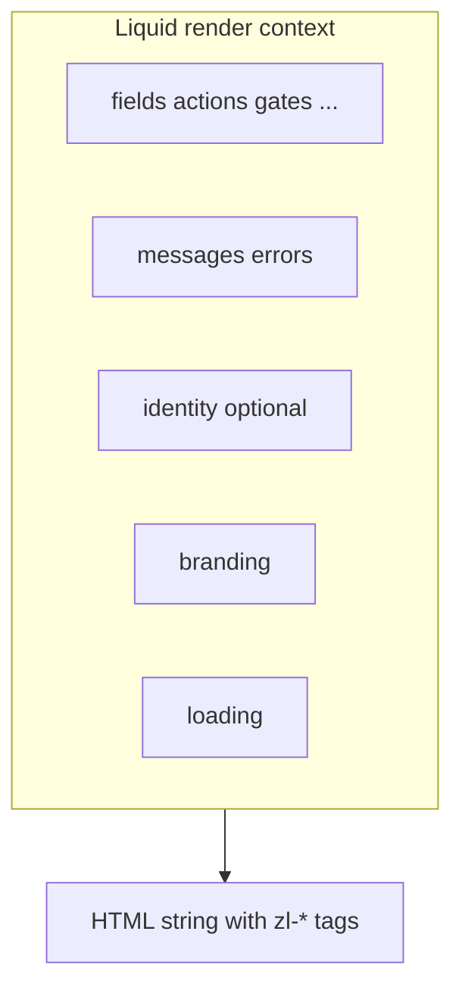

# Templates

**Status:** Stub. Liquid layer is specified with the flow engine docs; grouping TBD ([`README.md`](README.md) q2–q3). **Parent:** [`README.md`](README.md). **See also:** [`../flowengine/template-security.md`](../flowengine/template-security.md) (escape, CSP, banned filters).

A template is a Liquid string the component evaluates against the flow payload. It composes `<zl-*>` atoms in a chosen order and grouping, resolves labels through the i18n filter, and calls `` as the safety net. Nothing more.

Templates are carried on the branding projection as `branding.liquid_template` (see [`schema.md`](schema.md)); omitting it falls back to the bundled default for the current `branding.layout`.



## Scope

Templates own:

- The order of `<zl-*>` atoms on a step.
- Structural grouping (fields inside a form, SSO providers inside a block, secondary actions in a footer).
- Layout chrome (headings, descriptions, dividers, logo placement).
- Step-conditional branches (show different content on `identifier` vs `password` vs `mfa_totp`).

Out of scope for Liquid authors: colour/spacing tokens ([`tokens.md`](tokens.md)); which fields exist ([`../flowengine/flow-engine-nodes.md`](../flowengine/flow-engine-nodes.md)); copy (use `text_key` + `| t`); powered-by policy ([`README.md`](README.md) q9); security pipeline ([`../flowengine/template-security.md`](../flowengine/template-security.md)).

## The payload the template receives

Every render has access to the capability dictionaries from [`../flowengine/flow-engine-nodes.md`](../flowengine/flow-engine-nodes.md):

| Binding    | Shape                                                                        | Source                  |
| ---------- | ---------------------------------------------------------------------------- | ----------------------- |
| `step`     | `{ name, type, texts: { title_key, description_key } }`                      | Flow payload            |
| `fields`   | `Record<string, FlowField>` (keyed dict)                                     | Flow payload            |
| `actions`  | `Record<string, FlowAction>` (keyed dict, `primary: boolean` flag per entry) | Flow payload            |
| `gates`    | `Record<string, Gate>` (keyed dict)                                          | Flow payload            |
| `messages` | `FlowMessage[]`                                                              | Flow payload            |
| `identity` | `FlowIdentity \| null`                                                       | Flow payload            |
| `errors`   | `FlowError[]`                                                                | Flow payload            |
| `branding` | Branding projection (see [`schema.md`](schema.md))                           | Inline on flow response |
| `loading`  | `boolean`                                                                    | Component state         |

Templates iterate these bindings. They never mutate them.

## Canonical template skeleton

```liquid
<div class="zl-shell">
  <div class="zl-card">
    <h2 class="zl-heading">{{ step.texts.title_key | t }}</h2>
    
      <p class="zl-description">
        {{ step.texts.description_key | t: identity.display_name }}
      </p>
    

    
      <zl-field
        name="{{ field[0] }}"
        label="{{ field[1].text_key | t }}"
        type="{{ field[1].type }}"
        value="{{ field[1].value }}"
        autocomplete="{{ field[1].autocomplete }}"
        required
      ></zl-field>
    

    
      
        <zl-submit
          action="{{ action[0] }}"
          label="{{ action[1].text_key | t }}"
          loading
        ></zl-submit>
      
    

    
      <zl-sso-providers
        providers="{{ actions.sso.providers | json }}"
      ></zl-sso-providers>
    

    
      <zl-action
        ghost
        action="register"
        label="{{ actions.register.text_key | t }}"
      ></zl-action>
    

    
  </div>
</div>
```

Notes:

- The `font_url` stylesheet is injected by the orchestrator; the template does not emit the `<link>` tag itself.
- `actions` is a keyed dictionary with a `primary: true` flag on the primary entry; there is no `actions.primary` alias. Exactly one entry must be `primary`.
- `` appends missing required UI. Structural validator requires this tag.

## Built-in set

Two built-in `layout` values ship with the component package in v1:

| `layout`             | Sketch                                                                                                              |
| -------------------- | ------------------------------------------------------------------------------------------------------------------- |
| `centered` (default) | Card centred on page. Fields stacked, primary action full-width, SSO below a divider.                               |
| `split`              | Brand panel on the left (logo, `hero_url` background), form on the right. Maps to the legacy `side-by-side` layout. |

ADR-033 described four presets (`centered`, `split`, `muted`, `minimal`). Whether `muted` and `minimal` graduate into the `layout` enum in a later revision is tracked as open question 2 in [`README.md`](README.md). For v1, the same chrome effect is reachable via `branding.liquid_template`.

## Contract every template must satisfy

Regardless of grouping decision (open question 3 in [`README.md`](README.md)), every template must render:

- One `<zl-field>` per entry in `fields`, with `name` matching the dictionary key.
- One consumer per required entry in `gates` (`<zl-captcha>` for `captcha`, `<zl-passkey>` for `passkey_ceremony`, `<zl-fingerprint>` for `fingerprint`).
- Exactly one `<zl-submit>` wired to the action with `primary: true`.
- A consumer for every secondary action declared (`<zl-action>` for navigation, `<zl-sso-providers>` for SSO).
- A `<zl-error>` outlet for step-level errors.
- A single trailing `` tag.

The runtime `` tag appends any missing required element to the rendered output as a safety net. See [`validator.md`](validator.md) for the static structural-validation equivalent, and [`../flowengine/template-security.md`](../flowengine/template-security.md) for the orthogonal security validator.

## Grouping (open, README q3)

- **A:** one file per `flow.purpose`, branches per step inside.
- **B:** one file per `(flow.purpose, step.name)`.
- **C:** one global file with big conditionals.

Choice affects the branding object shape, editor UI, and what "change this one screen" costs. Decision blocks stage 1 delivery because built-ins need to be shipped in the chosen shape.

## Editor stages

Detail deferred to the stage rollout in [`README.md`](README.md). Summary:

| Stage | What the editor produces                | Validator feedback           |
| ----- | --------------------------------------- | ---------------------------- |
| 1     | Built-ins only                          | N/A                          |
| 2     | Generated Liquid from a fixed block set | Generator enforces validity  |
| 3     | Hand-written Liquid                     | Full static validator inline |

## See also

- [`../flowengine/flow-engine-nodes.md`](../flowengine/flow-engine-nodes.md)
- [`../flowengine/template-security.md`](../flowengine/template-security.md)
- [`validator.md`](validator.md)
- [`override-ladder.md`](override-ladder.md)
