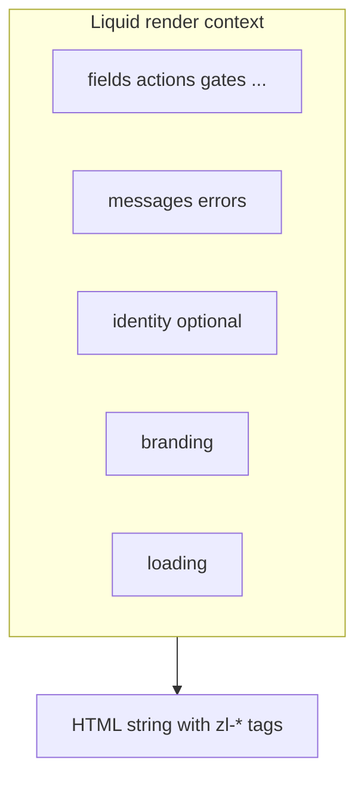

# Templates

**Status:** Draft. Storage, validation, and authoring workflow decided in [ADR 040](../../adrs/040-tenant-login-templates-editable-config.md); grouping settled below. **Parent:** [`README.md`](README.md). **Placement:** a Liquid template is *widget structure* — not page chrome and not radii. The category map is [`customization-strategy.md`](customization-strategy.md) / [ADR 057](../../adrs/057-login-customization-categories.md). **See also:** [`../flowengine/template-security.md`](../flowengine/template-security.md) (escape, CSP, banned filters); [`../glossary.md`](../glossary.md#6-config-terms) (branding / template / design / layout / page chrome vocabulary).

A template is a Liquid string the component evaluates against the flow payload. It composes `<zl-*>` atoms in a chosen order and grouping, resolves labels through the i18n filter, and calls `` as the safety net. Nothing more.

Templates are carried on the branding projection as `branding.liquid_template` (see [`schema.md`](schema.md)); omitting it renders the bundled default template (`packages/components/src/orchestrator/templates/default.liquid`).


```mermaid
graph TB
    subgraph ctx[Liquid render context]
        F[fields actions gates ...]
        M[messages errors]
        I[identity optional]
        R[branding]
        H[loading]
    end
    ctx --> Out[HTML string with zl-* tags]
```

## Scope

Templates own:

- The order of `<zl-*>` atoms on a step.
- Structural grouping (fields inside a form, SSO providers inside a block, secondary actions in a footer).
- Layout chrome (headings, descriptions, dividers, logo placement).
- Step-conditional branches (show different content on `identifier` vs `password` vs `mfa_totp`).

Out of scope for Liquid authors: colour/spacing tokens ([`tokens.md`](tokens.md)); which fields exist ([`../flowengine/flow-engine-nodes.md`](../flowengine/flow-engine-nodes.md)); copy (use `text_key` + `| t`); powered-by policy (open in [`README.md`](README.md)); security pipeline ([`../flowengine/template-security.md`](../flowengine/template-security.md)).

## The payload the template receives

Every render has access to the capability dictionaries from [`../flowengine/flow-engine-nodes.md`](../flowengine/flow-engine-nodes.md):

| Binding         | Shape                                                        | Source                  |
| --------------- | ------------------------------------------------------------ | ----------------------- |
| `step`          | `{ name, complete, texts: { title_key, description_key } }`  | Flow payload            |
| `fields`        | Ordered array of fields, each carrying its `name` and, where one applies, its `autocomplete` token | Flow payload            |
| `actions`       | Ordered array of actions, `primary: true` on the primary one | Flow payload            |
| `gates`         | Dictionary keyed by gate name                                | Flow payload            |
| `sso_providers` | Array of providers                                           | Flow payload            |
| `challenge`     | The pending challenge, or `null`                             | Flow payload            |
| `errors`        | Array of errors, localised by the component                  | Flow payload            |
| `identity`      | The known identity, or `null`                                | Component state         |
| `messages`      | Always an empty array today                                  | Component               |
| `branding`      | Branding projection (see [`schema.md`](schema.md)), with `logo_url` resolved for the active theme side | Inline on flow response |
| `loading`       | `boolean`                                                    | Component state         |

Templates iterate these bindings. They never mutate them.

## Template skeleton

The bundled default is the reference: `packages/components/src/orchestrator/templates/default.liquid`. Its shape, reduced:

```liquid
<zl-page-shell data-zl-template-root>
  
    
  
  <zl-card>
    <h1 slot="header" class="zl-card-title">{{ step.texts.title_key | t: identity.display_name }}</h1>

    
      
      <zl-checkbox name="{{ f.name }}"></zl-checkbox>
      <zl-select name="{{ f.name }}"></zl-select>
      <zl-field name="{{ f.name }}"></zl-field>
      
    

    
      
        <zl-alert data-zl-step-error>{{ err.text_key | t }}</zl-alert>
      
    

    
      
        <zl-button hierarchy="primary" type="submit" block action="{{ a.name }}"
          label="{{ a.text_key | t }}" loading></zl-button>
      
    

    
      <zl-passkey challenge-id="{{ challenge.challenge_id }}"
        options='{{ challenge.options | json }}'></zl-passkey>
    

    
  </zl-card>
</zl-page-shell>
```

Notes:

- The `typography.font_url` stylesheet is injected by the orchestrator when the element runs as `variant="page"`; the template does not emit the `<link>` tag itself.
- `actions` is an ordered array of entries carrying `name` and a `primary: true` flag on the primary entry ([ADR 021](../../adrs/021-ordered-arrays-for-step-fields-actions-gates.md)); look an action up with ``. There is no `actions.primary` alias.
- Field atoms bind by `name` only. After each render `<zitadel-login>` fills the rest from the matching `fields` entry (`packages/components/src/orchestrator/field-fill.ts`): `label`, `type`, `value`, `autocomplete`, `required`, `placeholder`, help text, the inline `error`, the `data-testid` hook, select `options`, and the forgot-password link. An attribute the template writes itself wins, so a design can still set its own `label` or `placeholder`; writing one empty (`placeholder=""`, `forgot-password-href=""`) leaves that part out. A template that binds every attribute (as ejected designs did before) renders unchanged. The `fieldError`, `fieldPlaceholder`, `fieldHelp`, `selectOptions` and `testid` filters remain for such templates.
- `register` and `sign_in` render as links carrying `data-action`. `recover` becomes the password field's forgot-password link through the fill, and renders as a `data-action` link only on a step with no password field. Other secondary actions render as `<zl-button hierarchy="secondary">`.
- `` appends any required field and the primary action the template left out. The authoring validator requires the tag ([`validator.md`](validator.md)).

## Built-in set and the design catalog

The `layout` field has two values, `centered` (the default) and `split`. One template ships with the component package, `default.liquid`: a card centred in the page shell with fields stacked and the primary action full-width. It does not read `layout`. `split` describes revisions published from the split designs below.

The `layout` enum stays this small on purpose. This file is the **widget
template** (advanced structure inside the widget, shared later by embedded
and Zitadel-served login). Zitadel-served **page chrome** is unset;
`page.liquid` is only a later proposal — see
[`customization-strategy.md`](customization-strategy.md#what-the-shipped-designs-really-are)
and [ADR 057](../../adrs/057-login-customization-categories.md).
`zitadel branding eject --design` offers two widget-structure starting
points; setup never writes either
([#1039](https://github.com/zitadel/nextgen/issues/1039)):

| Design        | Descriptor `layout` | Sketch                                                                  |
| ------------- | ------------------- | ----------------------------------------------------------------------- |
| `centered`    | `centered`          | The bundled default, ejected verbatim.                                  |
| `minimal`     | `centered`          | Chrome stripped to heading, fields, and actions.                        |

The retired page-layout designs (`split`, `split-right`, `hero`) are no
longer ejectable: they were page chrome around the same card, and embedder
page looks live in the application (Zitadel-served page chrome is unset).
Revisions already published from them keep rendering; their last shipped
templates are kept as fixtures in
`packages/components/src/orchestrator/__fixtures__/legacy-designs/` and
covered by the component render tests. The split chrome below documents
that legacy render path.

### Split chrome (legacy revisions): mobile fallback and knobs

When the widget is 48rem wide or less the chrome collapses `.zl-split` to one column and hides `.zl-split__brand`; the shipped split-family designs render a `.zl-split__compact` node inside the form pane (logo, or a text brand line in `hero`) that only shows there, so the tenant's identity survives the collapse. Three custom properties tune the chrome — set them on the template's root element via its `style` attribute (inline `style=""` passes the sanitiser; the values cascade into the orchestrator's shadow chrome):

| Property                  | Default                            | Effect                                                     |
| ------------------------- | ---------------------------------- | ---------------------------------------------------------- |
| `--zl-split-columns`      | `minmax(0, 1fr) minmax(0, 1fr)`    | Grid template — e.g. `7fr 5fr` for a wider brand pane.      |
| `--zl-split-align`        | `center`                           | Vertical alignment of the two panes (`start` for tall brand content). |
| `--zl-split-brand-mobile` | `none`                             | `flex` keeps the full brand pane on mobile, stacked above the form. |

Widget-level sizing belongs to the **embedding page**, not the template:
`<zitadel-login>` defaults to `variant="widget"` (content-sized, no page
chrome) and dedicated login routes set `variant="page"` for the full-page
shape. `--zl-page-min-height` remains the fine-grained height override in
both modes, and the legacy split chrome's collapse responds to the widget's
own width (container queries), not the viewport — see the embedding section in
the `@zitadel/components` README.

## Authoring workflow (eject → edit → plan → apply)

```
zitadel branding eject --design minimal # writes .zitadel/branding/{branding.json, login.liquid}
$EDITOR .zitadel/branding/login.liquid  # real Liquid, not JSON-escaped strings
zitadel plan                            # authoritative validation + diff (revise on edit)
zitadel apply                           # publishes an immutable branding revision
```

`branding.json` references the template as `"liquid_template": { "$file": "./login.liquid" }`; the CLI replaces the reference with the file's content on upload. Flow responses resolve the latest revision per project — see [ADR 040](../../adrs/040-tenant-login-templates-editable-config.md).

## Contract every template must satisfy

Every template should render:

- One field atom per entry in the `fields` array, with `name` matching the entry's `name`: `<zl-checkbox>` for `checkbox`, `<zl-select>` for `select`, `<zl-field>` for every other type.
- The entry's `autocomplete` on that atom's `autocomplete` attribute, verbatim — the field fill sets it when the template does not — so password managers and browser autofill recognise the identifier and password inputs. Never derive the token from the field's or the step's name: the identifier is whatever property the schema designates, and whether a password is filled or generated depends on the flow's purpose, neither of which a name reveals.
- One primary `<zl-button>` wired to the action with `primary: true`.
- An affordance for each secondary action: a `<zl-button hierarchy="secondary">` or a link carrying `data-action`.
- `<zl-passkey>` when the step carries a passkey `challenge`.
- A `<zl-alert>` outlet for step-level errors.
- A single trailing `` tag.

Of these, the authoring validator enforces the last one only. At render time `` appends any required field and the primary action a template left out; nothing else on the list is checked or repaired. No atom renders `gates` (`captcha`) or `sso_providers` yet, so a template has nothing to place for them. See [`validator.md`](validator.md) for what ships and for the structural validation design, and [`../flowengine/template-security.md`](../flowengine/template-security.md) for the security rules.

A template renders no identifier control for a password-only step. A step that collects a password without the identifier carries one in `step.identifier` for the surrounding form to hold, so a manager can save the pair — but that is the widget's to place, not the template's: the template context exposes `step` as `name`, `complete` and `texts` only, and the sanitiser drops a raw `<input>` or `<form>` regardless (`FORBID_TAGS` in `packages/components/src/orchestrator/sanitiser.ts`). An ejected template keeps the behaviour by leaving it alone.

## Grouping (decided: one global template)

v1 stores **one template per project** with step-conditional branches inside (option C — the shape the bundled `default.liquid` already has). The other candidates (per `flow.purpose`, per `(purpose, step)`) remain available as storage-side evolution because storage shape and wire shape are decoupled: the component always receives one *resolved* string per step response, so a later move to a keyed map changes only the server's resolution rule, never the branding object the widget reads.

## Editor stages

Detail deferred to the stage rollout in [`README.md`](README.md). Summary:

| Stage | What the editor produces                | Validator feedback           |
| ----- | --------------------------------------- | ---------------------------- |
| 1     | Built-ins only                          | N/A                          |
| 2     | Generated Liquid from a fixed block set | Generator enforces validity  |
| 3     | Hand-written Liquid                     | Authoring validator          |

Stage 3 exists today through the CLI (the eject workflow above); a graphical editor for stages 2–3 layers on the same `@zitadel/config` validator later.

## See also

- [`../flowengine/flow-engine-nodes.md`](../flowengine/flow-engine-nodes.md)
- [`../flowengine/template-security.md`](../flowengine/template-security.md)
- [`validator.md`](validator.md)
- [`override-ladder.md`](override-ladder.md)
