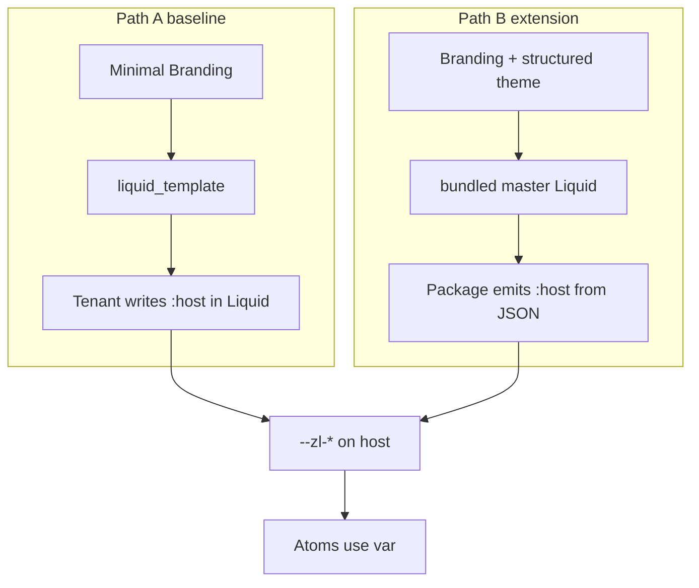

# Tokens

**Status:** Draft. Token catalogue open for feedback. **Parent:** [`README.md`](README.md).

Atoms use `var(--zl-*)` only. Liquid builds the DOM and may emit `:host { --zl-*: ... }`. Branding JSON is input to that Liquid (minimal five-field baseline from the flow API, or optional structured fields in [`schema.md`](schema.md)). Atoms do not read branding keys; Liquid is the only bridge.

With the minimal five-field branding, tenants put `:host` rules inside `liquid_template`. If structured branding ships, a bundled master template can emit the same variables from `branding.palette` / `branding.shape` / etc.

## Token delivery

There are two supported paths from a branding payload to live `--zl-*` values on the widget root. Atoms behave identically in both cases.



### Path A: inline `liquid_template` (baseline)

The minimal baseline has no structured palette; anyone overriding tokens puts `:host` rules in their Liquid template:

```liquid
<style>
  :host {
    --zl-color-primary:     #4A90D9;
    --zl-color-on-primary:  #FFFFFF;
    --zl-radius-md:         0.5rem;
    --zl-font-family:       'Arimo', ui-sans-serif, system-ui;
    
      /* font-url stylesheet is injected by the orchestrator; nothing to do here */
    
  }
</style>

<zl-card>
  
    <zl-field name="{{ pair[0] }}" label="{{ pair[1].text_key | t }}"></zl-field>
  
  <zl-submit action="submit" label="{{ actions.submit.text_key | t }}"></zl-submit>
</zl-card>
```

[`../flowengine/template-security.md`](../flowengine/template-security.md) still applies to `<style>` and `{{ ... }}` inside Liquid.

### Path B: master template + structured branding (extension)

If the structured shape in [`schema.md`](schema.md) is adopted, the bundled `default.liquid` master template emits the `:host` block from typed fields, so customers never write a stylesheet by hand:

```liquid
{# default.liquid, bundled with the package #}
<style>
  :host {
    --zl-color-primary: {{ branding.palette.primary }};
    --zl-color-on-primary: {{ branding.palette.on_primary }};
    --zl-radius-md: {{ branding.shape.radius | radius_token }};
    --zl-font-family: {{ branding.typography.font_family }};
  }
  
    :host([data-theme="dark"]) {
      --zl-color-background: {{ branding.theme.dark.palette.background }};
    }
  
</style>
```

Console validates each Branding axis independently on save and guarantees the emitted block is complete and consistent. Customers writing a `liquid_template` override opt out of this path and take on Path A's responsibilities.

### Either way, atoms read the same tokens

```css
/* inside zl-submit */
button {
  background: var(--zl-color-primary, #4a90d9);
  color: var(--zl-color-on-primary, #fff);
  border-radius: var(--zl-radius-md, 0.5rem);
  font-family: var(--zl-font-family, inherit);
}
```

Every fallback is a sensible default so an atom used without a widget still looks reasonable.

## Inline override (host element)

Consumers of the widget can always set tokens as inline styles on the host element, bypassing branding entirely:

```html
<zitadel-login
  style="
  --zl-color-primary: #4A90D9;
  --zl-radius-md: 0.5rem;
  --zl-font-family: 'Arimo', ui-sans-serif, system-ui;
"
></zitadel-login>
```

Inline styles on the host beat `:host` rules by specificity (one-off host tweaks).

## Catalogue

Names are **stable**. Once an atom consumes a token, renaming it is a breaking change to the override contract. Additions are cheap; removals and renames are not.

### Palette

| Token                   | Purpose                                                                   |
| ----------------------- | ------------------------------------------------------------------------- |
| `--zl-color-primary`    | Primary action backgrounds, focus rings, active states                    |
| `--zl-color-on-primary` | Text/icon on primary backgrounds                                          |
| `--zl-color-background` | Page background behind the card                                           |
| `--zl-color-surface`    | Card and elevated surfaces                                                |
| `--zl-color-muted`      | Subtle fills (dividers, secondary buttons, input backgrounds)             |
| `--zl-color-border`     | Input borders, card borders, divider lines                                |
| `--zl-color-text`       | Default text                                                              |
| `--zl-color-text-muted` | Secondary text, placeholders, helper copy                                 |
| `--zl-color-link`       | Inline link colour; falls back to `--zl-color-primary`                    |
| `--zl-color-success`    | Success messages                                                          |
| `--zl-color-warning`    | Warning messages                                                          |
| `--zl-color-error`      | Error messages, destructive actions                                       |
| `--zl-color-focus-ring` | Explicit focus ring colour; falls back to `--zl-color-primary` with alpha |

### Typography

| Token                      | Purpose                                           |
| -------------------------- | ------------------------------------------------- |
| `--zl-font-family`         | Body and heading font stack                       |
| `--zl-font-family-mono`    | Monospace (OTP codes, copy-to-clipboard surfaces) |
| `--zl-font-size-xs`        | Helper text, captions                             |
| `--zl-font-size-sm`        | Form labels, body small                           |
| `--zl-font-size-md`        | Default body                                      |
| `--zl-font-size-lg`        | Sub-headings                                      |
| `--zl-font-size-xl`        | Card heading                                      |
| `--zl-font-weight-regular` |                                                   |
| `--zl-font-weight-medium`  |                                                   |
| `--zl-font-weight-bold`    |                                                   |
| `--zl-line-height-tight`   |                                                   |
| `--zl-line-height-normal`  |                                                   |

### Shape

| Token                      | Purpose                           |
| -------------------------- | --------------------------------- |
| `--zl-radius-sm`           | Small controls (checkboxes, tags) |
| `--zl-radius-md`           | Inputs and buttons                |
| `--zl-radius-lg`           | Alerts                            |
| `--zl-radius-xl`           | The auth card                     |
| `--zl-radius-full`         | Circular (avatars, badges)        |
| `--zl-border-width`        | Default 1px                       |
| `--zl-border-width-strong` | Emphasised borders (focus, error) |

### Density / spacing

| Token                                 | Purpose                                        |
| ------------------------------------- | ---------------------------------------------- |
| `--zl-space-1` through `--zl-space-8` | Spacing scale; used for margins, padding, gaps |
| `--zl-control-height-sm`              | Small buttons / inputs                         |
| `--zl-control-height-md`              | Default                                        |
| `--zl-control-height-lg`              | Prominent CTAs                                 |
| `--zl-control-padding-x`              | Horizontal padding inside buttons / inputs     |

Density presets (`compact` / `regular` / `comfortable` on the branding object) resolve to different values of these tokens; atoms never branch on the preset name.

### Elevation

| Token              | Purpose             |
| ------------------ | ------------------- |
| `--zl-shadow-none` |                     |
| `--zl-shadow-sm`   | Inputs, subtle lift |
| `--zl-shadow-md`   | Cards               |
| `--zl-shadow-lg`   | Popovers, menus     |

### Motion

| Token                  | Purpose                  |
| ---------------------- | ------------------------ |
| `--zl-duration-fast`   | Hover, focus transitions |
| `--zl-duration-normal` | Entrance, button-press   |
| `--zl-ease-default`    | Timing function          |

### Assets

Asset URLs live on branding; the host loads them (img, link, background). They are not colour tokens.

| Source                               | Applied as                                                                         |
| ------------------------------------ | ---------------------------------------------------------------------------------- |
| `logo_url` (baseline)                | `` in the default template; `<zl-logo>` atom reads the attribute if bundled   |
| `hero_url` (baseline)                | `background-image` on `:host` when the `split` layout is active                    |
| design-system default font           | Loaded by the orchestrator as `<link rel="stylesheet">` (`applyDefaultFont`, default Arimo) so the brand face paints with no branding; dropped when `font_url` is set. See [ADR 025](../../adrs/025-default-brand-font-loading.md) |
| `font_url` (baseline)                | Tenant override; injected by the orchestrator as `<link rel="stylesheet">` before the widget paints, replacing the default font |
| `assets.logo_dark` (proposed)        | Swapped by `data-theme="dark"`                                                     |
| `assets.favicon` (proposed)          | Written to `<link rel="icon">` by the widget on mount                              |
| `assets.background_image` (proposed) | Additional background slot not covered by `hero_url`                               |

## Dark-mode pairing

Dark mode swaps token values on the root when `data-theme="dark"`. Names stay fixed:

```css
:host {
  --zl-color-background: #ffffff;
  --zl-color-text: #0f172a;
}
:host([data-theme="dark"]) {
  --zl-color-background: #0a0a0a;
  --zl-color-text: #fafafa;
}
```

Atoms stay theme-blind.

## Scale vs preset

If the structured branding extension in [`schema.md`](schema.md) is adopted, it exposes high-level knobs (`shape.radius: "md"`, `shape.density: "regular"`) that the master template expands to specific token values. Atoms only see the expanded tokens. This keeps the public shape compact while preserving token stability:

```
branding.shape.radius: "lg"
  → --zl-radius-md: 0.75rem
    --zl-radius-lg: 0.9375rem
    --zl-radius-xl: 1.3125rem
```

Preset-to-token tables ship in the component package, not in tenant JSON, so `lg` means the same everywhere.

## Open questions (token-specific)

- Do we publish the preset-to-token mapping as JSON for third parties who want to render token values in design tools (Figma, Tokens Studio), or keep it internal to the component package?
- Which tokens should be _customer-overridable_ on the branding object vs _read-only_ derivations? (Example: primary colour is an axis; focus-ring colour is likely a derivation.)
- Motion tokens: do we expose them at all, or bake durations into atom CSS and let customers override via `::part` if they really need to?

See [`README.md`](README.md) for the full open-question list.
