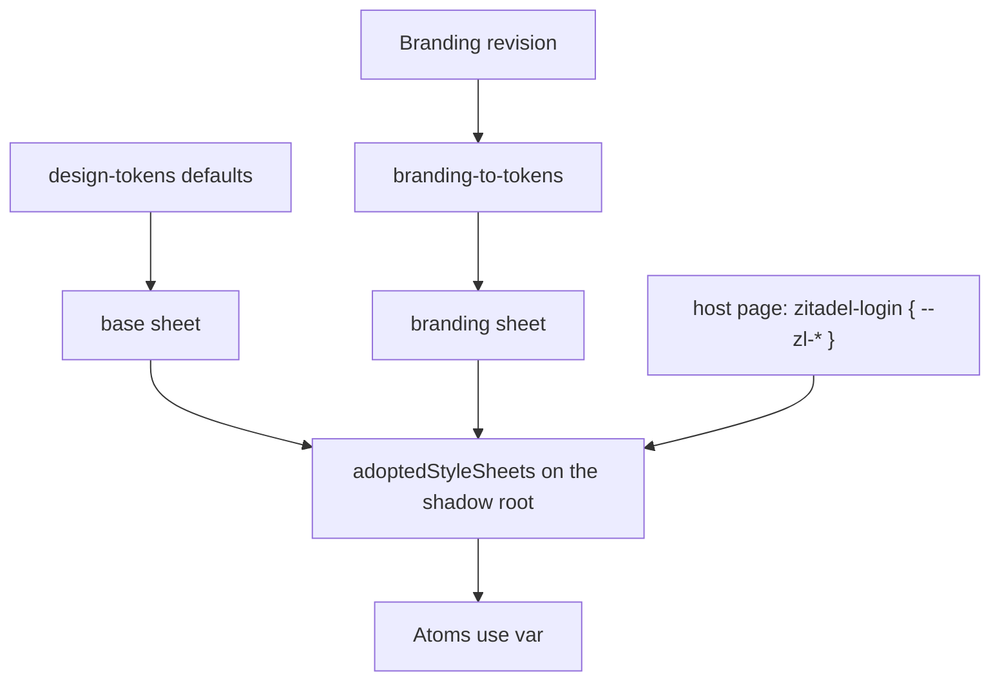

# Tokens

**Status:** Shipped. **Parent:** [`README.md`](README.md).

Atoms use `var(--zl-*)` only and never read branding keys. The orchestrator is the only bridge: it translates the branding object ([`schema.md`](schema.md)) into `--zl-*` declarations and adopts them onto its shadow root. Liquid templates structure HTML and emit no `<style>`.

The variables themselves are the design system's, defined in [`packages/design-tokens`](../../../packages/design-tokens/README.md). Branding introduces no token surface of its own.

## Token delivery


```mermaid
flowchart TB
    D[design-tokens defaults] --> S1[base sheet]
    B[Branding revision] --> T[branding-to-tokens] --> S2[branding sheet]
    S1 --> R["adoptedStyleSheets on the shadow root"]
    S2 --> R
    H["host page: zitadel-login { --zl-* }"] --> R
    R --> A[Atoms use var]
```

Two constructable stylesheets are adopted onto every `<zitadel-login>` shadow root (`packages/components/src/orchestrator/branding-to-tokens.ts`):

1. **Base sheet.** The full design-tokens set, rewritten from document selectors onto `:host` and `:host([data-theme="…"])`. It is adopted whether or not the host page imported `tokens.css`, so the widget paints correctly on any page.
2. **Branding sheet.** Only the variables the revision sets. It is adopted after the base sheet and replaced whole when a new payload arrives, so nothing from the previous payload lingers.

The branding sheet names the theme attributes in its selectors to match the base sheet's specificity, so adoption order decides and branding wins.

Shape and typography are shared across theme sides and land on one block. Each side's palette lands only under its own `data-theme` selector.

## What each branding key sets

Both columns are stable contracts with different consumers. Branding keys are what a revision stores. The variable names are what host pages and tenant CSS set directly ([override ladder](override-ladder.md)), and the design-tokens snapshot test locks them, so a rename is a breaking change to host overrides even when no revision changes. The mapping between the two is the part that can move.

### Palette (per theme side)

| Key | Variables |
| --- | --- |
| `primary` | `--zl-primary` |
| `on_primary` | `--zl-primary-foreground` |
| `background` | `--zl-background` |
| `surface` | `--zl-card`, `--zl-popover` |
| `muted` | `--zl-muted`, `--zl-secondary`, `--zl-accent` |
| `border` | `--zl-border`, `--zl-input` |
| `text` | `--zl-foreground`, `--zl-card-foreground`, `--zl-popover-foreground`, `--zl-secondary-foreground`, `--zl-accent-foreground` |
| `text_muted` | `--zl-muted-foreground` |
| `link` | `--zl-link` |
| `success` | `--zl-success` |
| `warning` | `--zl-warning` |
| `error` | `--zl-destructive` |

A key maps to several variables where the design system splits a role the branding object does not: a brand picks one border colour, and both the card edge and the control edge take it. `text` covers the foreground of every neutral surface, so a light `muted` on a dark side does not keep a near-white label.

`--zl-link` defaults to `currentColor`: links take the surrounding text colour and are distinguished by an underline, so setting `link` tints exactly the links.

### Typography

| Key | Variables |
| --- | --- |
| `font_family` | `--zl-font-family-sans`, `--zl-font-family-heading` |
| `scale` | `--zl-text-{xs,sm,base,lg,xl}-size` and `-leading` |

`scale` is clamped to `0.75`–`1.25` and multiplies both the size and its leading, so larger text gets the line box that goes with it. A separate display face is not part of a revision: a host page that has licensed one declares the `@font-face` and sets `--zl-font-family-heading` itself.

### Shape

| Key | Variables |
| --- | --- |
| `radius` | `--zl-radius-{xs,sm,md,lg,xl}` |
| `density` | `--zl-spacing-4`, `--zl-spacing-8` |
| `logo_scale` | `--zl-logo-scale` |

One `radius` value scales the whole corner ramp in proportion, so the card stays rounder than the controls inside it. The ratios come from the design system's own steps, so a change to the ramp moves branded corners with it.

```
shape.radius: "lg"                   shape.radius: 10
  → --zl-radius-xs: 0.1875rem          → --zl-radius-xs: 2.5px
    --zl-radius-sm: 0.5625rem            --zl-radius-sm: 7.5px
    --zl-radius-md: 0.75rem              --zl-radius-md: 10px
    --zl-radius-lg: 0.9375rem            --zl-radius-lg: 12.5px
    --zl-radius-xl: 1.3125rem            --zl-radius-xl: 17.5px
```

A preset name resolves to a `rem` value for the control step (`md`); an integer is that step in pixels. `full` sets every step to the pill radius. `density: regular` sets nothing. `logo_scale` is clamped to `0.5`–`2` and multiplies the logo height caps, which stay in the CSS that draws the mark.

Preset-to-token tables ship in the component package, not in tenant JSON, so `lg` means the same everywhere. Atoms never branch on a preset name; they only see the expanded variables.

## Host override

The page embedding the widget can set the same variables on the element, with a stylesheet rule or inline:

```html
<zitadel-login
  style="
  --zl-primary: #4A90D9;
  --zl-radius-md: 0.5rem;
"
></zitadel-login>
```

This is tier 1 of the [override ladder](override-ladder.md), alongside the tenant's branding.

## Assets

Asset URLs live on branding; the orchestrator loads them. They are not colour tokens.

| Source                               | Applied as                                                                         |
| ------------------------------------ | ---------------------------------------------------------------------------------- |
| `logo_url`                           | Single-mark fallback, used only when neither side names one                        |
| `hero_url`                           | An image in templates that reference it (revisions published from the split and hero designs); the bundled default does not use it |
| design-system default font           | Loaded by the orchestrator as `<link rel="stylesheet">` (`applyDefaultFont`, default Arimo) so the brand face paints with no branding; dropped when `typography.font_url` is set. See [ADR 025](../../adrs/025-default-brand-font-loading.md) |
| `typography.font_url`                | Tenant override; injected by the orchestrator as `<link rel="stylesheet">` before the widget paints, replacing the default font. Page mode only: an embedded widget applies the family and leaves loading to the page that owns the document |
| `theme.light.logo_url` / `theme.dark.logo_url` | The mark for that side. The orchestrator resolves one from the active theme and hands it to the template as `logo_url`; a side without a mark shows none, because a logo is pixels and is never recoloured |
| `shape.logo_scale`                   | `--zl-logo-scale`, a multiplier on the logo height caps                            |

## Theme sides

Light and dark are independent sides of the revision, not a base plus overrides: each carries its own palette, and a key one side omits takes the maintained default for that side rather than the other side's value. The orchestrator stamps the resolved side as `data-theme` on the host; names stay fixed and values swap:

```css
:host([data-theme="light"]) {
  --zl-background: #ffffff;
  --zl-foreground: #0f172a;
}
:host([data-theme="dark"]) {
  --zl-background: #0a0a0a;
  --zl-foreground: #fafafa;
}
```

Atoms stay theme-blind. How the side is resolved is in [`schema.md`](schema.md) § Theme sides.

## Open questions

- Publish the preset-to-token mapping as JSON for third parties who render token values in design tools, or keep it internal to the component package.
- Motion tokens: expose them on the branding object, or leave them to host overrides.
