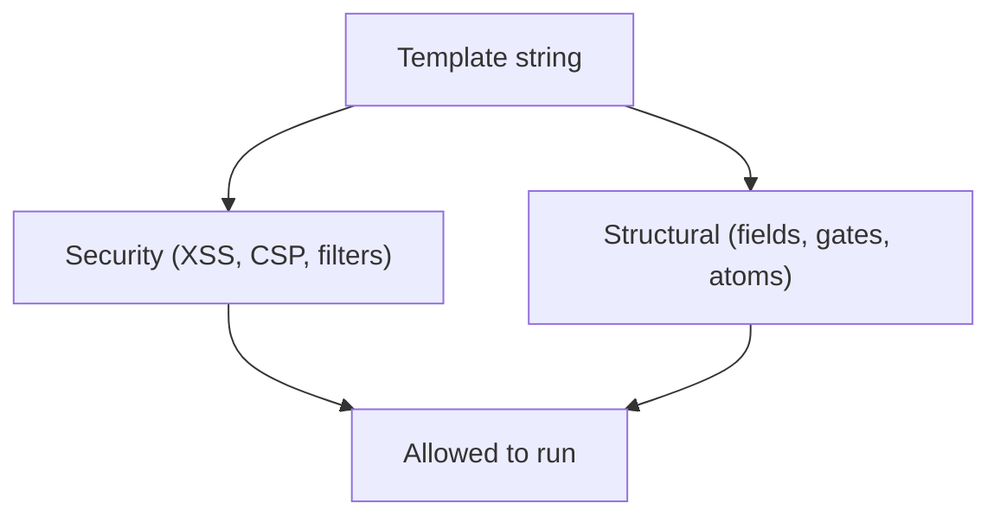

# Validator

**Status:** Part shipped, part design; each section says which. **Parent:** [`README.md`](README.md). **Scope:** Structural checks only (required atoms present, ``). Security (XSS, CSP, filters, DOMPurify) is [`../flowengine/template-security.md`](../flowengine/template-security.md).

## What ships

- **Authoring validator** (`validateLoginTemplate` in `@zitadel/config/template`), run by `zitadel plan` / `apply`. It checks four things: the template is within the size cap, contains none of the banned patterns, carries a `` tag, and parses as LiquidJS. It does not look at steps, fields, or atoms.
- **Server gate**, on publish. It mirrors the size cap and the banned patterns only; it cannot parse the LiquidJS dialect.
- **Runtime safety net** in the component, described below.
- **Atom manifests** (`packages/components/src/manifests.ts`), one per shipped atom. Nothing validates templates against them yet.

The component runs no validator. It parses and renders the template, and a template that throws renders the bundled default instead.

## Structural validity (design)

A template is structurally valid if, for every reachable step, required fields and gates have matching `<zl-*>` tags. The design is a static pass before render, with `` patching gaps at runtime. Only the runtime half exists.


```mermaid
flowchart TB
    T[Template string]
    T --> SEC["Security (XSS, CSP, filters)"]
    T --> STR["Structural (fields, gates, atoms)"]
    SEC --> OK[Allowed to run]
    STR --> OK
```

## Relationship to the security validator

| Concern | Validator | Source | Runs when |
|---|---|---|---|
| XSS, auto-escape, banned filters (`raw`), CSP enforcement, DOMPurify sanitisation | **Security** | [`../flowengine/template-security.md`](../flowengine/template-security.md) | Server-side on save. Non-negotiable. |
| `` emitted, template parses | **Authoring** (shipped) | `@zitadel/config/template` | `zitadel plan` / `apply`. |
| Required fields/gates present, one primary action, no unknown atoms | **Structural** (design) | Atom manifests + flow definition | Not built. |

Authoritative XSS/CSP rules live in `template-security.md`. This file is capability coverage only.

## Atom manifest

Every `<zl-*>` atom ships a machine-readable manifest for a validator and editor to consume. The examples below illustrate the shape; the shipped manifests are in `packages/components/src/atoms/`.

```json
{
  "tag": "zl-field",
  "consumes": { "field": { "required": true } },
  "attrs":    ["name", "label", "type", "autocomplete", "required", "pattern"],
  "parts":    ["root", "label", "input", "error"],
  "slots":    ["prefix", "suffix", "help"]
}

{
  "tag": "zl-submit",
  "consumes": { "action": { "kind": "submit", "required": true } },
  "attrs":    ["action", "label", "loading"],
  "parts":    ["root", "button", "spinner"],
  "slots":    []
}

{
  "tag": "zl-captcha",
  "satisfies_gate": "captcha",
  "attrs":    ["text", "solved"],
  "parts":    ["root", "widget", "status"],
  "slots":    []
}
```

Manifests are the single source of truth for parts, slots, and what an atom binds to on the step.

## Static validation (design)

Given a flow definition (from the flow engine) and a template:

1. Walk the Liquid AST, noting every `<zl-*>` tag with its bound `name=` or `action=` attribute and the surrounding control flow (`` scopes the element to one branch).
2. For each step the flow can emit, project the template to the elements reachable in that branch.
3. Against the projected set, assert:
   - Every required entry in `fields` has exactly one matching `<zl-field name="…">`.
   - Every required entry in `gates` has exactly one matching `satisfies_gate` consumer.
   - Exactly one `<zl-submit>` is reachable.
   - Every secondary entry in `actions` has at most one matching `<zl-action>` / `<zl-sso-providers>`.
   - A trailing `` tag is present.
   - No `<zl-*>` tags are unknown to the manifest registry.

Output is structured: `{ step_name, missing[], unknown[], duplicated[] }`. An editor would surface these inline, and `zitadel plan` / `apply` before upload.

## Runtime safety net

Shipped (`packages/components/src/orchestrator/mandatory-gates.ts`). `` is a Liquid tag the built-in templates place at the end of their body. After the template finishes rendering, the component inspects the produced DOM and appends:

- Any required `fields[*]` with no `<zl-field>`, `<zl-select>` or `<zl-checkbox>` of that name.
- The step's primary action as a `<zl-button>`, if no primary button was rendered.

It does not append gate consumers.

Appended nodes use token defaults only.

## What the validator does not check

- **Security.** Handled in [`../flowengine/template-security.md`](../flowengine/template-security.md), not duplicated here.
- Visual layout. A template may render every required element and still be ugly; that's a design concern, not a validation one.
- Performance. Expensive Liquid loops are flagged but not rejected.
- String correctness. String resources are a separate concern (see open question 8 in [`README.md`](README.md)).
- Accessibility. Part names give us a hook for an accessibility linter (separate concern, deferred).

## Frontend trigger points

Open for the structural pass. Candidates:

- Editor-time only (designer sees squiggles while authoring).
- `zitadel plan` / `apply` refuses to upload an invalid template, beside the authoring checks it already runs.
- Both.

No validator runs in the component at paint time. See [`schema.md`](schema.md) § Where each check runs.

## See also

- [`templates.md`](templates.md)
- [`../flowengine/flow-engine-nodes.md`](../flowengine/flow-engine-nodes.md)
- [`../flowengine/template-security.md`](../flowengine/template-security.md)
