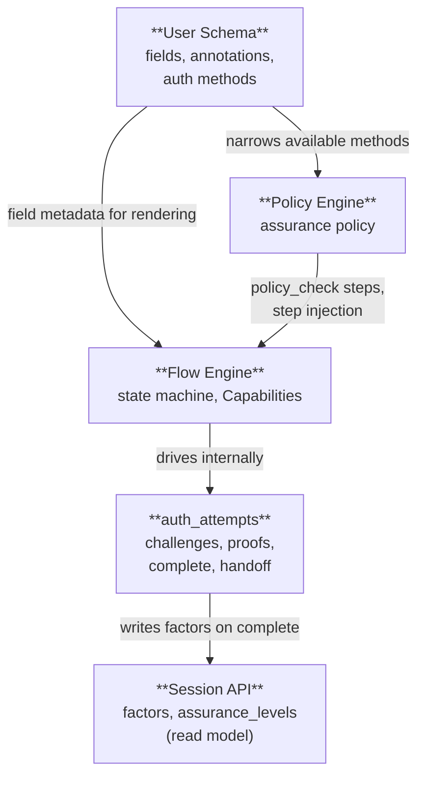

Flow orchestrates UI; primitives       Client orchestrates its own UI;
below come from auth_attempts.         calls auth_attempts + Session API.
  → manages registration, profiling      → server verifies, re-evaluates assurance
  → handles SSO redirects
  ...                                  Check assurance against requested acr_values
complete → redirect                      → build native UI, step-up if needed
                                       request satisfied → exchange / handoff

## Relevant POC ADRs

| Domain | ADRs |
|---|---|
| **Flow Engine** | [002](https://github.com/zitadel/oxidel/blob/main/docs/adr/002-schema-driven-login.md) Schema-Driven Login, [019](https://github.com/zitadel/oxidel/blob/main/docs/adr/019-server-driven-login-wc.md) Server-Driven Login UI, [033](https://github.com/zitadel/oxidel/blob/main/docs/adr/033-customizable-login-layouts.md) Customizable Layouts, [015](https://github.com/zitadel/oxidel/blob/main/docs/adr/015-actions-catalog.md) Actions & Catalog |
| **Session API** | [035](https://github.com/zitadel/oxidel/blob/main/docs/adr/035-provider-catalog-schema-binding.md) Provider Catalog & Session Provenance, [044](https://github.com/zitadel/oxidel/blob/main/docs/adr/044-short-lived-edge-access-tokens-and-authoritative-browser-sessions.md) Edge Tokens & Browser Sessions |
| **Policy & Risk** | [009](https://github.com/zitadel/oxidel/blob/main/docs/adr/009-settings-engine-pipeline.md) Settings & Engine Pipeline, [021](https://github.com/zitadel/oxidel/blob/main/docs/adr/021-login-flow-schema.md) Bot Detection & Telemetry, [024](https://github.com/zitadel/oxidel/blob/main/docs/adr/024-risk-evaluation-policy-consumers.md) Risk Evaluation, [032](https://github.com/zitadel/oxidel/blob/main/docs/adr/032-backend-layering-use-cases-hooks.md) Use Cases & Hook Pipeline |
| **User Schema** | [002](https://github.com/zitadel/oxidel/blob/main/docs/adr/002-schema-driven-login.md) Schema-Driven Login, [003](https://github.com/zitadel/oxidel/blob/main/docs/adr/003-auth-methods-meta-schema.md) Auth Methods Meta-Schema, [007](https://github.com/zitadel/oxidel/blob/main/docs/adr/007-schema-engine-interaction.md) Schema ↔ Engine, [016](https://github.com/zitadel/oxidel/blob/main/docs/adr/016-uniqueness-constraints.md) Uniqueness & Identifiers |
| **Cross-cutting** | [005](https://github.com/zitadel/oxidel/blob/main/docs/adr/005-unified-data-model.md) Unified Data Model |

## Documents

| Document | Status | Description |
|---|---|---|
| [Flow Engine](flow-engine.md) | In Review | Server-side state machine producing Capability payloads. Step types, flow definitions, resolution. |
| [Flow Engine — Step Response Shape](flow-engine-nodes.md) | In Review (frontend) | Capability mapping: Fields, Actions, Gates, and LiquidJS templates. |
| [Flow Engine — Storage](flow-engine-storage.md) | In Review | Encrypted cookie model, session/flow separation, optimistic locking, DB I/O analysis. |
| [Flow Engine — Developer Guide](flow-engine-guide.md) | In Review | Progressive walkthrough of building flows: steps, pivots, completion, sessions, error handling. |
| [Session API](session-api.md) | Preliminary | Factor accumulation primitive. Assurance-level model is directional, not final. |
| [User Schema Integration](user-schema.md) | Preliminary | How the flow engine and policy engine consume user schema annotations. |
| [Bot Detection](bot-detection.md) | Preliminary | Composable captcha, fingerprinting, and risk evaluation. Depends on policy engine. |
| [Template Security](template-security.md) | In Review | XSS attack vectors, trust boundaries, and defense-in-depth for LiquidJS + innerHTML rendering. |
| **Design API sketches** | | |
| [Session API sketch](api/session-api.yaml) | Preliminary | Design-facing OpenAPI sketch; implementation source of truth lives under `api/openapi/`. |
| [Flow API sketch](api/flow-api.yaml) | In Review | Design-facing OpenAPI sketch; implementation source of truth lives under `api/openapi/`. |
| **Tooling** | | |
| [Flow visualizer](visualizer.html) | Living | HTML tool for previewing flow payloads. Run `corepack pnpm --filter @zitadel-nextgen/components dev`, then open `http://localhost:5174/visualizer.html`. The "Real components" tab imports the components straight from `packages/components/src` (no build step) and walks `step.transitions` via `WalkingFixtureTransport`. |

## Core Concepts

The architecture is built on four concepts:

1. **auth_attempts** — ephemeral state machine for driving authentication. Issues challenges, verifies proofs, completes into a session or OIDC code. See [authn-and-auth-flows.md](../api/authn-and-auth-flows.md).
2. **Session API** — durable read model. Reflects accumulated factors and current `assurance_levels[]`. Never mutated directly by a client — factors flow in through `auth_attempts`. Supports pre-auth anonymous shells via `POST /sessions`.
3. **Flow Engine** — server-driven state machine producing Capabilities (Fields, Actions, Gates) alongside a LiquidJS template. Used by web/frontend clients. Operates on sessions internally.
4. **Policy Engine** — the sole decision maker. Evaluates session state + context and determines what's required. **Design TBD** — not covered in these documents.
5. **User Schema** — JSON Schema-based user definitions that drive registration forms, field validation, and claim mapping.

## Two Paths to Authentication

The flow engine orchestrates **which step renders when** (UI layer). The underlying auth primitives — start an attempt, issue a challenge, verify a proof, complete, mint a handoff — live in [`../api/authn-and-auth-flows.md`](../api/authn-and-auth-flows.md) as the `auth_attempts` state machine. Both paths below use the same primitives; they differ in who drives the UI.

```
Web/frontend client                    Any other client (mobile, backend, CLI)
─────────────────────                  ─────────────────────────────────────────

POST /flows                         POST /auth_attempts
  → get capabilities + template          → drive primitives directly
POST /flows/{id}/submit             POST /auth_attempts/{id}/challenges
  → server advances state machine        + /challenges/{cid}/verify
  → internally invokes auth_attempt      → submit factor proofs
    Go service layer (no HTTP)           → server verifies, re-evaluates assurance
  → renders next step
  → manages registration, profiling    Check assurance levels against requested acr_values
  → handles SSO redirects                → build native UI, step-up if needed
  ...                                  request satisfied → exchange / handoff
complete → redirect

Flow orchestrates UI; it drives        Client orchestrates its own UI;
auth_attempts via the internal         calls auth_attempts REST endpoints
Go service layer, not HTTP.            + Session API over HTTP directly.
```

Both paths get the same policy enforcement — the policy engine evaluates sessions regardless of how factors were submitted.

## Separation of Concerns



| Concern | Owned By | Decides |
|---|---|---|
| Which fields exist on a user? | **User Schema** | Field types, validation, annotations, auth method availability |
| What does the login/registration page look like? | **Flow Definition** | Branding, step graph, which schema fields on which step |
| Which fields to show during registration? | **Flow Definition** (`form` steps) | References schema fields by name; schema provides metadata |
| What assurance levels does this session satisfy? | **Policy Engine** | Evaluates factors + freshness + authenticator properties → computes `assurance_levels[]` |
| What screen does the user see next? | **Flow Engine** | Combines policy decision + flow definition + schema → Capabilities + Liquid Template |
| Is this session usable for token exchange? | **OIDC/SAML endpoint** | Compares session `assurance_levels[]` against requested `acr_values`; triggers step-up if insufficient |
| Is captcha/bot detection needed? | **Risk Evaluator → Policy Engine** | Composable signals (fingerprint, telemetry, rate limits) → risk score → policy decides |
| Where is flow state stored? | **Encrypted cookie** | Client-held, server-stateless. Only factor changes touch the DB. |
| Which flow definition to use? | **Flow resolution** | `purpose` + `audience` matching with specificity ranking |

## Design Principles

1. **The frontend is a dumb template renderer.** The frontend has no business logic. The server emits a semantic **Capability** payload (e.g. "Needs Email", "SSO available", "Passkey Gate Required") alongside a **LiquidJS Template**. The frontend securely parses the template, which explicitly binds the semantic capabilities to isolated HTML Atoms (Lit Web Components). It never decides what screen comes next or what authentication is required.

2. **The flow engine never decides policy.** The flow engine's job is orchestration: emit capabilities, serve layouts, collect input, delegate decisions. All questions about "what does the user need to do?" are answered by the policy engine. The flow engine just follows the answer.

3. **auth_attempts are the mutation primitive.** A session accumulates verified factors, but never accepts direct mutations from a client. The flow engine drives `auth_attempts` internally; direct-API clients drive them explicitly. On completion, an `auth_attempt` writes factors into the session and updates the assurance level. The client then reads the session to observe the result.

4. **Flows are configurable per audience.** Flow definitions are API resources that describe step graphs. An admin can create different flows for different teams, applications, or user types. One team gets SSO-first login; another gets email + password. The flow engine resolves which definition to use based on the request context.

5. **User schemas drive forms.** Registration fields, validation rules, and progressive profiling steps come from JSON Schema definitions — not hardcoded templates. When a schema adds a new field, every flow that references it picks it up automatically.

6. **Flow state lives in the browser.** The flow engine stores its orchestration state (current step, collected data, history) in an encrypted HttpOnly cookie. The server is stateless between requests. Only factor verifications and user mutations touch the database. This means multiple flows can run on the same session over time (login, then step-up, then profiling) without accumulating server-side state.

7. **Assurance is graduated, not binary.** A session never says "I am sufficient." It says "I am at this assurance level." Whether that level is enough depends on who is asking. The same session might satisfy one application's requirements but not another's. This follows OIDC ACR (Authentication Context Class Reference) and NIST AAL (Authenticator Assurance Levels).

8. **Bot detection is composable.** Captcha, device fingerprinting, behavioral signals, and rate limiting are independent inputs to a risk evaluator. Altcha (self-hosted proof-of-work) ships as the default with zero external dependencies. Admins can configure third-party providers (reCAPTCHA, hCaptcha, Turnstile) when needed.
