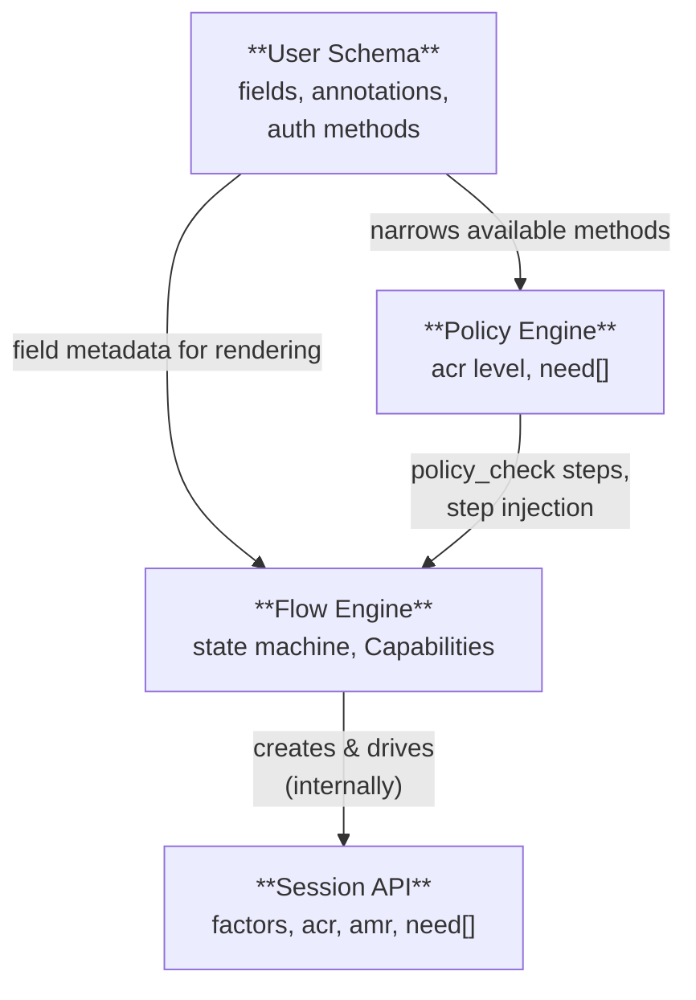

# Authentication Architecture

> **Status:** Draft proposal — sharing for feedback
> **Date:** 2026-04-21
> **Context:** Zitadel next-generation architecture design
>
> **What needs feedback:** Flow engine architecture (state machine, Capabilities, encrypted cookie storage, pivots, completion semantics).
> **What's early draft:** Step response shape (Capabilities vs UINodes — see ADR-048), session API details (ACR model, `x-freshness`), policy engine design (TBD).

## Relevant POC ADRs

| Domain | ADRs |
|---|---|
| **Flow Engine** | [002](https://github.com/zitadel/oxidel/blob/main/docs/adr/002-schema-driven-login.md) Schema-Driven Login, [019](https://github.com/zitadel/oxidel/blob/main/docs/adr/019-server-driven-login-wc.md) Server-Driven Login UI, [033](https://github.com/zitadel/oxidel/blob/main/docs/adr/033-customizable-login-layouts.md) Customizable Layouts, [015](https://github.com/zitadel/oxidel/blob/main/docs/adr/015-actions-catalog.md) Actions & Catalog |
| **Session API** | [035](https://github.com/zitadel/oxidel/blob/main/docs/adr/035-provider-catalog-schema-binding.md) Provider Catalog & Session Provenance, [044](https://github.com/zitadel/oxidel/blob/main/docs/adr/044-short-lived-edge-access-tokens-and-authoritative-browser-sessions.md) Edge Tokens & Browser Sessions |
| **Policy & Risk** | [009](https://github.com/zitadel/oxidel/blob/main/docs/adr/009-settings-engine-pipeline.md) Settings & Engine Pipeline, [021](https://github.com/zitadel/oxidel/blob/main/docs/adr/021-login-flow-schema.md) Bot Detection & Telemetry, [024](https://github.com/zitadel/oxidel/blob/main/docs/adr/024-risk-evaluation-policy-consumers.md) Risk Evaluation, [032](https://github.com/zitadel/oxidel/blob/main/docs/adr/032-backend-layering-use-cases-hooks.md) Use Cases & Hook Pipeline |
| **User Schema** | [002](https://github.com/zitadel/oxidel/blob/main/docs/adr/002-schema-driven-login.md) Schema-Driven Login, [003](https://github.com/zitadel/oxidel/blob/main/docs/adr/003-auth-methods-meta-schema.md) Auth Methods Meta-Schema, [007](https://github.com/zitadel/oxidel/blob/main/docs/adr/007-schema-engine-interaction.md) Schema ↔ Engine, [016](https://github.com/zitadel/oxidel/blob/main/docs/adr/016-uniqueness-constraints.md) Uniqueness & Identifiers |
| **Cross-cutting** | [005](https://github.com/zitadel/oxidel/blob/main/docs/adr/005-unified-data-model.md) Unified Data Model |

## Documents

| Document | Status | Description |
|---|---|---|
| [Flow Engine](flow-engine.md) | In Review | Server-side state machine producing Capability payloads. Step types, flow definitions, resolution. |
| [Flow Engine — Step Response Shape](flow-engine-nodes.md) | In Review (frontend) | Capability mapping: Fields, Actions, Gates, and LiquidJS templates. |
| [Flow Engine — Storage](flow-engine-storage.md) | In Review | Encrypted cookie model, session/flow separation, optimistic locking, DB I/O analysis. |
| [Flow Engine — Developer Guide](flow-engine-guide.md) | In Review | Progressive walkthrough of building flows: steps, pivots, completion, sessions, error handling. |
| [Session API](session-api.md) | Preliminary | Factor accumulation primitive. ACR/LoA model is directional, not final. |
| [User Schema Integration](user-schema.md) | Preliminary | How the flow engine and policy engine consume user schema annotations. |
| [Bot Detection](bot-detection.md) | Preliminary | Composable captcha, fingerprinting, and risk evaluation. Depends on policy engine. |
| [Template Security](template-security.md) | In Review | XSS attack vectors, trust boundaries, and defense-in-depth for LiquidJS + innerHTML rendering. |
| **API specs** | | |
| [Session API OpenAPI](api/session-api.yaml) | Preliminary | OpenAPI 3.1 spec for the Session API |
| [Flow API OpenAPI](api/flow-api.yaml) | Draft | Design-phase sketch (flow runtime + definitions) |
| [**Flow Runtime OpenAPI (canonical)**](../../../api/openapi/openapi-spec.yaml) | In Review | Canonical spec: `POST /flow`, `GET /flow/{id}`, `POST /flow/{id}/submit`, `POST /flow/{id}/event`. Schemas in [`api/openapi/components/flows/`](../../../api/openapi/components/flows/). |

## Core Concepts

The architecture is built on four concepts:

1. **Session API** — low-level primitive for factor accumulation. Any client can use it directly.
2. **Flow Engine** — server-driven state machine producing Capabilities (Fields, Actions, Gates) alongside a LiquidJS template. Used by web/frontend clients. Operates on sessions internally.
3. **Policy Engine** — the sole decision maker. Evaluates session state + context and determines what's required. **Design TBD** — not covered in these documents.
4. **User Schema** — JSON Schema-based user definitions that drive registration forms, field validation, and claim mapping.

## Two Paths to Authentication

```
Web/frontend client                    Any other client (mobile, backend, CLI)
─────────────────────                  ─────────────────────────────────────────

POST /v1/flows                         POST /v1/sessions
  → get capabilities + template          → get session + acr + need[]
POST /v1/flows/{id}/submit             PATCH /v1/sessions/{id}
  → server advances state machine        → submit factor proofs
  → renders next step                    → server verifies, re-evaluates acr
  → manages registration, profiling
  → handles SSO redirects              Check acr against requested acr_values
  ...                                    → build native UI, step-up if needed
complete → redirect                    acr meets request → token exchange

Flow creates a session internally.     Client drives the session directly.
Client never touches Session API.      Client never touches Flow API.
```

Both paths get the same policy enforcement — the policy engine evaluates sessions regardless of how factors were submitted.

## Separation of Concerns



| Concern | Owned By | Decides |
|---|---|---|
| Which fields exist on a user? | **User Schema** | Field types, validation, annotations, auth method availability |
| What does the login/registration page look like? | **Flow Definition** | Branding, step graph, which schema fields on which step |
| Which fields to show during registration? | **Flow Definition** (`form` steps) | References schema fields by name; schema provides metadata |
| What assurance level does this session have? | **Policy Engine** | Evaluates factors + freshness + authenticator properties → computes `acr` |
| What screen does the user see next? | **Flow Engine** | Combines policy decision + flow definition + schema → Capabilities + Liquid Template |
| Is this session usable for token exchange? | **OIDC/SAML endpoint** | Compares session `acr` against requested `acr_values`; triggers step-up if insufficient |
| Is captcha/bot detection needed? | **Risk Evaluator → Policy Engine** | Composable signals (fingerprint, telemetry, rate limits) → risk score → policy decides |
| Where is flow state stored? | **Encrypted cookie** | Client-held, server-stateless. Only factor changes touch the DB. |
| Which flow definition to use? | **Flow resolution** | `purpose` + `audience` matching with specificity ranking |

## Design Principles

1. **The frontend is a dumb template renderer.** The frontend has no business logic. The server emits a semantic **Capability** payload (e.g. "Needs Email", "SSO available", "Passkey Gate Required") alongside a **LiquidJS Template**. The frontend securely parses the template, which explicitly binds the semantic capabilities to isolated HTML Atoms (Lit Web Components). It never decides what screen comes next or what authentication is required.

2. **The flow engine never decides policy.** The flow engine's job is orchestration: emit capabilities, serve layouts, collect input, delegate decisions. All questions about "what does the user need to do?" are answered by the policy engine. The flow engine just follows the answer.

3. **Sessions are the primitive.** A session is a bag of verified authentication factors. The flow engine creates and drives sessions internally, but sessions also exist independently. Clients that want full control (mobile apps, backend services, CLIs) skip the flow engine entirely and talk to the Session API directly.

4. **Flows are configurable per audience.** Flow definitions are API resources that describe step graphs. An admin can create different flows for different organizations, applications, or user types. One org gets SSO-first login; another gets email + password. The flow engine resolves which definition to use based on the request context.

5. **User schemas drive forms.** Registration fields, validation rules, and progressive profiling steps come from JSON Schema definitions — not hardcoded templates. When a schema adds a new field, every flow that references it picks it up automatically.

6. **Flow state lives in the browser.** The flow engine stores its orchestration state (current step, collected data, history) in an encrypted HttpOnly cookie. The server is stateless between requests. Only factor verifications and user mutations touch the database. This means multiple flows can run on the same session over time (login, then step-up, then profiling) without accumulating server-side state.

7. **Assurance is graduated, not binary.** A session never says "I am sufficient." It says "I am at this assurance level." Whether that level is enough depends on who is asking. The same session might satisfy one application's requirements but not another's. This follows OIDC ACR (Authentication Context Class Reference) and NIST AAL (Authenticator Assurance Levels).

8. **Bot detection is composable.** Captcha, device fingerprinting, behavioral signals, and rate limiting are independent inputs to a risk evaluator. Altcha (self-hosted proof-of-work) ships as the default with zero external dependencies. Admins can configure third-party providers (reCAPTCHA, hCaptcha, Turnstile) when needed.
