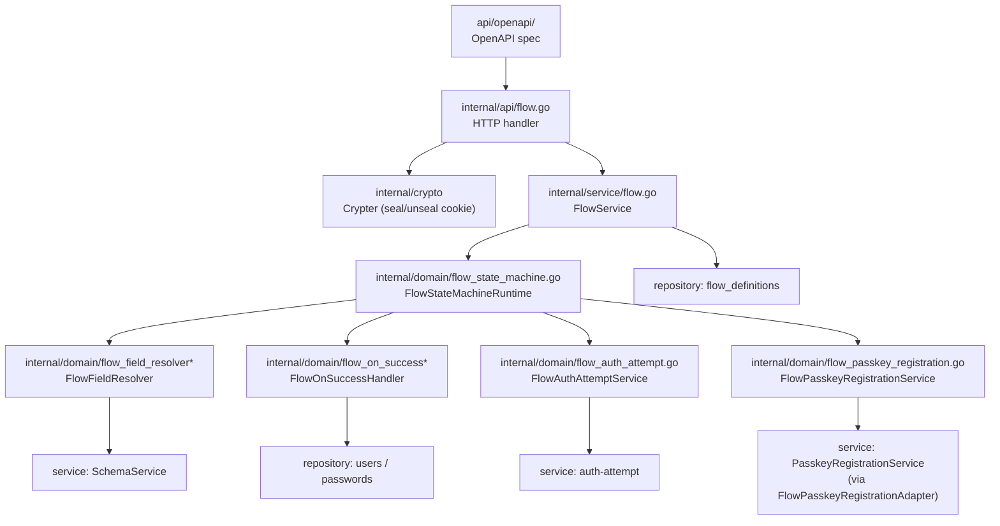
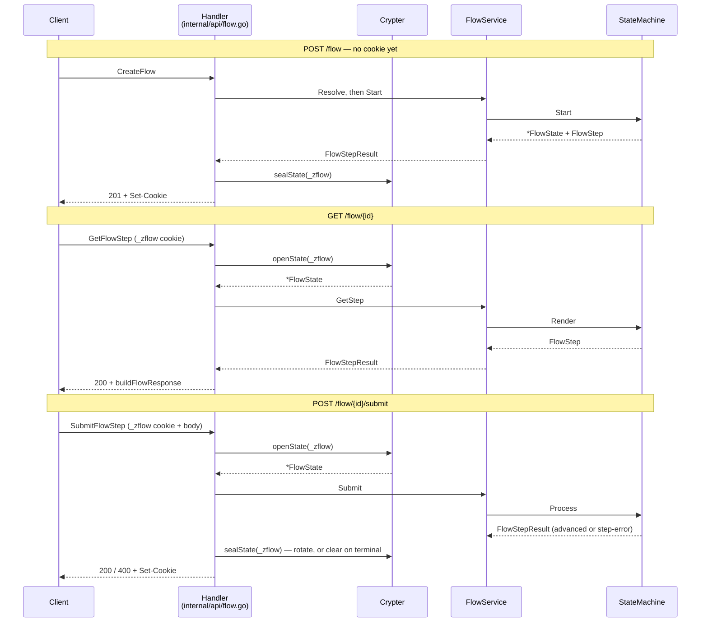

# Flow Engine — Architecture

> **Status:** Current
> **See also:** [Flow Engine](flow-engine.md) · [Definition Rules](flow-definition-rules.md) · [Capabilities](capabilities.md) · [Storage](flow-engine-storage.md)

This document maps the flow engine to the code that runs it: the components
that live inside the engine, the boundary code that drives it, and the
collaborators it calls into.

## Component map



## Request path



Cookie I/O is owned by the handler. The state machine never touches HTTP, cookies, or the encryption layer — it receives a `*FlowState` and returns one.

## Internal components

The components below all live under `internal/domain/` and `internal/service/`.

### `FlowService` (`internal/service/flow.go`)

The use-case surface the HTTP handler depends on. Four methods:

| Method | Responsibility |
|---|---|
| `Resolve` | Pick the active `FlowDefinition` to run. `Name` → direct lookup; otherwise audience-based (`Hint` plumbed through but not yet honored). |
| `Start` | Mint a fresh `FlowState`, ask the state machine to bootstrap it, mint and attach `flow_*` and `sess_*` ids. |
| `Submit` | Re-fetch the definition from `state.DefinitionID`, hand to `stateMachine.Process`. |
| `GetStep` | Re-fetch the definition, hand to `stateMachine.Render` (no advancement). |

Service holds `*service.DB` (v2 statements), the `FlowStateMachine` interface,
and the `idgen.Generator`. Flow definitions are loaded via
`ListFlowDefinitions` / `GetFlowDefinitionByID` on `AllStatements`.

### `FlowStateMachineRuntime` (`internal/domain/flow_state_machine.go`)

The state machine. Three entry points (`Start`, `Process`, `Render`) and one private pipeline:

```
Process(in):
  ├── find current step in definition
  ├── resolve fields via FlowFieldResolver
  ├── prefillFromCollected: hydrate resolved fields from state.CollectedData
  ├── validate submitted values
  │     └─ on error: return same step with Error set
  ├── merge fields into state.CollectedData
  ├── if action ∈ {passkey, passkey_register}:
  │     ├─ Phase 1 (no proof yet):
  │     │   ├─ login: run dispatchChallenges first so SubmitIdentifier
  │     │   │   resolves the user and PreparePasskeyChallenge can
  │     │   │   populate allowCredentials
  │     │   └─ register: GenerateUserID → store as provisional _user_id
  │     │       (marked _passkey_provisional in CollectedData)
  │     └─ Phase 2 (challenge_response present):
  │         ├─ verify the assertion / attestation
  │         ├─ if provisional: HandleProvisional creates the user inside
  │         │   the credential-save transaction, then RegisterCreatedUser
  │         │   marks the user verified on the auth attempt
  │         └─ on success, fall through to terminal handoff
  ├── dispatchChallenges (identifier, then password) — skipped when the
  │     passkey ceremony handled the step
  │     ├─ verify-vs-skip keyed on state.CurrentPurpose + visited on_success
  │     ├─ on user_not_found / user_already_exists: route via outcome
  │     │   (and flip CurrentPurpose per the engine's flip rule)
  │     └─ on password reject: return same step with Error set
  ├── if step.OnSuccess set: run handler (create_user today)
  ├── look up routeOutcome in step.Transitions
  ├── advance state (push to history, set CurrentStep)
  └── if next step is terminal:
        ├── render terminal step
        └── if a user was resolved: authAttempts.Handoff → token + expiry
```

Errors that surface from `Process`:

- `ErrInvalidAction` — submitted action not in the step's `Transitions`.
- `ErrIntegrity` — wiring contract violated (missing definition, missing step, missing dependency).
- `ErrUnsupported` — feature deferred (cross-flow transitions, SSO submissions, gate proofs).
- `ErrSessionConflict` — reserved; not emitted today.

### `FlowFieldResolver` (`internal/domain/flow_field_resolver*.go`)

Interface (`Resolve` + `Validate`) plus a schema-backed implementation in `flow_field_resolver_schema.go`. Given a user schema URL and a list of property names, it returns:

- `FlowField` per property — UI input `Type`, `TextKey`, `Required`, optional `Validation`, the field's uniqueness scope, and the `FlowFieldChallenge` it maps to (derived from the property's `x-unique` annotation, or — for credential fields — the reserved `x-auth-methods#<method>` field name resolved against the schema root's `x-auth-methods`).
- `ImplicitOutcomes` per field — the engine-emitted routing outcomes the field contributes (today: `user_not_found` and `user_already_exists` from identifier-shaped fields).

`Validate` walks the resolved fields and returns `FlowFieldValidationErrors` on rule violations — the state machine surfaces those as step errors.

### `FlowOnSuccessHandler` (`internal/domain/flow_on_success.go`)

Interface every `on_success` mutation satisfies. One implementation today:

- `FlowCreateUserHandler` (`flow_on_success_create_user.go`) — reads the identifier and password fields from the collected data, hashes the password (argon2id) via `FlowPasswordHasher`, writes the user via the user repository, writes the credential via the password repository, then calls `auth-attempt.RegisterCreatedUser` so the new user is treated as verified by the terminal handoff.
- `HandleProvisional` (same type) — used by the passkey-register verify leg: creates the user row inside the same DB transaction that persists the passkey credential, using the provisional `_user_id` minted at Phase 1.

### `FlowAuthAttemptService` (`internal/domain/flow_auth_attempt.go`)

A narrow interface over the auth-attempt service. The state machine sees
`Start`, `SubmitIdentifier`, `SubmitPassword`, `RegisterCreatedUser`, and
`Handoff`, and never sees challenge ids. Identifier no-match and password
rejection both surface as `ErrAuthAttemptProofRejected`, which the state
machine routes (`user_not_found`) or re-renders (step error) accordingly.
`RegisterCreatedUser` is called after `create_user` (and after passkey-register
verify) so the freshly-created user counts as a verified factor for the
terminal handoff.

### `FlowPasskeyRegistrationService` (`internal/domain/flow_passkey_registration.go`)

A narrow interface for the passkey-register ceremony. The state machine sees
`IssuePasskeyRegistrationChallenge` (Phase 1 — mints a WebAuthn registration
challenge keyed to a provisional user id) and `SubmitPasskeyRegistration`
(Phase 2 — verifies the attestation and persists the credential inside the
caller's statements transaction, so it can share the transaction that
`HandleProvisional` uses to materialize the user row).

### Domain types worth knowing

- `FlowDefinition` / `FlowDefinitionStep` — the immutable graph (`flow_definition.go`). Steps don't have a `type`; behavior derives from `Fields`, `Actions`, `Gates`, `SSOProviders`, `OnSuccess`, `Complete`, and `Transitions`.
- `FlowState` / `FlowProgress` — the cookie payload (`flow_state.go`). `FlowState` wraps `FlowProgress` (current step, history, collected data, `Purpose`, and the dispatch-mode `CurrentPurpose`) and adds session/OIDC context plus a reserved `PivotStack`.
- `FlowStep` — the capability payload returned to the client (`flow_state_machine.go`). `Challenge` carries the issue-leg payload of a two-phase ceremony.
- `FlowStepChallenge` / `FlowChallengeResponse` / `FlowPendingChallenge` — the two-phase ceremony contract: a pending challenge the client signs, and the proof it submits back.
- Reserved key `FlowCollectedUserIDKey` (`_user_id`) — set by the dispatch loop when the auth-attempt identifies the user; gates whether the terminal step mints a handoff.
- Reserved key `_passkey_provisional` — flags that `_user_id` was minted by the passkey-register issue leg and still needs `HandleProvisional` + `RegisterCreatedUser` on verify.

## Upstream dependencies (what calls into the engine)

### HTTP handler — `internal/api/flow.go`

Implements three ogen-generated method signatures: `CreateFlow`, `SubmitFlowStep`, `GetFlowStep`. The handler:

- Decodes ogen request types into `service.*Request` shapes.
- Calls `FlowService`.
- Seals the returned `*FlowState` into the `_zflow` cookie (`HttpOnly`, `Secure`, `SameSite=Strict`, `Max-Age=600`).
- Translates `service.FlowStepResult` into the OpenAPI `FlowResponse` (`toFlowStep`, `toFlowField`, `toFlowStepActions`).
- Maps domain errors to HTTP status codes (`mapFlowErrorStatus`, `mapFlowGetError`).
- Derives the WebAuthn RPID from the effective request host injected by `WithRequestHostMiddleware` (`internal/api/security.go`) — needed because same-origin browser fetches do not send an `Origin` header.

Cookie semantics:

| Sentinel | HTTP code | Cookie response |
|---|---|---|
| `errFlowCookieMissing` / `errFlowCookieInvalid` | 401 | none |
| `errFlowCookieExpired` | 401 | none |
| `errFlowIDMismatch` | 404 | none |
| `errFlowCompleted` (GET only) | 410 | none |
| Validation step error | 400 | rotated cookie |
| Terminal step | 200 | cleared cookie (`Max-Age=0`) |
| Advancing step | 200 | rotated cookie |

### Cookie sealer — `internal/crypto.Crypter`

Interface with `Encrypt(string) (string, error)` and `Decrypt(string) (string, error)`. Wired into `Handler.crypter` at construction. The handler's `sealState` / `openState` helpers wrap JSON encoding around it. Max-age expiration is enforced separately by comparing `state.IssuedAt` against `flowCookieMaxAgeSeconds`.

### OpenAPI spec — `api/openapi/`

Source of truth for the wire format. The ogen-generated types under `api/generated/` are what the handler receives and returns. The relevant schemas live in `api/openapi/components/flows/`. Changing a request or response shape starts here.

## Downstream dependencies (what the engine calls)

### auth-attempt service

Wired in as `FlowAuthAttemptService`. The state machine calls `Start` at `FlowService.Start`, `SubmitIdentifier` and `SubmitPassword` from `dispatchChallenges`, and `Handoff` at the terminal step when a user has been resolved. Today the production implementation is the `AuthAttemptService` in `internal/service/auth_attempt.go`.

### passkey-registration service

Wired in as `FlowPasskeyRegistrationService` via `FlowPasskeyRegistrationAdapter` (`internal/service/flow_passkey_registration.go`), which wraps the broader `PasskeyRegistrationService`. The state machine calls `IssuePasskeyRegistrationChallenge` on Phase 1 of a `passkey_register` action and `SubmitPasskeyRegistration` on Phase 2. The adapter is the seam that lets the engine consume only the two methods it needs without depending on the full passkey-registration service surface.

### `FlowDefinitionStatements`

Postgres and Spanner implementations live under
`internal/storage/v2/dialect/{postgres,spanner}/flow_definition.go` and back
`FlowService.Resolve` (list active definitions) and `FlowService.Submit` /
`GetStep` (re-fetch by id) via `FlowDefinitionService`. Migrations both ship
`000005_flow_definitions.sql`.

### User writers

`FlowCreateUserHandler` depends on a narrow `flowUserWriter` (`Create`) and
`flowUserPasswordWriter` (`Create`). Production wiring uses
`UserStatements` / `UserPasswordStatements` (storage v2) through the user
service — the handler itself stays storage-agnostic.

### Password hasher

`FlowPasswordHasher` (`internal/domain/flow_on_success.go`). The runtime implementation lives in `internal/crypto/` and is injected at wiring time.

### Schema service

Backs the schema-driven `FlowFieldResolver` implementation. Reads the user schema referenced by `FlowDefinition.UserSchema` and translates JSON Schema + `x-*` annotations into `FlowField` and `ImplicitOutcomes`.

### ID generator

Dialect-owned `NewManagedID` on the storage pool (ADR 047). `FlowService`
mints `flow_*` / provisional `session_*` ids at `Start`; passkey registration
mints provisional `user_*` ids in `PasskeyRegistrationService.Begin` when the
caller has none; create inserts mint managed resource IDs in the dialect.
Auth attempts use DB IDENTITY (ephemeral IDs).

## Where to read next

- [`flow-engine.md`](flow-engine.md) — design-level overview of definitions, resolution, and capabilities.
- [`flow-definition-rules.md`](flow-definition-rules.md) — definition shape and validation rules.
- [`capabilities.md`](capabilities.md) — what works today, what's stubbed, what's missing.
- [`flow-engine-storage.md`](flow-engine-storage.md) — why the cookie, why the DB stays quiet between submits.
