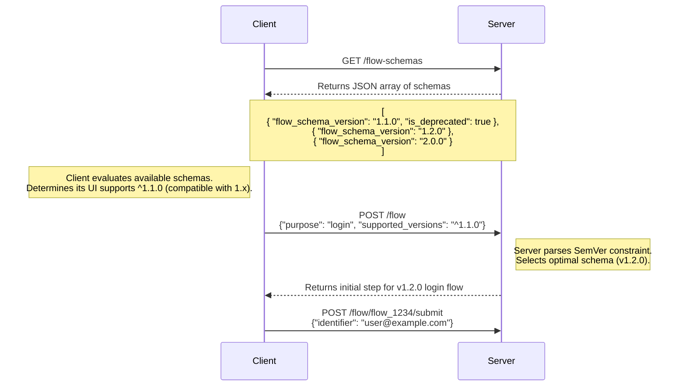

# Client/SDKs + API Version Compatibility

> **Status:** Research — proposal on the table, not implemented and not a design decision.
> **See also:** [Capabilities](capabilities.md) for what the engine emits today.

## Problem Statement
When a Flow Engine dictates which UI components should be rendered, version mismatches often occur: the Flow Engine API might be on a higher version than the Client/SDK can support, or vice versa. Left unhandled, this leads to a poor user experience, such as the UI rendering a blank screen (if the API requests an unknown state) or the API returning unhelpful error messages (if the Client/SDK requests a feature the server doesn’t yet support).

## Proposal - Bidirectional Capability Exchange

### Bootstrapping Phase
The `GET /flow-schemas` call is made during the bootstrapping phase of the Client/SDK (maybe cache with a TTL). 
The Server responds with a JSON array of all supported flow schemas, including their version numbers and deprecation statuses. 

This especially solves the problem of the Client/SDK being on a higher version than the Server, as it can review the versions supported by the Server and select the version(s) it can handle.
The call to obtain the schema list is done only during the bootstrapping phase, and not during every flow initiation. 

### Client Capability Declaration
During flow API calls, the Client/SDK includes its supported schema version(s) in the request payload. The Client/SDK declares these versions using standard Semantic Versioning (SemVer) constraints. For example:

* `1.2.0` indicates support for exactly version 1.2.0.
* `~1.2.0` allows for patch updates, supporting versions 1.2.0 up to, but not including, 1.3.0.
* `^1.2.0` allows for minor and patch updates, supporting versions 1.2.0 up to, but not including, 2.0.0.

If the declared schema versions of the Client/SDK are older than the Server's minimum, or if there is a mandatory security flow step (e.g., MFA) that the Client/SDK does not support, the Server will respond with an error message indicating that the Client/SDK must be updated.

### A Note on Flow Engine Version Updates

Within the context of flow schemas, version increments are defined as follows:
* Patch updates: Non-breaking changes, such as security fixes or minor bug resolutions. 
* Minor updates: Backward-compatible changes, such as the introduction of new capabilities or modifications to existing ones (e.g., adding a CAPTCHA step). 
* Major updates: Changes that break backward compatibility, such as the removal of a required field or a change in a field's data type.

Note: The granular details related to schema versioning and Flow Engine revisions will be documented as part of the formal API documentation and are out of scope for this proposal.

**Pros:**
* **Decoupled releases:** Client/SDK and Server release cycles are decoupled, allowing each to evolve independently without forcing simultaneous updates.
* **Graceful Upgrades:** When the Server expands its capabilities, older Clients/SDKs can handle the mismatch gracefully, preventing breaking changes and forced updates.
* **Graceful Downgrades:** Likewise, when the Server is on an older version than the Client/SDK, the client can downgrade its UI to match the server’s older schema.
* **Clear Deprecation Path:** Sharing deprecation statuses gives Client and SDK teams advance notice and a predictable timeline to upgrade their code.
* **Default Patching:** Clients/SDKs automatically receive non-breaking patch updates without needing to alter their schema negotiation, ensuring they benefit from improvements and security fixes.

**Cons:**
* **Client-Side Complexity:** The frontend takes on the added computational burden of parsing supported schemas during the bootstrapping phase.
* **Backend Maintenance:** The backend team incurs technical debt, as they must support older schema versions