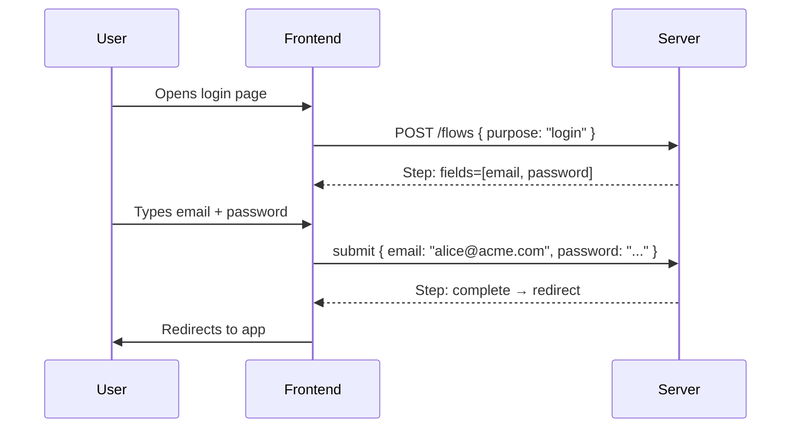
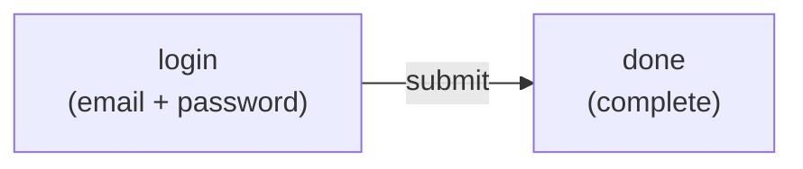
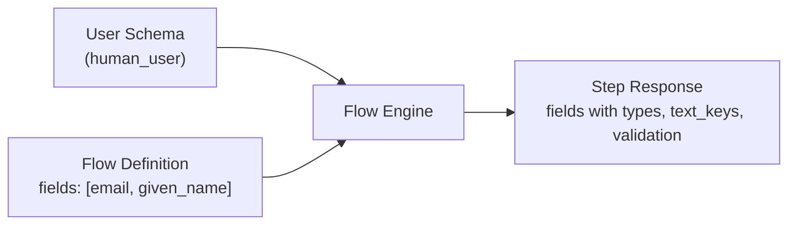
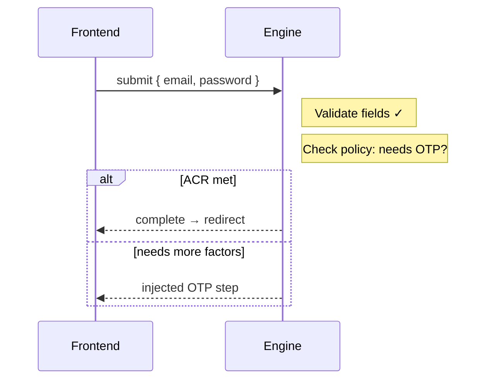
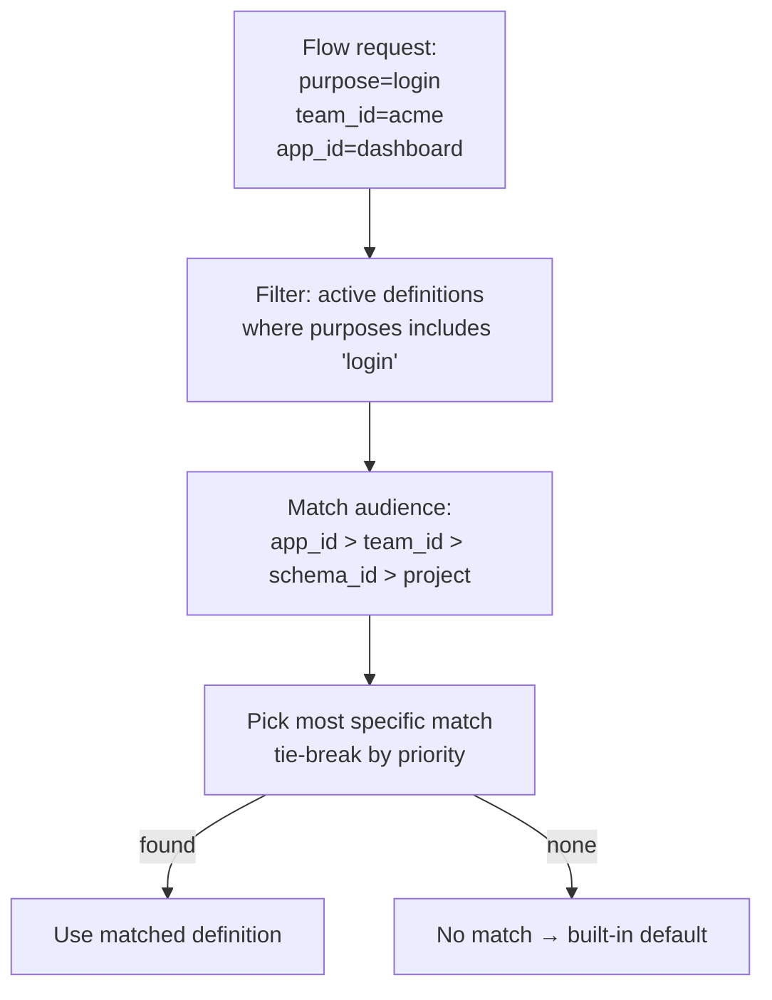
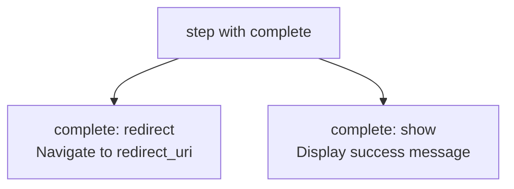
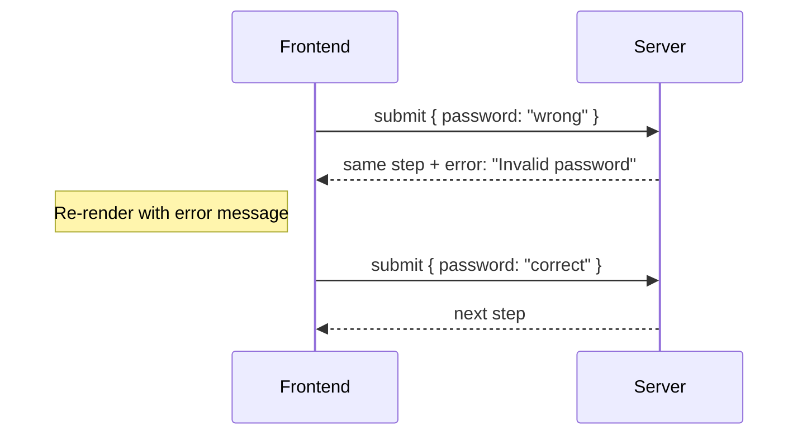
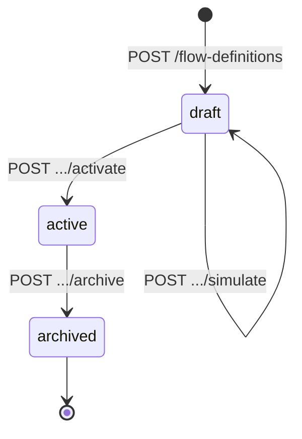

# Building Flows

> **Status:** Draft
> **Note:** The step response shape is [decided](flow-engine-nodes.md) — steps emit unordered capability dictionaries (`fields`, `actions`, `gates`) and a LiquidJS template controls layout.
>
> **Canonical OpenAPI spec:** [`api/openapi/openapi-spec.yaml`](../../../api/openapi/openapi-spec.yaml) — endpoints under `/flow`. Schemas in [`api/openapi/components/flows/`](../../../api/openapi/components/flows/).

The flow engine is a **server-side state machine** that produces **Capability payloads** alongside a **LiquidJS template**. It is used by web/frontend clients that want a ready-made login and registration experience. Clients that want full control skip it entirely and use the Session API directly.

This guide walks through how to build authentication flows from scratch. It starts with the simplest concepts and builds up to advanced patterns.

---

## What is a Flow?

A flow is a **server-driven conversation** between the backend and the frontend. The server tells the frontend what to show. The frontend renders it and sends back user input. The server decides what happens next.



The frontend is stateless. It doesn't know what step comes next, what fields are required, or what authentication methods are available. It renders what the server sends and posts back what the user provides.

---

## Anatomy of a Step

Every step the server returns has the same shape:

```json
{
  "session_id": "sess_1",
  "session_token": "tok_1",
  "step": {
    "name": "login",
    "texts": { "title_key": "login.title", "description_key": "login.description" },
    "error": null,
    "complete": null,
    "fields": { ... },
    "actions": { ... },
    "gates": { ... }
  }
}
```

| Field | What it is |
|---|---|
| `name` | Unique step identifier (from the flow definition) |
| `texts` | Localization keys for title and description |
| `error` | Error message from a failed previous submission (null if none) |
| `complete` | Only on terminal steps: `redirect` or `show` (null otherwise) |
| `fields` | Input fields to render — keyed by field name |
| `actions` | Things the user can do — keyed by action name |
| `gates` | Security gates that must be satisfied before submission |

**Fields** are resolved by the engine from the user schema:

```json
{ "type": "email", "text_key": "login.field.email", "required": true }
```

**Actions** are keyed by name in an unordered dictionary:

```json
{
  "submit": { "text_key": "login.action.submit", "primary": true },
  "register": { "text_key": "login.action.register" },
  "recover": { "text_key": "login.action.recover" }
}
```

Actions are **unordered capabilities**. The LiquidJS template decides where and how to render them — the server never controls visual positioning.

---

## The Frontend Rendering Pipeline

The `<zitadel-login>` orchestrator is a Lit Web Component that manages the entire rendering lifecycle. It does not contain hardcoded UI layouts. Instead, it delegates all visual rendering to a **LiquidJS template** that the backend provides alongside each step's capability payload.

### Rendering lifecycle


### What the orchestrator does

1. **Fetches capabilities** — calls the Flow API and receives the step payload (fields, actions, gates, branding).
2. **Selects the template** — uses `branding.liquid_template` if provided, otherwise falls back to the built-in `default.liquid`.
3. **Builds the Liquid context** — injects the capability dictionaries, identity info, and branding values as template variables.
4. **Renders the template** — LiquidJS parses the template string, resolves all `{{ }}` expressions and `` control flow, and outputs an HTML string.
5. **Mounts the HTML** — the orchestrator injects the rendered HTML into its Shadow DOM.
6. **Listens for events** — the atomic `<zl-*>` components self-register and dispatch native `CustomEvent`s (`zl-submit`, `zl-action`) when the user interacts.
7. **Submits and re-renders** — on user action, the orchestrator calls the Flow API with the collected data, receives the next step, and repeats from step 2.

### The Liquid context

The template receives the full step payload as its rendering context:

```javascript
// What the orchestrator passes to LiquidJS
{
  step: { name, texts, complete },
  fields: { email: { type, required, text_key } },
  actions: { submit: { primary, text_key }, recover: { text_key } },
  gates: { captcha: { provider, config } },
  sso_providers: [ { id, name, template } ],
  identity: { display_name, avatar_url },
  branding: { layout, font_url, logo_url },
  loading: false,
  errors: []
}
```

### Atomic components (`<zl-*>`)

Templates emit standard HTML containing Lit Web Components. These components are intentionally "dumb" — they handle rendering and user interaction only, with zero knowledge of the Flow API or backend structure.

| Component | Renders | Events emitted |
|---|---|---|
| `<zl-field>` | Labeled input with validation | `zl-input` (value change) |
| `<zl-submit>` | Primary button with loading spinner | `zl-submit` (click) |
| `<zl-action>` | Secondary/ghost button | `zl-action` (click with action name) |
| `<zl-sso-providers>` | Grid of branded SSO buttons | `zl-sso` (click with provider id) |
| `<zl-passkey>` | Invisible WebAuthn ceremony handler | `zl-passkey-result` (ceremony result) |
| `<zl-captcha>` | Proof-of-work / third-party challenge | `zl-captcha-solved` (solution token) |
| `<zl-error>` | Inline error message | — |

Because these are standard HTML Custom Elements, they work identically whether rendered by LiquidJS, written by hand, or generated by any other templating system.

### The `| t` translation filter

All human-readable text is resolved client-side. The backend sends `text_key` strings; the template pipes them through the `| t` filter:

```liquid
<!-- The filter looks up "login.field.email" in the active locale dictionary -->
<zl-field
  name="email"
  label="{{ fields.email.text_key | t }}"
  type="{{ fields.email.type }}"
></zl-field>

<!-- Interpolation: "Hi, {{displayName}}" becomes "Hi, Alice" -->
<p>{{ step.texts.description_key | t: identity.display_name }}</p>
```

The filter falls back to the raw key if no translation is found, making custom schema fields work without requiring frontend changes.

### The master template

The backend ships a single `default.liquid` that handles all layout variants via conditional logic:

```liquid

  <div class="layout-split">
    <div class="image-half" style="background-image: url('{{ branding.hero_url }}')"></div>
    <div class="form-half">
      
    </div>
  </div>

  <div class="layout-centered">
    
  </div>

```

Customers who want full control "eject" this template — the Zitadel Console copies the master template into a custom text field, the customer modifies it, and the backend serves their version instead. This bridges zero-configuration convenience (selecting "Split" from a dropdown) with absolute structural control (editing raw Liquid).

### The frontend loop (pseudocode)

```
response = POST /flows { purpose, auth_request_id }

loop:
  step = response.step

  if step.complete == "redirect":
    navigate(response.redirect_uri)
    return

  if step.complete == "show":
    // Render the step as a success screen via the Liquid template.
    // No further interaction needed.
    render(step)
    return

  // Render the step
  html = liquidEngine.render(step.branding.liquid_template, {
    step, fields, actions, gates, sso_providers, identity, branding
  })
  shadowRoot.innerHTML = html

  { action, data } = waitForCustomEvent()

  response = POST /flows/{session_id}/submit {
    session_token: response.session_token,
    action: action,
    data: data
  }
```

The frontend never decides what step comes next. It never checks what authentication is required. It parses the template, mounts the atoms, and submits.

---

## Security

See [Template Security Model](template-security.md) for XSS attack vectors, trust boundaries, and the defense-in-depth mitigation strategy for the LiquidJS + innerHTML rendering pipeline.

---

## Flow Definitions

A flow definition is a **directed graph of steps** backed by a **user schema**. You create it via the API and it becomes a reusable template.

### Simplest Possible Flow: Password Login



As a definition:

```json
{
  "slug": "simple-login",
  "name": "Simple Login",
  "user_schema": "human_user",
  "purposes": ["login"],
  "initial_steps": { "login": "login" },
  "steps": [
    {
      "name": "login",
      "fields": ["email", "password"],
      "transitions": {
        "submit": { "target": "done" }
      }
    },
    { "name": "done", "complete": "redirect" }
  ]
}
```

Key points:
- **`fields`** reference properties from the `human_user` schema. The engine resolves type, validation, and text keys at runtime.
- **`transitions`** define the edges of the graph — each maps an action name to a target step.
- The engine **implicitly evaluates assurance policy** after every submit. If the session meets the target ACR, it transitions to `complete`. If not, it follows the defined transition or injects additional steps dynamically.

---

## Schema-Driven Fields

Steps reference fields by name from the flow's user schema. The engine resolves all metadata at runtime:



The schema is the **single source of truth** for field metadata. Changing a field's label or validation in the schema automatically updates every flow that references it.

### Schema annotations drive engine behavior

Schema fields can have `x-*` annotations that tell the engine how to handle them:

| Annotation | Effect |
|---|---|
| `x-unique: "<scope>"` | Value must be unique at the given scope (`project` or `team`). A non-empty scope makes the field an identifier: the engine looks up the user on submit, which implies the `user_not_found` and `user_already_exists` outcomes in transitions. |
| `x-credential: "password"` | Engine verifies the credential via auth_attempt. |

This means the flow definition stays simple — field names only — while the engine derives all the complex behavior from the schema.

---

## Action Properties

Steps can declare server-side behavior directly as properties:

### `on_success` — server-side mutation

```json
{
  "name": "set_password",
  "fields": ["password"],
  "on_success": "create_user",
  "transitions": {
    "submit": { "target": "done" }
  }
}
```

The `on_success` mutation runs **after** the step succeeds (fields validated) and **before** the transition fires. Possible values:

| Action | What it does |
|---|---|
| `create_user` | Creates the user from accumulated schema data |
| `reset_credential` | Resets the password or other credential |

### `complete` — terminal step

```json
{ "name": "done", "complete": "redirect" }
```

A step with `complete` set is the terminal state. No fields, no actions, no transitions. The frontend checks `step.complete` to know the flow is done.

---

## Implicit Policy Evaluation

The engine evaluates assurance policy **after every submit** — no explicit policy check nodes in the definition.

After the user submits a step:
1. Engine validates fields and runs any `on_success` logic
2. Engine checks: does the session's `assurance_levels[]` meet the target ACR?
3. **If yes** → skip to `complete` (regardless of what the transition says)
4. **If no** → follow the defined transition, or inject a step dynamically if additional factors are needed

This means a simple two-step login (`login` → `done`) works for both single-factor and MFA — the engine handles the complexity invisibly.



---

## Purpose

Every flow starts with a **purpose** — what the user is trying to accomplish.

| Purpose | When | Typical starting step |
|---|---|---|
| `login` | OIDC auth request, direct login | identifier or combined |
| `register` | Self-service signup | profile fields |
| `recovery` | "Forgot password" link | identifier |
| `profiling` | Policy requires additional data | missing fields |
| `reauth` | Step-up auth needed | credential |
| `link_account` | Link external IdP to existing account | identifier |

A single flow definition can serve **multiple purposes** by declaring different entry points:

```json
{
  "slug": "combined-auth",
  "user_schema": "human_user",
  "purposes": ["login", "register"],
  "initial_steps": {
    "login": "identify",
    "register": "identify"
  },
  "steps": [ ... ]
}
```

Or you can have separate definitions for each purpose. The flow engine resolves which definition to use based on purpose + audience context.

---

## Audience and Resolution

When a flow starts, the server resolves which definition to use:



A definition's **audience** scopes where it applies:

```json
{
  "audience": {
    "team_ids": ["team_acme"],
    "app_ids": ["app_dashboard"],
    "schema_ids": ["human_user"]
  }
}
```

- `app_ids` is the most specific — a definition scoped to an app wins over one scoped to a team.
- An empty audience means "project default" — matches everything inside the project.
- Multiple definitions can coexist: one for `team_acme`, another for `team_globex`, a default for everyone else.

---

## Gates

Gates are security challenges that must be satisfied before a step can be submitted. Declare them on any step:

```json
{
  "name": "profile",
  "fields": ["email", "given_name", "family_name"],
  "gates": {
    "captcha": { "type": "captcha", "provider": "altcha" }
  },
  "transitions": {
    "submit": { "target": "set_password" }
  }
}
```

The engine resolves gate details (provider, config) at runtime. The frontend receives:

```json
{
  "gates": {
    "captcha": { "type": "captcha", "provider": "altcha", "config": { ... } }
  }
}
```

The engine can also **inject gates dynamically** based on policy (e.g., risk score triggers captcha even if the definition doesn't declare it).

---

## Cross-Flow Navigation (Pivot and Switch)

Users don't always follow a straight path. They might start logging in, click "Create account", register, then come back to complete login.

Transitions support two cross-flow actions:

| Action | Behavior |
|---|---|
| `pivot` | Push a new flow onto the stack. The current flow pauses and resumes when the new flow completes. |
| `switch` | Replace the current flow entirely. No return. |

```json
{
  "name": "login",
  "fields": ["email", "password"],
  "actions": {
    "submit": { "primary": true },
    "register": {},
    "recover": {}
  },
  "transitions": {
    "submit": { "target": "done" },
    "register": { "target": "default-register", "action": "switch" },
    "recover": { "target": "default-recovery", "action": "pivot" }
  }
}
```

- **`switch`** is for peer flows (login ↔ register). The user is choosing a different path.
- **`pivot`** is for supplementary flows (login → recovery → back to login). The user will return.

### What carries over

| Data | Preserved? | Why |
|---|---|---|
| Session | Yes | The session is the continuity primitive |
| Collected data (e.g., email) | Yes | Pre-fills forms in the new flow |
| Verified factors | Yes | Password verified during login attempt still counts |
| `auth_request_id` | Yes | After registration, the original OIDC request is still pending |
| Device fingerprint | Yes | Same browser, same risk profile |

---

## Flow Completion

A flow ends when it reaches a step with `complete` set:



| `complete` | When | Frontend action |
|---|---|---|
| `redirect` | Login/reauth with OIDC auth request | Navigate to `redirect_uri` |
| `show` | Standalone registration, recovery | Display success screen |

After a pivoted flow completes, the engine auto-pops back to the parent. If the session now meets the target ACR, it transitions straight to `complete` with `redirect`.

---

## Sessions and Flows

A session and a flow are different things with different lifetimes:


| | Session | Flow |
|---|---|---|
| **What it is** | Accumulated authentication factors | Orchestration state (current step, collected data) |
| **Lifetime** | Hours to days | Seconds to minutes |
| **Storage** | Configured dialect (SQLite / PostgreSQL / Spanner) | Encrypted cookie (ephemeral) |
| **One or many?** | One session can have many flows over time | Each flow operates on one session |
| **What it knows** | user, factors, assurance_levels | definition, step, history, collected data |

The session accumulates factors across flows. A login flow adds `user` + `password`. A step-up flow adds `totp`. A profiling flow doesn't add factors — it collects data. Each flow is independent, but they all contribute to the same session.

---

## Error Handling

When a submission fails, the server returns the **same step** with an `error` field:



The session token still rotates on error (prevents replay). The step doesn't advance. The frontend re-renders with the error message displayed.

```json
{
  "step": {
    "name": "signin",
    "error": "Invalid password. 2 attempts remaining.",
    "fields": {
      "password": { "type": "password", "text_key": "signin.field.password", "required": true }
    },
    "actions": {
      "submit": { "text_key": "signin.action.submit", "primary": true },
      "recover": { "text_key": "signin.action.recover" }
    },
    "gates": {}
  }
}
```

---

## Putting It All Together

Here's how two separate flow definitions connect via a cross-flow switch:


Two separate flow definitions, connected by a switch transition. The user can navigate between them. The session persists throughout, accumulating factors and collected data. The engine handles policy evaluation implicitly after every submit.

---

## Definition Lifecycle

Flow definitions go through a lifecycle before they're used in production:



| State | Can be resolved? | Can be edited? |
|---|---|---|
| `draft` | No | Yes |
| `active` | Yes | No (create a new draft to iterate) |
| `archived` | No | No |

Use **validate** to check for dead ends, missing transitions, and unreachable steps before activating. Use **simulate** to dry-run the flow with mock input and see the path the state machine would take.
