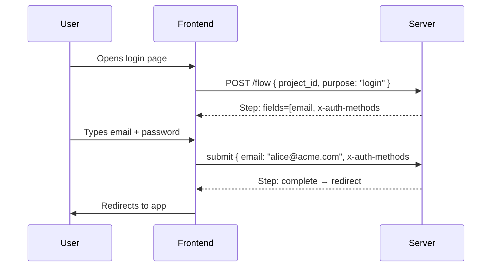
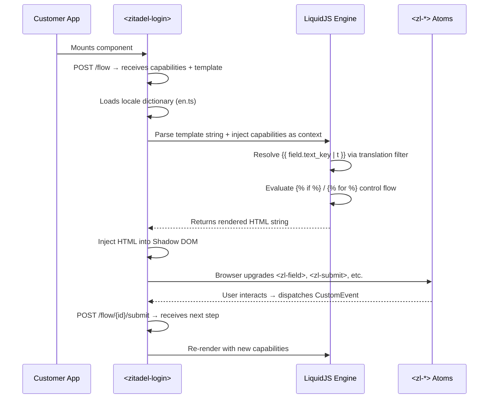
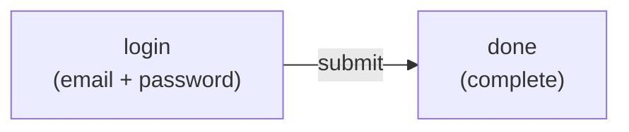
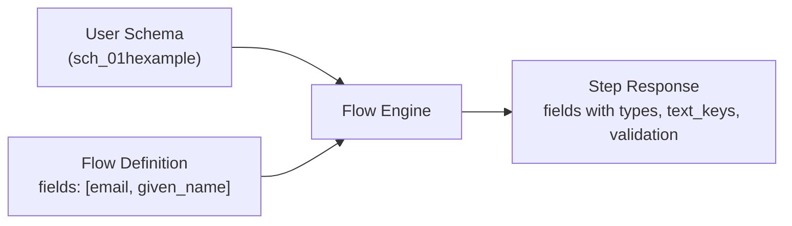
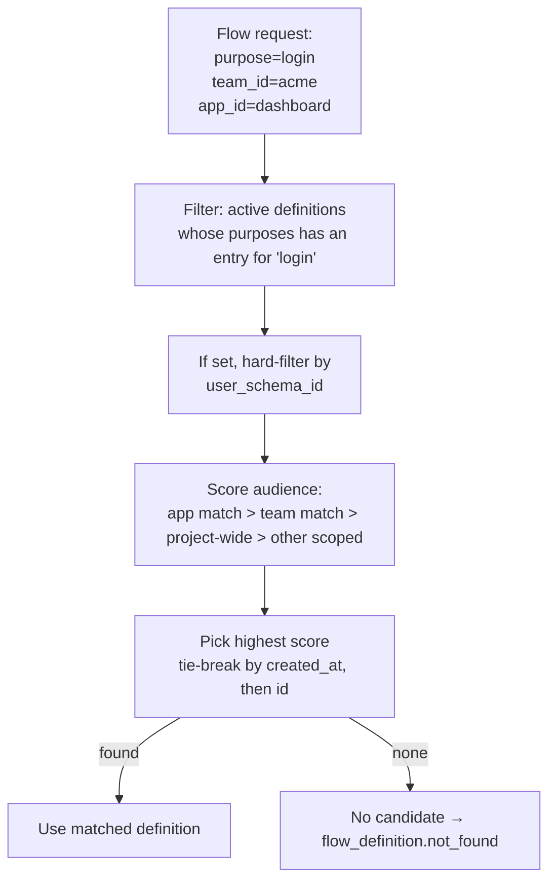
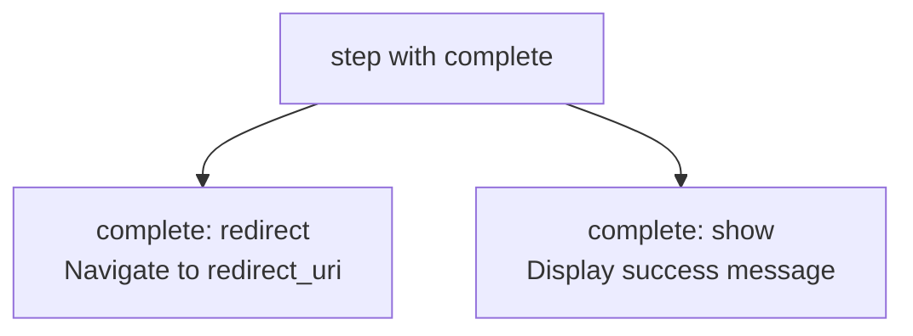
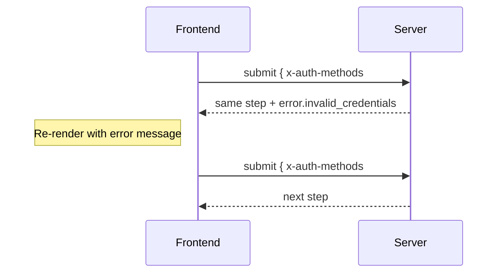
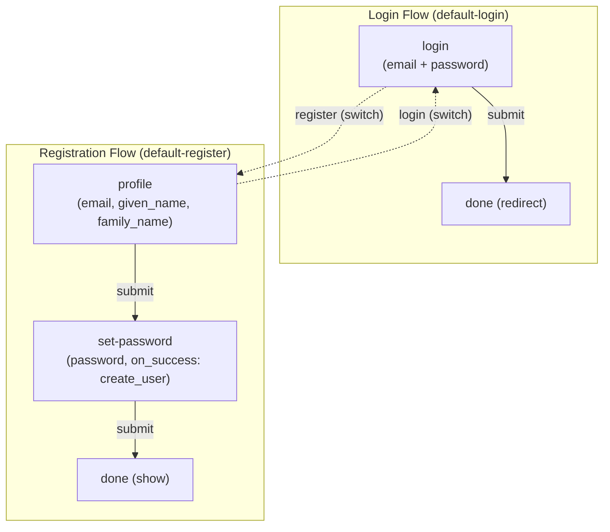

# Building Flows

> **Status:** Draft
> **Note:** The step response shape is [decided](flow-engine-nodes.md) — steps emit ordered capability arrays for `fields` and `actions` (entries carry a `name`, ADR 021), a keyed `gates` map, and a LiquidJS template controls layout.
>
> **Canonical OpenAPI spec:** [`api/openapi/openapi-spec.yaml`](../../../api/openapi/openapi-spec.yaml) — endpoints under `/flow`. Schemas in [`api/openapi/components/flows/`](../../../api/openapi/components/flows/).

The flow engine is a **server-side state machine** that produces **Capability payloads** alongside a **LiquidJS template**. It is used by web/frontend clients that want a ready-made login and registration experience. Clients that want full control skip it entirely and use the Session API directly.

This guide walks through how to build authentication flows from scratch. It starts with the simplest concepts and builds up to advanced patterns.

---

## What is a Flow?

A flow is a **server-driven conversation** between the backend and the frontend. The server tells the frontend what to show. The frontend renders it and sends back user input. The server decides what happens next.



The frontend is stateless. It doesn't know what step comes next, what fields are required, or what authentication methods are available. It renders what the server sends and posts back what the user provides.

---

## Anatomy of a Step

Every step the server returns has the same shape:

```json
{
  "id": "flow_1",
  "session_id": "sess_1",
  "step": {
    "name": "login",
    "texts": { "title_key": "login.title", "description_key": "login.description" },
    "error": null,
    "complete": null,
    "fields": [ ... ],
    "actions": [ ... ],
    "gates": { ... }
  }
}
```

| Field | What it is |
|---|---|
| `name` | Unique step identifier (from the flow definition) |
| `texts` | Localization keys for title and description |
| `error` | Error message from a failed previous submission (null if none) |
| `complete` | Only on terminal steps: `redirect` or `show` (null otherwise) |
| `fields` | Input fields to render — an ordered array; each entry carries `name` |
| `actions` | Things the user can do — an ordered array; each entry carries `name` and `kind` |
| `gates` | Reserved security-gate contract; always empty in today's runtime |

**Fields** are resolved by the engine from the user schema:

```json
{ "name": "email", "type": "email", "text_key": "login.field.email", "required": true }
```

**Actions** are an ordered array of `{name, kind, …}` entries:

```json
[
  { "name": "submit", "kind": "submit", "text_key": "login.action.submit", "primary": true },
  { "name": "register", "kind": "navigate", "text_key": "login.action.register" },
  { "name": "recover", "kind": "navigate", "text_key": "login.action.recover" }
]
```

The array order is a stable default, but the LiquidJS template owns layout — it iterates in order, reorders, or looks entries up by name (`where: "name"`).

---

## The Frontend Rendering Pipeline

The `<zitadel-login>` orchestrator is a Lit Web Component that manages the entire rendering lifecycle. It does not contain hardcoded UI layouts. Instead, it delegates all visual rendering to a **LiquidJS template** that the backend provides alongside each step's capability payload.

### Rendering lifecycle



### What the orchestrator does

1. **Fetches capabilities** — calls the Flow API and receives the step payload (fields, actions, gates, branding).
2. **Selects the template** — uses `branding.liquid_template` if provided, otherwise falls back to the built-in `default.liquid`.
3. **Builds the Liquid context** — injects the capability dictionaries, identity info, and branding values as template variables.
4. **Renders the template** — LiquidJS parses the template string, resolves all `{{ }}` expressions and `` control flow, and outputs an HTML string.
5. **Mounts the HTML** — the orchestrator injects the rendered HTML into its Shadow DOM.
6. **Listens for events** — the atomic `<zl-*>` components self-register and dispatch native `CustomEvent`s (`zl-submit`, `zl-action`) when the user interacts.
7. **Submits and re-renders** — on user action, the orchestrator calls the Flow API with the collected data, receives the next step, and repeats from step 2.

### The Liquid context

The template receives the full step payload as its rendering context:

```javascript
// What the orchestrator passes to LiquidJS
{
  step: { name, texts, complete },
  fields: [ { name, type, required, text_key } ],
  actions: [ { name, kind, primary, text_key } ],
  gates: { captcha: { provider, config } },
  sso_providers: [ { id, name, template } ],
  identity: { display_name, avatar_url },
  branding: { layout, font_url, logo_url },
  loading: false,
  errors: []
}
```

### Atomic components (`<zl-*>`)

Templates emit standard HTML containing Lit Web Components. These components are intentionally "dumb" — they handle rendering and user interaction only, with zero knowledge of the Flow API or backend structure.

| Component | Renders | Events emitted |
|---|---|---|
| `<zl-field>` | Labeled input with validation | `zl-input` (value change) |
| `<zl-submit>` | Primary button with loading spinner | `zl-submit` (click) |
| `<zl-action>` | Secondary/ghost button | `zl-action` (click with action name) |
| `<zl-sso-providers>` | Grid of branded SSO buttons | `zl-sso` (click with provider id) |
| `<zl-passkey>` | Invisible WebAuthn ceremony handler | `zl-passkey-result` (ceremony result) |
| `<zl-captcha>` | Proof-of-work / third-party challenge | `zl-captcha-solved` (solution token) |
| `<zl-error>` | Inline error message | — |

Because these are standard HTML Custom Elements, they work identically whether rendered by LiquidJS, written by hand, or generated by any other templating system.

### The `| t` translation filter

All human-readable text is resolved client-side. The backend sends `text_key` strings; the template pipes them through the `| t` filter:

```liquid
<!-- The filter looks up "login.field.email" in the active locale dictionary -->

<zl-field
  name="email"
  label="{{ email.text_key | t }}"
  type="{{ email.type }}"
></zl-field>

<!-- Interpolation: "Hi, {{displayName}}" becomes "Hi, Alice" -->
<p>{{ step.texts.description_key | t: identity.display_name }}</p>
```

The filter falls back to the raw key if no translation is found, making custom schema fields work without requiring frontend changes.

### The master template

The backend ships a single `default.liquid` that handles all layout variants via conditional logic:

```liquid

  <div class="layout-split">
    <div class="image-half" style="background-image: url('{{ branding.hero_url }}')"></div>
    <div class="form-half">
      
    </div>
  </div>

  <div class="layout-centered">
    
  </div>

```

Customers who want full control "eject" this template — the Zitadel Console copies the master template into a custom text field, the customer modifies it, and the backend serves their version instead. This bridges zero-configuration convenience (selecting "Split" from a dropdown) with absolute structural control (editing raw Liquid).

### The frontend loop (pseudocode)

```
response = POST /flow { project_id, purpose, auth_request_id }

loop:
  step = response.step

  if step.complete == "redirect":
    navigate(response.redirect_uri)
    return

  if step.complete == "show":
    // Render the step as a success screen via the Liquid template.
    // No further interaction needed.
    render(step)
    return

  // Render the step
  html = liquidEngine.render(step.branding.liquid_template, {
    step, fields, actions, gates, sso_providers, identity, branding
  })
  shadowRoot.innerHTML = html

  { action, fields } = waitForCustomEvent()

  response = POST /flow/{id}/submit {
    action: action,
    fields: fields
  }
```

The frontend never decides what step comes next. It never checks what authentication is required. It parses the template, mounts the atoms, and submits.

---

## Security

See [Template Security Model](template-security.md) for XSS attack vectors, trust boundaries, and the defense-in-depth mitigation strategy for the LiquidJS + innerHTML rendering pipeline.

---

## Flow Definitions

A flow definition is a **directed graph of steps** backed by a **user schema**. You create it via the API and it becomes a reusable template.

### Simplest Possible Flow: Password Login



As a definition:

```json
{
  "name": "simple-login",
  "status": "active",
  "user_schema": "sch_01hexample",
  "purposes": { "login": "login" },
  "steps": [
    {
      "name": "login",
      "fields": ["email", "x-auth-methods#password"],
      "actions": [
        {"name": "submit", "kind": "submit", "primary": true}
      ],
      "transitions": {
        "submit": { "target": "done" }
      }
    },
    { "name": "done", "complete": "redirect" }
  ]
}
```

Key points:
- **`fields`** reference properties from the definition's `user_schema` or reserved authentication-method fields such as `x-auth-methods#password`. The engine resolves type, validation, challenge behavior, and text keys at runtime.
- **`transitions`** define the edges of the graph — each maps an action name to a target step.
- Today's engine follows the authored transition after verifying the fields on the submitted step. Requested-ACR evaluation and dynamic step injection are planned.

---

## Schema-Driven Fields

Steps reference fields by name from the flow's user schema. The engine resolves all metadata at runtime:



The schema is the **single source of truth** for field metadata. Changing a field's label or validation in the schema automatically updates every flow that references it.

### Schema annotations and reserved fields drive engine behavior

Schema fields can have `x-*` annotations that tell the engine how to handle them:

| Marker | Effect |
|---|---|
| `x-unique: "<scope>"` | Value must be unique at the given scope (`project` or `team`). A non-empty scope makes the field an identifier: the engine looks up the user on submit, which implies the `user_not_found` and `user_already_exists` outcomes in transitions. |
| Step field `x-auth-methods#password` plus root `x-auth-methods.password.enabled: true` | Engine renders a password field and verifies the submitted credential via `auth_attempt`. |

Ordinary step fields name top-level user-schema properties. Credential fields
use the reserved `x-auth-methods#<method>` namespace; a top-level property named
`password` is only user data and does not trigger password verification.

---

## Action Properties

Steps can declare server-side behavior directly as properties:

### `on_success` — server-side mutation

```json
{
  "name": "set-password",
  "fields": ["x-auth-methods#password"],
  "on_success": "create_user",
  "actions": [
    {"name": "submit", "kind": "submit", "primary": true}
  ],
  "transitions": {
    "submit": { "target": "done" }
  }
}
```

The `on_success` mutation runs **after** the step succeeds (fields validated) and **before** the transition fires. Possible values:

| Value | What it does |
|---|---|
| `create_user` | Creates the user from accumulated schema data. The only value in the shipped schema. |
| `reset_credential` | Direction for recovery flows — not in the shipped schema. |

### `complete` — terminal step

```json
{ "name": "done", "complete": "redirect" }
```

A step with `complete` set is the terminal state. No fields, no actions, no transitions. The frontend checks `step.complete` to know the flow is done.

---

## Planned Policy Evaluation

Implicit assurance-policy evaluation is design direction, not shipped
behavior. Today the engine verifies the challenges declared by the current
step and then follows that step's authored transition. It does not compare the
session with a requested ACR, skip transitions, or inject MFA steps.

Until a policy evaluator populates required checks, a definition must model
every required authentication step explicitly. Reaching a step with
`complete` means only that the authored graph reached that terminal step; it
is not evidence that an ACR policy was evaluated.

---

## Purpose

Every flow starts with a **purpose** — what the user is trying to accomplish.

| Purpose | When | Typical starting step |
|---|---|---|
| `login` | OIDC auth request, direct login | identifier or combined |
| `register` | Self-service signup | profile fields |
| `recovery` | "Forgot password" link | identifier |
| `profiling` | Policy requires additional data | missing fields |
| `reauth` | Step-up auth needed | credential |
| `link_account` | Link external IdP to existing account | identifier |

A single flow definition can serve **multiple purposes** by declaring different entry points:

```json
{
  "name": "combined-auth",
  "status": "active",
  "user_schema": "sch_01hexample",
  "purposes": {
    "login": "identify",
    "register": "identify"
  },
  "steps": [ ... ]
}
```

Or you can have separate definitions for each purpose. The flow engine resolves which definition to use based on purpose + audience context.

---

## Audience and Resolution

When a flow starts, the server resolves which definition to use:



A definition's **audience** scopes where it applies:

```json
{
  "audience": {
    "team_ids": ["team_acme"],
    "app_ids": ["app_dashboard"]
  }
}
```

- A matching `app_id` is the most specific, followed by a matching `team_id`, then a project-wide definition.
- An empty audience means "project default" — matches everything inside the project.
- Equal scores prefer the newest `created_at`, then the highest ID; there is no `priority` field.
- Audience hints are routing suggestions, not a security boundary. If no matching or project-wide definition exists, a definition scoped to another app or team can still be selected at the lowest score.
- Project creation persists the shipped default definition normally; the resolver does not synthesize a fallback when no candidate exists.

---

## Gates

> **Direction — not runtime-supported.** The definition schema accepts gates,
> but today's engine emits `gates: {}`, accepts a normal submission without a
> proof, and rejects a non-empty `gate_proofs` map with `flow.unsupported`.
> Do not rely on gates for CAPTCHA or other security enforcement yet.

The planned contract declares a keyed gate on a step:

```json
{
  "name": "profile",
  "fields": ["email", "given_name", "family_name"],
  "gates": {
    "captcha": { "kind": "captcha", "provider": "altcha" }
  },
  "actions": [
    {"name": "submit", "kind": "submit", "primary": true}
  ],
  "transitions": {
    "submit": { "target": "set-password" }
  }
}
```

When gate support ships, the engine is intended to resolve provider details
and emit them to the frontend. Today the frontend receives:

```json
{
  "gates": {}
}
```

Proof verification and dynamic gate injection remain planned work.

---

## Cross-Flow Navigation (Pivot and Switch)

Users don't always follow a straight path. They might start logging in, click "Create account", register, then come back to complete login.

Transitions support two cross-flow actions:

| Action | Behavior |
|---|---|
| `pivot` | Push a new flow onto the stack. The current flow pauses and resumes when the new flow completes. |
| `switch` | Replace the current flow entirely. No return. |

> **Direction — not runtime-supported.** The schema and validator accept these,
> but today's engine rejects every transition carrying a non-null `action` with
> `{ "code": "flow.unsupported" }` — see
> [flow-engine.md](flow-engine.md#flow-pivot-cross-flow-navigation) and
> [capabilities.md](capabilities.md). The shipped default flow covers
> login ↔ register inside one definition with local re-purposing transitions
> (`{ "target": "register", "purpose": "register" }`).

```json
{
  "name": "login",
  "fields": ["email", "x-auth-methods#password"],
  "actions": [
    {"name": "submit", "primary": true, "kind": "submit"},
    {"name": "register", "kind": "navigate"},
    {"name": "recover", "kind": "navigate"}
  ],
  "transitions": {
    "submit": { "target": "done" },
    "register": { "target": "default-register", "action": "switch" },
    "recover": { "target": "default-recovery", "action": "pivot" }
  }
}
```

- **`switch`** is for peer flows (login ↔ register). The user is choosing a different path.
- **`pivot`** is for supplementary flows (login → recovery → back to login). The user will return.

### What carries over

| Data | Preserved? | Why |
|---|---|---|
| Session | Yes | The session is the continuity primitive |
| Collected data (e.g., email) | Yes | Pre-fills forms in the new flow |
| Verified factors | Yes | Password verified during login attempt still counts |
| `auth_request_id` | Yes | After registration, the original OIDC request is still pending |
| Device fingerprint | Yes | Same browser, same risk profile |

---

## Flow Completion

A flow ends when it reaches a step with `complete` set:



| `complete` | When | Frontend action |
|---|---|---|
| `redirect` | Login/reauth with OIDC auth request | Navigate to `redirect_uri` |
| `show` | Standalone registration, recovery | Display success screen |

Automatic pop-and-resume after a pivot and requested-ACR evaluation are
planned. Today's runtime rejects the cross-flow transition before entering the
child definition; ordinary local transitions reach `complete` exactly as
authored.

---

## Sessions and Flows

A session and a flow are different things with different lifetimes:


| | Session | Flow |
|---|---|---|
| **What it is** | Accumulated authentication factors | Orchestration state (current step, collected data) |
| **Lifetime** | Hours to days | Seconds to minutes |
| **Storage** | Configured dialect (SQLite / PostgreSQL / Spanner) | Encrypted cookie (ephemeral) |
| **One or many?** | One session can have many flows over time | Each flow operates on one session |
| **What it knows** | user, factors, assurance_levels | definition, step, history, collected data |

The shipped password and passkey paths record verified factors on the
flow-linked authentication attempt, and terminal handoff transfers the result
to the session. Additional methods such as TOTP and cross-flow factor
accumulation are planned.

---

## Error Handling

When a submission fails, the server returns the **same step** with an `error` field:



The sealed `_zflow` cookie rotates on error to prevent replay. The response
body does not contain a rotating `session_token`. The step does not advance,
and the frontend localizes the returned error key before re-rendering.

```json
{
  "step": {
    "name": "signin",
    "error": "error.invalid_credentials",
    "fields": [
      {"name": "x-auth-methods#password", "type": "password", "text_key": "signin.field.password", "required": true}
    ],
    "actions": [
      {"name": "submit", "text_key": "signin.action.submit", "primary": true, "kind": "submit"},
      {"name": "recover", "text_key": "signin.action.recover", "kind": "navigate"}
    ],
    "gates": {}
  }
}
```

---

## Putting It All Together

Here's how two separate flow definitions connect via a cross-flow switch
(direction — today's runtime rejects cross-flow transitions; see
[Cross-Flow Navigation](#cross-flow-navigation-pivot-and-switch)):



This diagram is direction for the planned cross-flow implementation. Today's
shipped default keeps login and registration inside one definition with local
re-purposing transitions, and follows the authored graph without implicit
policy evaluation.

---

## Definition Lifecycle

The shipped schema defines two statuses:

| Status | Can be resolved? | How to change |
|---|---|---|
| `draft` | No — never selected for new flows | Publish a new revision with `POST /flow_definitions` |
| `active` | Yes | Publish a new revision with `POST /flow_definitions` |

A revision is immutable and its `status` is fixed at creation. There are no
lifecycle verbs in the shipped spec — you change a flow by publishing a new
revision under the same `name`, and create already runs the definition
validator. A standalone `POST .../validate` (dead-end and reachability checks
on demand) and `POST .../simulate` (dry-run with mock input) are planned, not
shipped — see [flow-engine.md](flow-engine.md#flow-definitions).
