# Building Flows

> **Status:** Draft
> **Note:** The step response shape is [decided](flow-engine-nodes.md) — steps emit unordered capability dictionaries (`fields`, `actions`, `gates`) and a LiquidJS template controls layout.
>
> **Canonical OpenAPI spec:** [`api/openapi/openapi-spec.yaml`](../../../api/openapi/openapi-spec.yaml) — endpoints under `/flow`. Schemas in [`api/openapi/components/flows/`](../../../api/openapi/components/flows/).

The flow engine is a **server-side state machine** that produces **Capability payloads** alongside a **LiquidJS template**. It is used by web/frontend clients that want a ready-made login and registration experience. Clients that want full control skip it entirely and use the Session API directly.

This guide walks through how to build authentication flows from scratch. It starts with the simplest concepts and builds up to advanced patterns.

---

## What is a Flow?

A flow is a **server-driven conversation** between the backend and the frontend. The server tells the frontend what to show. The frontend renders it and sends back user input. The server decides what happens next.

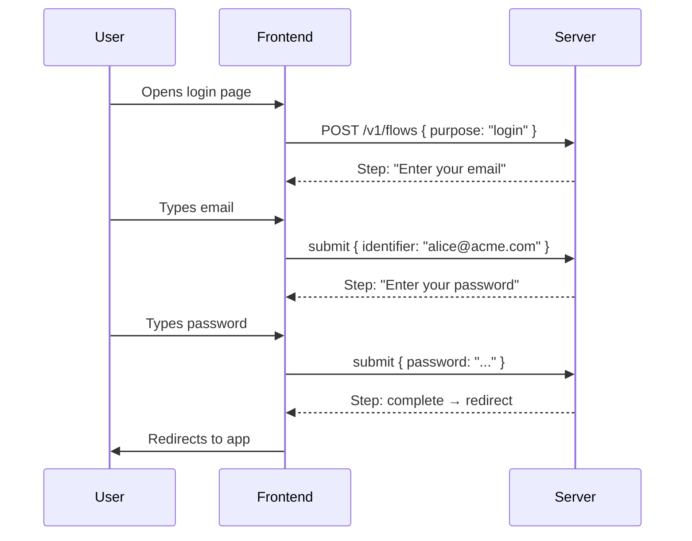

The frontend is stateless. It doesn't know what step comes next, what fields are required, or what authentication methods are available. It renders what the server sends and posts back what the user provides.

---

## Anatomy of a Step

Every step the server returns has the same shape:

```json
{
  "session_id": "sess_1",
  "session_token": "tok_1",
  "step": {
    "name": "identifier",
    "type": "identifier",
    "label": "Sign in",
    "description": "Enter your email to continue",
    "error": null,
    "behavior": null,
    "fields": [ ... ],
    "actions": [ ... ]
  }
}
```

| Field | What it is |
|---|---|
| `name` | Unique step identifier (from the flow definition) |
| `type` | What kind of step (identifier, credential, form, complete, ...) |
| `label` | Heading to display |
| `description` | Optional explanatory text |
| `error` | Error message from a failed previous submission (null if none) |
| `behavior` | Only on `complete` steps: `redirect`, `show`, or `continue` (null otherwise) |
| `fields` | Input fields to render (email, password, OTP code, ...) |
| `actions` | Things the user can do (submit, SSO, passkey, navigation links) |

**Fields** are always uniform — the frontend renders them as form inputs:

```json
{ "name": "email", "label": "Email", "type": "email", "required": true }
```

**Actions** have a `kind` that tells the frontend how to render them:

```json
{ "kind": "submit",  "name": "submit",   "label": "Continue", "primary": true }
{ "kind": "sso",     "name": "google",   "label": "Continue with Google", "provider": "google" }
{ "kind": "passkey", "name": "passkey",  "label": "Sign in with passkey" }
{ "kind": "link",    "name": "register", "label": "Create account" }
```

Actions are **unordered capabilities**. The LiquidJS template decides where and how to render them — the server never controls visual positioning.

---

## The Frontend Rendering Pipeline

The `<zitadel-login>` orchestrator is a Lit Web Component that manages the entire rendering lifecycle. It does not contain hardcoded UI layouts. Instead, it delegates all visual rendering to a **LiquidJS template** that the backend provides alongside each step's capability payload.

### Rendering lifecycle


### What the orchestrator does

1. **Fetches capabilities** — calls the Flow API and receives the step payload (fields, actions, gates, branding).
2. **Selects the template** — uses `branding.liquid_template` if provided, otherwise falls back to the built-in `default.liquid`.
3. **Builds the Liquid context** — injects the capability dictionaries, identity info, and branding values as template variables.
4. **Renders the template** — LiquidJS parses the template string, resolves all `{{ }}` expressions and `` control flow, and outputs an HTML string.
5. **Mounts the HTML** — the orchestrator injects the rendered HTML into its Shadow DOM.
6. **Listens for events** — the atomic `<zl-*>` components self-register and dispatch native `CustomEvent`s (`zl-submit`, `zl-action`) when the user interacts.
7. **Submits and re-renders** — on user action, the orchestrator calls the Flow API with the collected data, receives the next step, and repeats from step 2.

### The Liquid context

The template receives the full step payload as its rendering context:

```javascript
// What the orchestrator passes to LiquidJS
{
  step: { name, type, texts },
  fields: { identifier: { type, required, text_key } },
  actions: { submit: { primary, text_key }, passkey: { text_key } },
  gates: { captcha: { provider, config } },
  sso_providers: [ { id, name, template } ],
  identity: { display_name, avatar_url },
  branding: { layout, font_url, logo_url },
  loading: false,
  errors: []
}
```

### Atomic components (`<zl-*>`)

Templates emit standard HTML containing Lit Web Components. These components are intentionally "dumb" — they handle rendering and user interaction only, with zero knowledge of the Flow API or backend structure.

| Component | Renders | Events emitted |
|---|---|---|
| `<zl-field>` | Labeled input with validation | `zl-input` (value change) |
| `<zl-submit>` | Primary button with loading spinner | `zl-submit` (click) |
| `<zl-action>` | Secondary/ghost button | `zl-action` (click with action name) |
| `<zl-sso-providers>` | Grid of branded SSO buttons | `zl-sso` (click with provider id) |
| `<zl-passkey>` | Invisible WebAuthn ceremony handler | `zl-passkey-result` (ceremony result) |
| `<zl-captcha>` | Proof-of-work / third-party challenge | `zl-captcha-solved` (solution token) |
| `<zl-error>` | Inline error message | — |

Because these are standard HTML Custom Elements, they work identically whether rendered by LiquidJS, written by hand, or generated by any other templating system.

### The `| t` translation filter

All human-readable text is resolved client-side. The backend sends `text_key` strings; the template pipes them through the `| t` filter:

```liquid
<!-- The filter looks up "identifier.field.email" in the active locale dictionary -->
<zl-field
  name="identifier"
  label="{{ fields.identifier.text_key | t }}"
  type="{{ fields.identifier.type }}"
></zl-field>

<!-- Interpolation: "Hi, {{displayName}}" becomes "Hi, Alice" -->
<p>{{ step.texts.description_key | t: identity.display_name }}</p>
```

The filter falls back to the raw key if no translation is found, making custom schema fields work without requiring frontend changes.

### The master template

The backend ships a single `default.liquid` that handles all layout variants via conditional logic:

```liquid

  <div class="layout-split">
    <div class="image-half" style="background-image: url('{{ branding.hero_url }}')"></div>
    <div class="form-half">
      
    </div>
  </div>

  <div class="layout-centered">
    
  </div>

```

Customers who want full control "eject" this template — the Zitadel Console copies the master template into a custom text field, the customer modifies it, and the backend serves their version instead. This bridges zero-configuration convenience (selecting "Split" from a dropdown) with absolute structural control (editing raw Liquid).

### The frontend loop (pseudocode)

```
response = POST /v1/flows { purpose, auth_request_id }

loop:
  step = response.step

  if step.type == "complete" and step.behavior == "redirect":
    navigate(response.redirect_uri)
    return

  if step.type == "complete" and step.behavior == "continue":
    // Server already auto-pivoted (e.g. registration done → back to login).
    // Fetch the next step from the already-advanced state machine.
    response = GET /v1/flows/{session_id}
    continue

  // Render the step — including "complete" steps with behavior "show",
  // which simply render a success screen via the Liquid template.
  html = liquidEngine.render(step.branding.liquid_template, {
    step, fields, actions, gates, sso_providers, identity, branding
  })
  shadowRoot.innerHTML = html

  { action, data } = waitForCustomEvent()

  response = POST /v1/flows/{session_id}/submit {
    session_token: response.session_token,
    action: action,
    data: data
  }
```

The frontend never decides what step comes next. It never checks what authentication is required. It parses the template, mounts the atoms, and submits.

---

## Security

See [Template Security Model](template-security.md) for XSS attack vectors, trust boundaries, and the defense-in-depth mitigation strategy for the LiquidJS + innerHTML rendering pipeline.

---

## Flow Definitions

A flow definition is a **directed graph of steps**. You create it via the API and it becomes a reusable template.

### Simplest Possible Flow: Password Login

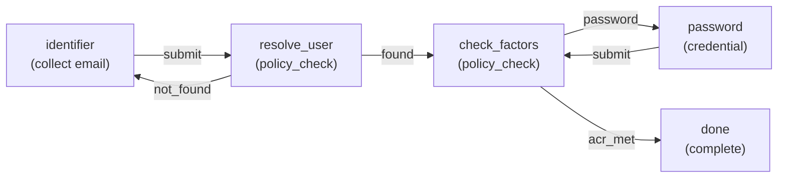

As a definition:

```json
{
  "name": "Simple Login",
  "purposes": ["login"],
  "initial_steps": { "login": "identifier" },
  "steps": [
    {
      "name": "identifier",
      "type": "identifier",
      "transitions": { "submit": "resolve_user" }
    },
    {
      "name": "resolve_user",
      "type": "policy_check",
      "config": { "check": "resolve_user" },
      "transitions": { "found": "check_factors", "not_found": "identifier" }
    },
    {
      "name": "check_factors",
      "type": "policy_check",
      "config": { "check": "required_factors" },
      "transitions": { "password": "password", "acr_met": "done" }
    },
    {
      "name": "password",
      "type": "credential",
      "config": { "factor": "password" },
      "transitions": { "submit": "check_factors" }
    },
    {
      "name": "done",
      "type": "complete",
      "config": { "behavior": "redirect" }
    }
  ]
}
```

Key points:
- **Steps** define what the user sees (or what the server does invisibly).
- **Transitions** define the edges of the graph — which step follows which action.
- **`policy_check`** steps are invisible. The server evaluates a condition and follows one of the transitions automatically. The frontend never sees them.

---

## Step Types

Steps fall into two categories: **visible** (the user sees them) and **invisible** (the server handles them automatically).

### Visible Steps (user sees these)

| Type | Purpose |
|---|---|
| `identifier` | Collect email, phone, or username |
| `credential` | Verify password, OTP, passkey |
| `form` | Collect profile fields from user schema |
| `verification` | Verify email or phone via code |
| `consent` | Show terms, accept/decline |
| `captcha` | Proof-of-work or third-party challenge |
| `info` | Display information |
| `complete` | Terminal — flow is done |

### Invisible Steps (server auto-transitions)

| Type | Purpose |
|---|---|
| `policy_check` | Evaluate a condition and pick a transition |
| `action` | Create user, link account, reset password |

The frontend never renders invisible steps. When the server hits a `policy_check`, it evaluates the condition and follows the appropriate transition immediately. The response the frontend receives is always the next **visible** step.

This means a single submit can skip through multiple invisible steps:

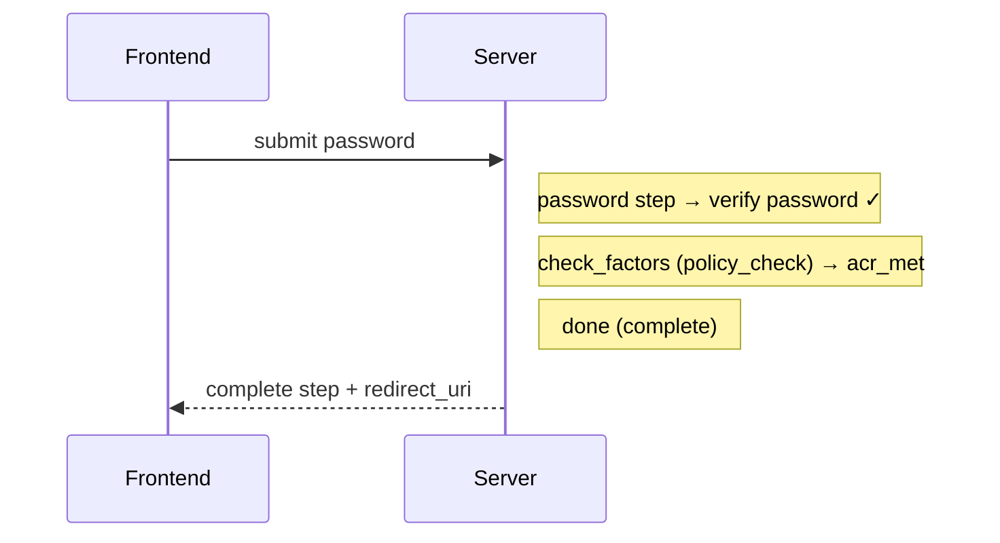

---

## Purpose

Every flow starts with a **purpose** — what the user is trying to accomplish.

| Purpose | When | Typical starting step |
|---|---|---|
| `login` | OIDC auth request, direct login | `identifier` |
| `register` | Self-service signup | `form` (profile fields) |
| `recovery` | "Forgot password" link | `identifier` or `verification` |
| `profiling` | Policy requires additional data | `form` (missing fields) |
| `reauth` | Step-up auth needed | `credential` |
| `link_account` | Link external IdP to existing account | `identifier` |

A single flow definition can serve **multiple purposes** by declaring different entry points:

```json
{
  "purposes": ["login", "register"],
  "initial_steps": {
    "login": "identifier",
    "register": "profile"
  },
  "steps": [ ... ]
}
```

Or you can have separate definitions for each purpose. The flow engine resolves which definition to use based on purpose + audience context.

---

## Audience and Resolution

When a flow starts, the server resolves which definition to use:

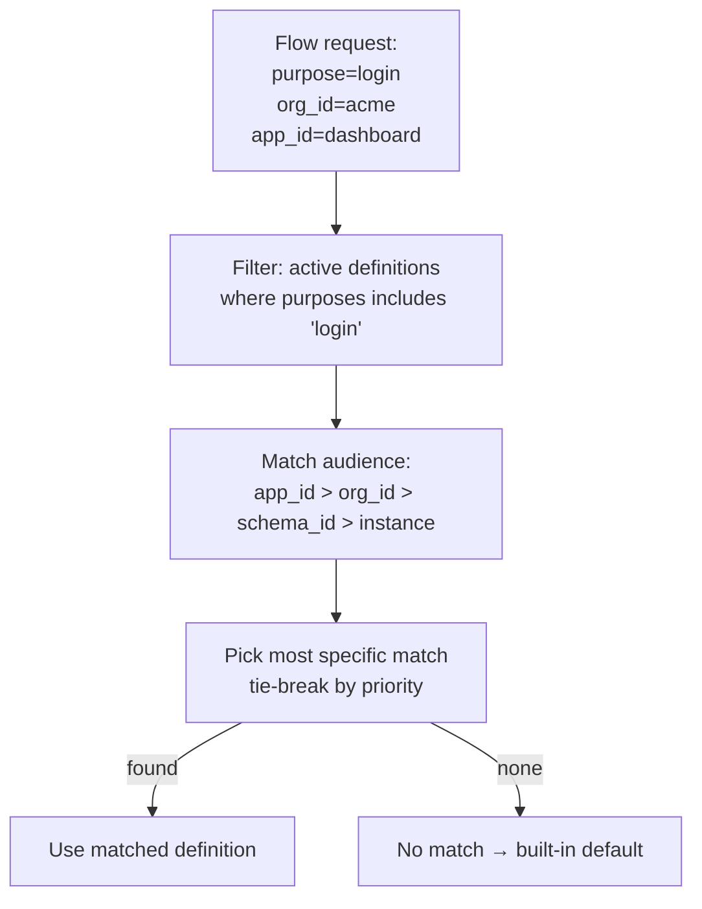

A definition's **audience** scopes where it applies:

```json
{
  "audience": {
    "org_ids": ["org_acme"],
    "app_ids": ["app_dashboard"],
    "schema_ids": ["human_user"]
  }
}
```

- `app_ids` is the most specific — a definition scoped to an app wins over one scoped to an org.
- An empty audience means "instance default" — matches everything.
- Multiple definitions can coexist: one for `org_acme`, another for `org_globex`, a default for everyone else.

---

## Form Steps and User Schemas

`form` steps collect structured data from the user. Instead of hardcoding fields, they reference a **user schema**:

```json
{
  "name": "profile",
  "type": "form",
  "config": {
    "schema": "human_user",
    "fields": ["email", "given_name", "family_name"]
  },
  "transitions": { "submit": "set_password" }
}
```

At runtime, the flow engine reads the schema, looks up each field's type, title, validation rules, and annotations, and generates the step response:

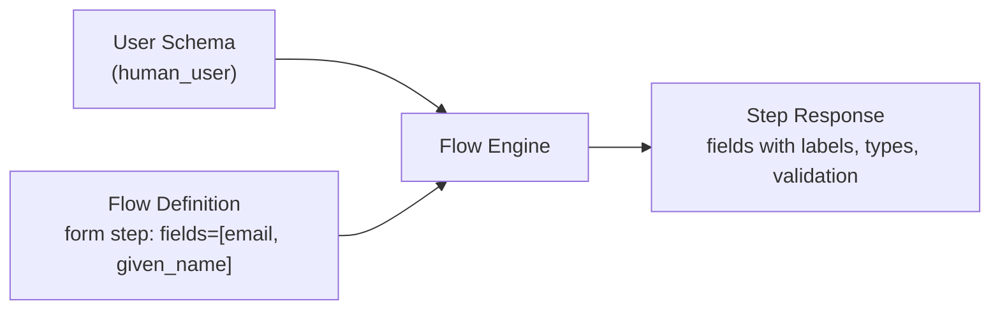

The schema is the **single source of truth** for field metadata. Changing a field's label or validation in the schema automatically updates every flow that references it.

Multi-step registration spreads fields across multiple form steps. The flow engine accumulates values in the encrypted cookie. On the final `action` step, it merges everything and creates the user.

---

## Policy Checks

`policy_check` steps are the **decision points** of the graph. They evaluate a condition and follow one of their transitions.

### Common policy checks

**`resolve_user`** — looks up the user by identifier:

```json
{
  "name": "resolve_user",
  "type": "policy_check",
  "config": { "check": "resolve_user" },
  "transitions": {
    "found": "check_factors",
    "not_found": "identifier"
  }
}
```

**`required_factors`** — evaluates what the session needs to reach the target ACR:

```json
{
  "name": "check_factors",
  "type": "policy_check",
  "config": { "check": "required_factors" },
  "transitions": {
    "password": "password",
    "passkey": "passkey",
    "otp": "otp",
    "acr_met": "done"
  }
}
```

The policy engine decides which transition to follow. If the session already has `password` but needs a second factor, it might follow `otp`. If the session has `passkey` (which satisfies AAL2 on its own), it follows `acr_met`.

### Step injection

The policy engine can also **inject steps** that aren't in the definition. For example, if a suspicious request triggers captcha:

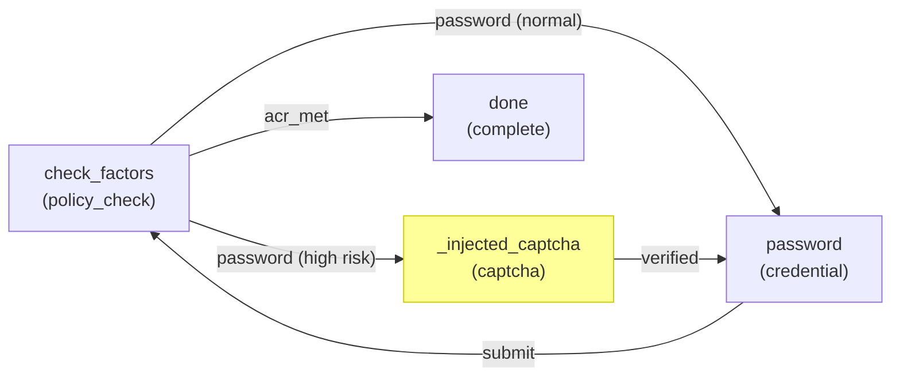

The injected captcha step doesn't exist in the flow definition. It appears dynamically when policy demands it, then transitions back into the normal graph.

---

## Flow Pivot

Users don't always follow a straight path. They might start logging in, click "Create account", register, then come back to complete login. This is a **pivot** — the flow switches purpose while keeping the same session.

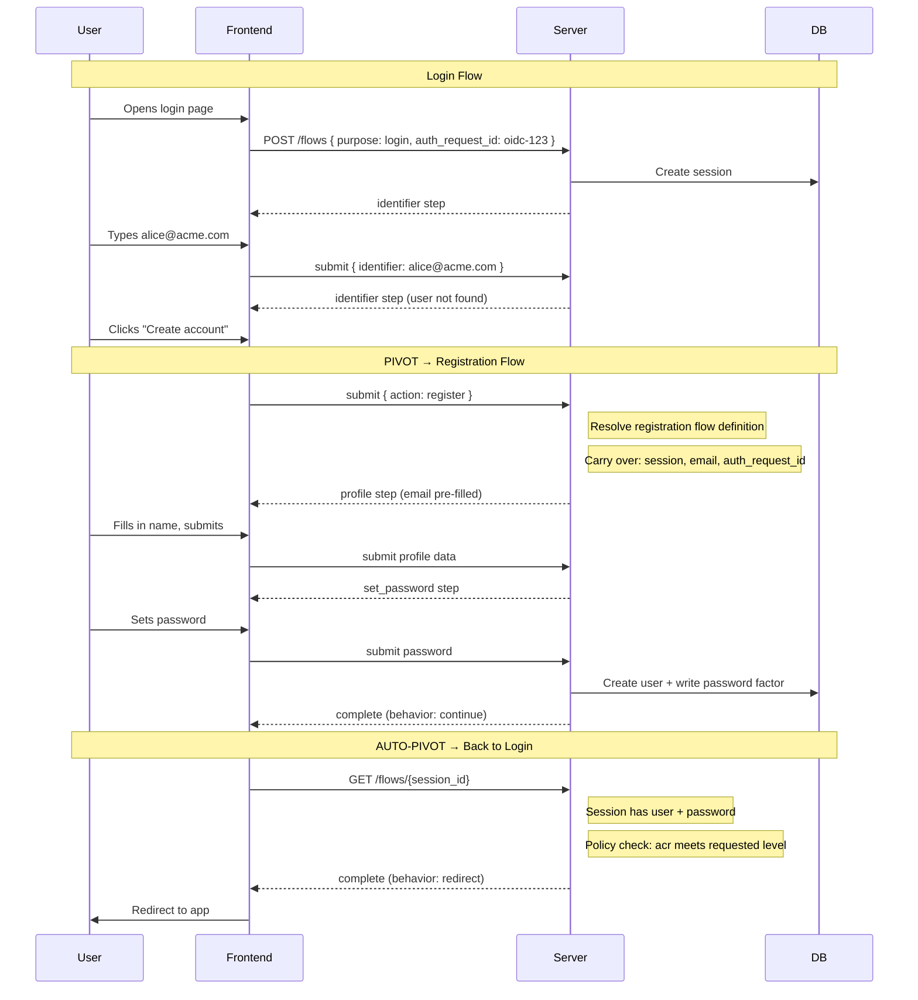

### How to enable pivots

Pivots are declared in transitions using the `pivot` keyword:

```json
{
  "name": "identifier",
  "type": "identifier",
  "transitions": {
    "submit": "resolve_user",
    "register": { "pivot": "register" },
    "recover": { "pivot": "recovery" }
  }
}
```

A `{ "pivot": "register" }` transition tells the flow engine: "resolve a new flow definition for purpose `register`, using the same audience context."

### What carries over

| Data | Preserved? | Why |
|---|---|---|
| Session | Yes | The session is the continuity primitive |
| Collected data (e.g., email) | Yes | Pre-fills forms in the new flow |
| Verified factors | Yes | Password verified during login attempt still counts |
| `auth_request_id` | Yes | After registration, the original OIDC request is still pending |
| Device fingerprint | Yes | Same browser, same risk profile |

### What resets

| Data | Resets? | Why |
|---|---|---|
| Flow definition | New one resolved | Different purpose may use a different definition |
| Current step | New initial step | Starts at `initial_steps[new_purpose]` |
| Step history | Appended | Previous history preserved for "back" navigation |

---

## Flow Completion

A flow ends when it reaches a `complete` step. The `behavior` field tells the frontend what to do:

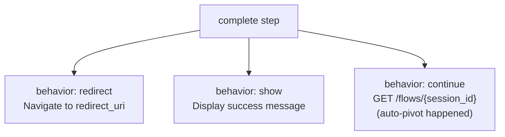

| `behavior` | When | Frontend action |
|---|---|---|
| `redirect` | Login/reauth with OIDC auth request | Navigate to `redirect_uri` |
| `show` | Standalone registration, recovery | Display `label` as success screen |
| `continue` | Registration with pending auth request | Call `GET /flows/{session_id}` for next step |

`continue` means the server already auto-pivoted back to a pending purpose (e.g., back to login after registration). The frontend just needs to fetch the next step.

---

## Sessions and Flows

A session and a flow are different things with different lifetimes:


| | Session | Flow |
|---|---|---|
| **What it is** | Accumulated authentication factors | Orchestration state (current step, collected data) |
| **Lifetime** | Hours to days | Seconds to minutes |
| **Storage** | Postgres (durable) | Encrypted cookie (ephemeral) |
| **One or many?** | One session can have many flows over time | Each flow operates on one session |
| **What it knows** | user, factors, acr, amr | definition, step, history, collected data |

The session accumulates factors across flows. A login flow adds `user` + `password`. A step-up flow adds `totp`. A profiling flow doesn't add factors — it collects data. Each flow is independent, but they all contribute to the same session.

---

## Error Handling

When a submission fails, the server returns the **same step** with an `error` field:

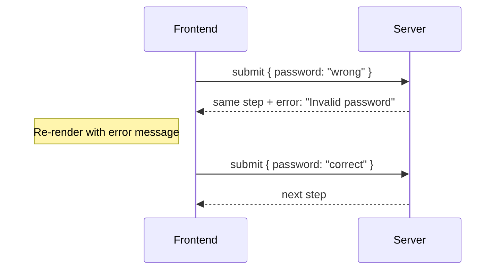

The session token still rotates on error (prevents replay). The step doesn't advance. The frontend re-renders with the error message displayed.

```json
{
  "step": {
    "name": "password",
    "type": "credential",
    "label": "Enter your password",
    "error": "Invalid password. 2 attempts remaining.",
    "fields": [ ... ],
    "actions": [ ... ]
  }
}
```

---

## Putting It All Together

Here's a complete flow definition that handles login, registration, and recovery — using pivots to connect them:

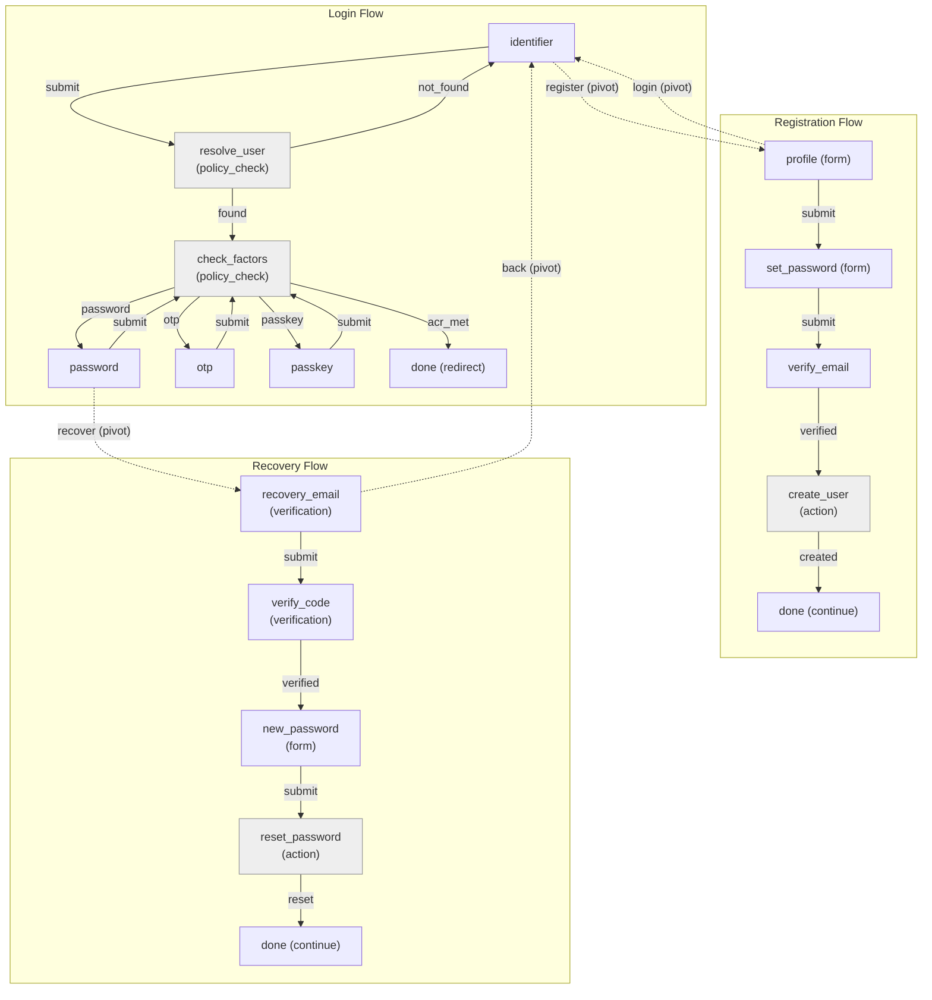

Three separate flow definitions, connected by pivots. The user can navigate freely between them. The session persists throughout, accumulating factors and collected data.

---

## Definition Lifecycle

Flow definitions go through a lifecycle before they're used in production:

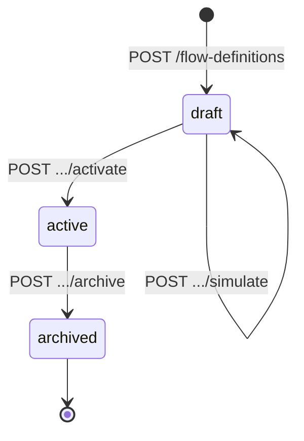

| State | Can be resolved? | Can be edited? |
|---|---|---|
| `draft` | No | Yes |
| `active` | Yes | No (create a new draft to iterate) |
| `archived` | No | No |

Use **validate** to check for dead ends, missing transitions, and unreachable steps before activating. Use **simulate** to dry-run the flow with mock input and see the path the state machine would take.
