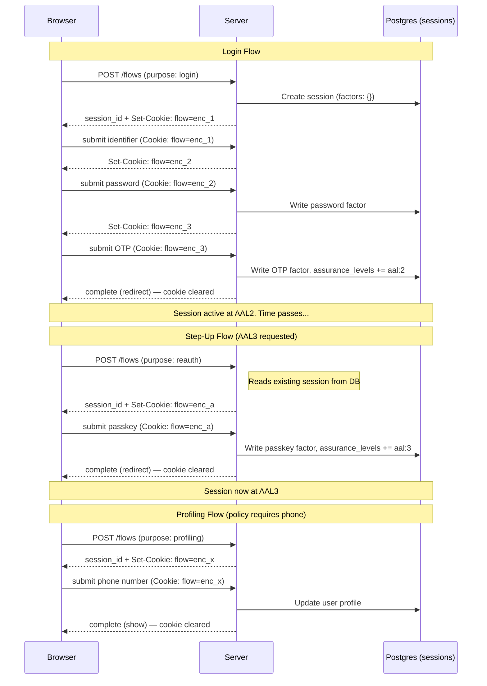

# Flow Engine — Storage

> **Status:** Draft
> **See also:** [Flow Engine](flow-engine.md) · [Session API](session-api.md) · [Canonical OpenAPI spec](../../../api/openapi/openapi-spec.yaml)

## Sessions vs Flows

Sessions and flows have fundamentally different lifetimes and purposes:

- A **session** is durable server-side state: factors, assurance_levels, user identity. It lives in Postgres and persists for hours or days.
- A **flow** is ephemeral orchestration: which step the user is on, what data they've entered so far, where to redirect on completion. It lives only while the user is actively clicking through screens.

A single session can have **many flows over its lifetime**:



The database is only touched when **factors change or user data is written**. Flow navigation (advancing steps, pivoting between purposes) is pure cookie reads/writes — zero DB I/O.

## Decision: Encrypted Cookie

Flow state is stored as an **encrypted, HttpOnly cookie** set by the server on every response. The browser sends it back automatically on every request.

### Why not the other options

| Option | Rejected because |
|---|---|
| **JSONB column on sessions table** | Couples ephemeral flow state with durable session state. Only one flow per session. Dead weight after completion. DB write on every step transition even when no factors change. |
| **Separate flow table** | Extra table, extra joins, orphaned rows when users abandon flows. DB write on every step transition. |

### Why encrypted cookie works

| Concern | How it's handled |
|---|---|
| **Size** | Flow state is ~600 bytes (login) to ~1.5KB (registration with pivot). Well under the 4KB cookie limit. |
| **Replay / tampering** | Cookie is AES-GCM encrypted + authenticated. Includes `session_version` — server rejects if session has been modified since the cookie was issued. |
| **Revocation** | Revoking or expiring the session invalidates any flow — the server checks session state on every submit. |
| **Multiple flows** | Each flow is a separate cookie lifetime. A flow completes → cookie is cleared. A new flow starts → new cookie. |
| **Stateless server** | Any replica handles any request. No shared state, no sticky sessions, no external cache dependency. |
| **Browser closes** | Cookie is gone. No orphaned state to clean up. |

### Cookie shape

```
Set-Cookie: _zflow=<encrypted-payload>; HttpOnly; Secure; SameSite=Strict; Path=/
```

The cookie is set with `Path=/` so that each `Set-Cookie` replaces the previous
one in the browser's cookie jar instead of accumulating per-path copies (the
flow endpoints span `/flow` and `/flow/{id}/submit`, which would otherwise
derive different paths — see the rationale in `internal/api/flow.go`). It is
therefore sent to other endpoints on the same origin; confidentiality and
integrity rest on the AES-GCM encryption and authentication, not on path
scoping.

## Cookie Contents

The encrypted payload, once decrypted server-side, contains:

```json
{
  "session_id": "sess_abc",
  "session_version": 7,
  "definition_id": "flow_default_login",
  "purpose": "login",
  "current_step": "password",
  "step_version": 4,
  "history": ["identifier", "resolve_user", "check_factors"],
  "pivot_history": [],
  "collected_data": {
    "email": "alice@acme.com"
  },
  "auth_request_id": "oidc-123",
  "redirect_uri": "https://app.com/callback",
  "requested_acr": "urn:nist:aal:2"
}
```

| Field | Purpose |
|---|---|
| `session_id` | Links the flow to its session |
| `session_version` | Optimistic lock — reject if session was modified by another request |
| `definition_id` | Which flow definition is active |
| `purpose` | Current purpose (may change on pivot) |
| `current_step` | Where the user is in the step graph |
| `step_version` | Monotonic counter — prevents cookie replay within the same flow |
| `history` | Steps visited (enables "back" navigation) |
| `pivot_history` | Previous purposes (enables return after registration/recovery) |
| `collected_data` | Form field values accumulated across steps (not yet committed to DB) |
| `auth_request_id` | OIDC/SAML request that triggered the flow |
| `redirect_uri` | Where to send the user on completion |
| `requested_acr` | Target assurance level for login/reauth |

## Size Estimate

| Scenario | JSON size | Encrypted + base64 |
|---|---|---|
| Login (simple) | ~350 bytes | ~500 bytes |
| Login with MFA + hint | ~450 bytes | ~650 bytes |
| Registration (3 fields collected) | ~550 bytes | ~800 bytes |
| Registration with pivot + history | ~700 bytes | ~1,000 bytes |
| Worst case (long history, pivot, 5+ collected fields) | ~1,000 bytes | ~1,400 bytes |

All well under the 4KB cookie limit.

## Optimistic Locking

The flow cookie contains `session_version`. On every submit that writes to the session (factor verification, user creation), the server:

1. Reads the session from DB
2. Compares `cookie.session_version` with `session.version`
3. If they match → proceed, write to session, increment version
4. If they don't match → another request already modified the session → return 409 Conflict

```sql
UPDATE sessions
SET factors = $new_factors,
    version = version + 1
WHERE project_id = $proj AND id = $sess AND version = $expected_version;
-- 0 rows affected → 409 Conflict
```

For flow-only transitions (advancing steps without touching the session), there's no DB write — the server just re-encrypts the updated flow state into a new cookie. The `step_version` counter in the cookie prevents replay of stale flow states.

## What Hits the Database

| Operation | DB read | DB write |
|---|---|---|
| Start flow (`POST /flows`) | Read session (if reauth/step-up) or create session | Create session (login/register) |
| Advance step (no factor change) | None | None |
| Pivot to different purpose | None | None |
| Submit identifier (resolve user) | Read user | None |
| Submit password/OTP/passkey | Read session + user | Write session (factor + version) |
| Create user (registration action) | Read session | Write session + write user |
| Complete flow | Read session | None (cookie cleared) |

Most step transitions are **zero-DB operations**. Only factor verifications and user mutations touch Postgres.
