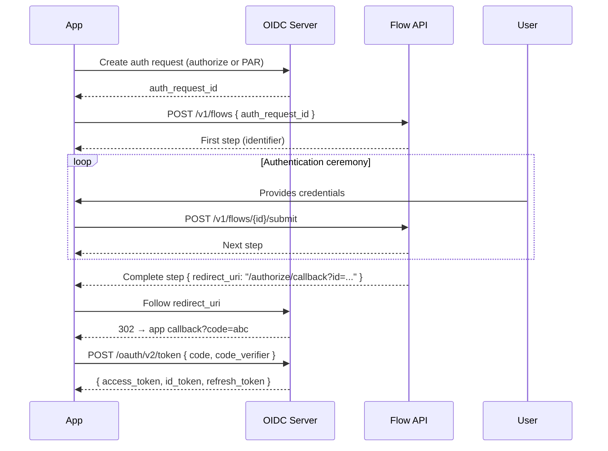

# OIDC ↔ Flow Engine Integration

**Status:** Draft. **Parent:** [`README.md`](README.md). **See also:** [`api/flow-api.yaml`](api/flow-api.yaml), [`session-api.md`](session-api.md).

The Flow API handles the **authentication ceremony** (identity verification). OIDC handles **token issuance**. They are connected by `auth_request_id` — the Flow API never issues tokens, scopes, or codes.

## How OIDC and the Flow API connect



## Creating the auth request

The `auth_request_id` can be created two ways:

### Redirect (traditional OIDC)

```
GET /oauth/v2/authorize?
  client_id=my-app&
  redirect_uri=https://myapp.com/callback&
  scope=openid profile email&
  response_type=code&
  code_challenge=...&
  code_challenge_method=S256

→ 302 /login?authRequest=oidc_123
```

The server creates the auth request and redirects to the login UI. The login UI reads `oidc_123` from the URL and starts the flow.

### PAR (Pushed Authorization Request, RFC 9126)

```http
POST /oauth/v2/par
Content-Type: application/x-www-form-urlencoded

client_id=my-app&
redirect_uri=https://myapp.com/callback&
scope=openid profile email&
response_type=code&
code_challenge=...&
code_challenge_method=S256
```

```json
{
  "request_uri": "urn:ietf:params:oauth:request_uri:abc123",
  "expires_in": 90
}
```

PAR returns a `request_uri` without a redirect. The client uses this to start the flow. **PAR is the bridge for embedded widgets and headless SDKs** — it creates the OIDC auth request without navigating away from the page.

> **Note:** The server maps `request_uri` to an internal `auth_request_id`. The Flow API accepts either.

## Per-pillar integration

### Pillar A: Headless SDK

The developer builds their own UI and calls the Flow API directly. The `@zitadel/client` SDK handles OIDC + Flow orchestration.

```typescript
import { ZitadelAuth } from '@zitadel/client';

const auth = new ZitadelAuth({
  issuer: 'https://my-instance.zitadel.cloud',
  clientId: 'my-app',
  redirectUri: 'https://myapp.com/callback',
  scopes: ['openid', 'profile', 'email'],
});

// 1. Create auth request via PAR (no redirect)
const { authRequestId, codeVerifier } = await auth.startLogin();

// 2. Start the flow
const flow = await auth.flow.create({ purpose: 'login', authRequestId });

// 3. Read capabilities, render custom UI
// flow.step.fields → { identifier: { type: 'email', ... } }

// 4. Submit user input
const next = await auth.flow.submit(flow.sessionId, {
  action: 'submit',
  fields: { identifier: 'alice@acme.com' },
});

// 5. Continue until complete...
// 6. Exchange code for tokens (see "Token exchange" below)
```

### Pillar B: Embedded widget

The `<zitadel-login>` widget abstracts OIDC entirely. Developers configure it with ZITADEL concepts:

```html
<!-- Cloud user — just project + app + callback -->
<zitadel-login
  project-id="my-project"
  app-id="12345"
  callback="https://myapp.com/auth/callback"
  purpose="login"
></zitadel-login>

<!-- Self-hosted — override the API URL -->
<zitadel-login
  api-url="https://auth.mycompany.com"
  project-id="my-project"
  app-id="12345"
  callback="https://myapp.com/auth/callback"
></zitadel-login>
```

Internally, the widget:
1. Reads the app configuration from the API (scopes, redirect URIs, etc.)
2. Builds a PAR request with the correct OIDC parameters
3. Starts flow with the given `purpose` → renders steps via LiquidJS templates
4. On complete → fires `zl-complete` event and/or navigates to callback

```javascript
document.querySelector('zitadel-login')
  .addEventListener('zl-complete', (e) => {
    // e.detail.callbackUrl contains the callback with code
    window.location.href = e.detail.callbackUrl;
  });
```

### Pillar C: Redirect (hosted login)

Standard OIDC. The app redirects to `/authorize`, the server redirects to the hosted login UI, the user authenticates, and the server redirects back with a code. The Flow API runs server-side within the hosted login — the app never calls it directly.

## Widget public API

The widget exposes **ZITADEL-native properties**, not OIDC parameters. OIDC is an implementation detail the developer never sees.

### Attributes

| Attribute | Required | Description |
|---|---|---|
| `project-id` | Yes | Project ID. Identifies the ZITADEL project (formerly "instance"). |
| `app-id` | Yes | Application ID (configured in Console) |
| `callback` | Yes | Where to return after authentication |
| `api-url` | No | ZITADEL API URL. Default: `https://api.zitadel.com`. Self-hosters override this. |
| `purpose` | No | Which flow to start. Default: `login` |

No `issuer` or `scope` attributes — OIDC parameters are resolved from the app configuration on the server.

### The `purpose` attribute

Controls which flow the widget starts. Maps to `CreateFlowRequest.purpose`.

| `purpose` | Flow started |
|---|---|
| `login` (default) | Login flow |
| `register` | Registration flow |
| `recovery` | Password recovery flow |
| `reauth` | Re-authentication flow |

The developer writes `purpose="register"`. The widget translates that to the correct internal parameters. The developer never touches `prompt`, `max_age`, `scope`, or any OIDC-specific parameter.

### Design principle: ZITADEL-native, not OIDC-native

```html
<!-- ✅ What the developer writes -->
<zitadel-login
  project-id="my-project"
  app-id="12345"
  callback="https://myapp.com/auth/callback"
  purpose="register"
></zitadel-login>

<!-- ❌ OIDC internals — never exposed -->
<zitadel-login
  issuer="https://my-instance.zitadel.cloud"
  client-id="12345@my-project"
  redirect-uri="https://myapp.com/auth/callback"
  scope="openid profile email"
  prompt="create"
  response-type="code"
  code-challenge-method="S256"
></zitadel-login>
```

### How the widget resolves OIDC parameters

The widget needs `project-id` + `app-id`. It calls the API (default `api.zitadel.com`, or the `api-url` override) to resolve everything:

1. **Discovery** — fetches `/.well-known/openid-configuration` from the API
2. **App config** — reads the app's allowed scopes, redirect URIs, and OIDC settings
3. **PAR** — builds the authorization request with the correct parameters (scopes from app config, PKCE, etc.)
4. **Flow** — starts the flow with the resolved `auth_request_id`

Scopes are configured once in Console, not scattered across every widget embed.

### Pivoting between purposes

`purpose` sets the **starting point**. The user can still pivot during the flow (e.g., click "Already have an account?" on the register flow → server pivots to login). The flow graph handles this — `purpose` just determines which entry point the widget requests.

## Token exchange

After the flow completes, the `redirect_uri` on the response points to the OIDC finalization endpoint. Following it produces the authorization code.

### Redirect model (Pillar B + C)

The widget or hosted login navigates to the `redirect_uri`:

```
Flow complete → redirect_uri: /authorize/callback?id=oidc_123
  → OIDC server finalizes auth request
  → 302 https://myapp.com/callback?code=abc&state=xyz
  → App exchanges code for tokens
```

```http
POST /oauth/v2/token
Content-Type: application/x-www-form-urlencoded

grant_type=authorization_code&
code=abc&
redirect_uri=https://myapp.com/callback&
code_verifier=...
```

### Headless model (Pillar A)

The SDK follows the `redirect_uri` programmatically:

```typescript
if (step.type === 'complete' && step.behavior === 'redirect') {
  // SDK follows the finalization URL, captures the redirect
  const callbackUrl = await auth.finalizeAuthRequest(flow.redirectUri);

  // Parse the code from the callback URL
  const code = new URL(callbackUrl).searchParams.get('code');

  // Exchange code for tokens
  const tokens = await auth.exchangeCode(code);
  // → { access_token, id_token, refresh_token }
}
```

## Authentication methods in the headless SDK

### Email + Password

```typescript
// Step 1: Identifier
let step = await auth.flow.create({ purpose: 'login', authRequestId });
// step.fields = { identifier: { type: 'email' } }

step = await auth.flow.submit(step.sessionId, {
  action: 'submit',
  fields: { identifier: 'alice@acme.com' },
});

// Step 2: Password
// step.fields = { password: { type: 'password' } }
step = await auth.flow.submit(step.sessionId, {
  action: 'submit',
  fields: { password: 'correct-horse-battery-staple' },
});

// Step 3: Complete
// step.type === 'complete', step.behavior === 'redirect'
const tokens = await auth.completeFlow(step);
```

### SSO (Google, Microsoft, etc.)

SSO requires a page navigation — the user must authenticate with the external provider. The headless SDK cannot avoid this redirect.

```typescript
// Step 1: Identifier step with sso_providers
let step = await auth.flow.create({ purpose: 'login', authRequestId });
// step.sso_providers = [{ id: 'google-1', name: 'Google', template: 'google' }]

// User chooses SSO
step = await auth.flow.submit(step.sessionId, {
  action: 'sso',
  sso_provider_id: 'google-1',
});

// Step 2: Redirect step
// step.type === 'redirect'
// step.redirect_url === 'https://accounts.google.com/o/oauth2/auth?...'

// ⚠️ Must navigate the page — cannot be done via fetch
window.location.href = step.redirect_url;

// After Google callback → Zitadel processes it → flow advances
// The app reloads with the flow session restored
// GET /v1/flows/{flowId} → complete step (or next step)
```

### Passkey (discoverable credential)

```typescript
// Step 1: Identifier step with passkey gate
let step = await auth.flow.create({ purpose: 'login', authRequestId });
// step.gates = { passkey: { type: 'passkey', config: { challenge, rpId, ... } } }

// Browser triggers WebAuthn ceremony
const assertion = await navigator.credentials.get({
  publicKey: step.gates.passkey.config,
});

// Submit with gate proof — skips identifier + password entirely
step = await auth.flow.submit(step.sessionId, {
  action: 'submit',
  fields: {},
  gate_proofs: { passkey: JSON.stringify(assertion) },
});

// → Complete step (passkey identifies + authenticates in one step)
const tokens = await auth.completeFlow(step);
```

### Passkey (step-up, after identification)

```typescript
// User already identified, server requires passkey verification
// step.type === 'credential'
// step.gates = { passkey: { type: 'passkey', required: true, config: { ... allowCredentials } } }

const assertion = await navigator.credentials.get({
  publicKey: step.gates.passkey.config,
});

step = await auth.flow.submit(step.sessionId, {
  action: 'submit',
  fields: {},
  gate_proofs: { passkey: JSON.stringify(assertion) },
});
```

## Summary

| Concern | Who handles it |
|---|---|
| Auth request creation | OIDC server (via redirect or PAR) |
| Authentication ceremony | Flow API |
| Token issuance | OIDC server (code exchange) |
| Cross-domain trust | OIDC code + PKCE |
| `auth_request_id` bridge | Passed from OIDC → Flow on creation |
| Flow completion | `redirect_uri` → OIDC callback → code → tokens |

The Flow API is protocol-agnostic. It authenticates the user and links the result to an `auth_request_id`. OIDC (or SAML) handles everything before (auth request creation) and after (token issuance). This separation means the same Flow API serves all three pillars without protocol-specific logic.
