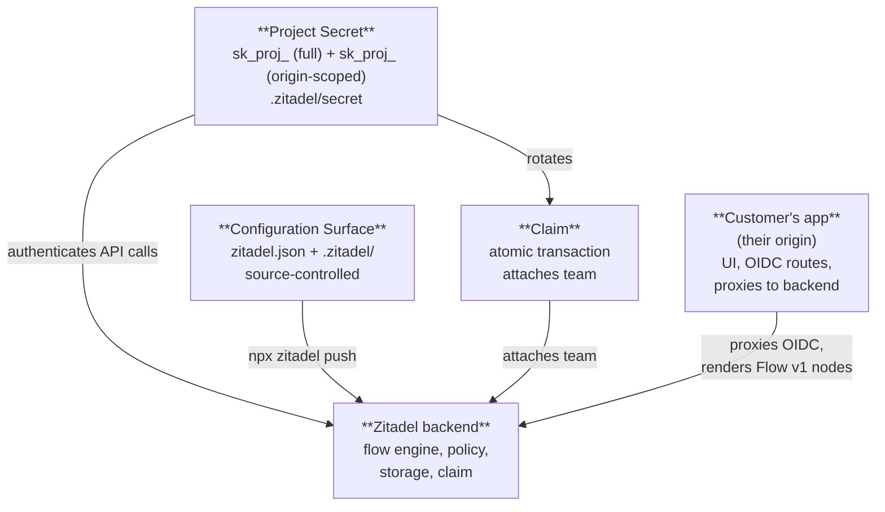

# Platform Architecture

> **Status:** Revised draft — pass 3 (Model A only, domains as context)
> **Date:** 2026-04-21
> **Context:** Zitadel next-generation architecture design — the lifecycle, configuration surface, and integration model that sits around the flow engine.
>
> **What needs feedback:** The Model-A-only MVP, domains as a security + context primitive, the `preview_origins` declaration at project creation, the three deferred capability tiers (SPA, hosted login, white-label mapping).
> **What's early draft:** OpenAPI stubs for claim and config APIs (endpoints and schemas marked `TODO` where the team still needs to converge). Flow v1 (the named versioned protocol between UI renderers and the flow engine) is referenced throughout but specified in a follow-up pass.
>
> **Current implementation note:** This folder describes target platform design.
> The MVP claim lifecycle is shipped: the server serves
> `/projects/{project_id}/claim/{init,status,complete}` and the CLI provides
> `zitadel claim`, per
> [ADR 046: Claim Lifecycle v2](../../adrs/046-claim-lifecycle-v2.md).
> ADR 003 records the withdrawal of the earlier mock-only lifecycle. The
> fuller design below (team resolution, secret rotation at claim, OAuth
> authenticators) remains target design beyond the shipped MVP — see the
> per-document notes.

## How this relates to the flow engine

The [flow engine](../flowengine/README.md) runs the state machine that drives login, registration, and recovery — steps, factors, policy decisions, the resulting session. This folder describes what sits around that: how a Zitadel project comes into being without a signup form, how it is configured from source control, how the customer's app talks to Zitadel's backend, and how a project transitions from anonymous capability to owned-by-a-team.

Both sets of documents are siblings. The flow engine docs can be read standalone if you only care about login/registration internals. The platform docs can be read standalone if you only care about setup, config, and claim. The two meet at `configuration-surface.md` (flow definitions are uploaded via `npx zitadel push`) and at `claim-flow.md` (claim attaches ownership; it does not move anything the flow engine cares about).

## Documents

| Document | Status           | Description                                                                                                                                              |
|---|------------------|----------------------------------------------------------------------------------------------------------------------------------------------------------|
| [Overview](overview.md) | Revised (pass 3) | Thesis, three orthogonal axes, condensed walkthrough, deferred capability tiers, relationship to the flow engine.                                        |
| [Login customization strategy](../branding/customization-strategy.md) | Proposed | Placement map under #678 / #936: three presentation models, first iteration appearance + voice, later widget structure ([ADR 056](../../adrs/056-login-customization-categories.md)). |
| [Project Secret](secret.md) | Revised (pass 3) | The server-issued bearer token that authenticates SDK/CLI calls. Dual-secret model (project + preview), storage in `.zitadel/secret`, rotation at claim. |
| [Configuration Surface](configuration-surface.md) | Revised (pass 3) | `zitadel.json` specification. Declared-issuer model, renderer modes, `npx zitadel push`, what uploads and what stays local, silent repo-wins drift.      |
| [Claim Flow](claim-flow.md) | Revised (pass 3) | The transaction that attaches ownership to a project. Auth methods, team resolution, what changes at claim, failure modes, agent boundary.               |
| [Project vs. Team Modeling](project-team-modeling.md) | Draft | Defines the decision heuristics to choose between a **Project** and a **Team** in the Zitadel next-generation architecture with worked examples.         |
| **API specs** |                  |                                                                                                                                                          |
| [Claim API OpenAPI](api/claim-api.yaml) | Revised (pass 3) | Anonymous project create with `preview_origins`, dual-secret response, claim init/complete, team domain-match.                                           |
| [Config API OpenAPI](api/config-api.yaml) | Revised (pass 3) | `npx zitadel push` upload, capability manifest, drift query.                                                                                             |

## Glossary

The canonical vocabulary for all design docs lives in [`../glossary.md`](../glossary.md). Quick platform-specific references:

- **Flow** — the state machine that drives a user through login, registration, recovery, or profile steps. Owned by the flow engine. Defined by the developer in `zitadel.json`. Full definition in [`../glossary.md`](../glossary.md).
- **Session** — the durable post-auth container. Full definition in [`../glossary.md`](../glossary.md).
- **Project** — the top-level tenant/deployment; what used to be called an "instance" in older design notes. Identified by a stable `project_id` minted by the server at `POST /projects` in the dialect-owned form `proj_<opaque>` per [ADR 047](../../adrs/047-dialect-id-generation.md). The opaque body is a ULID on PostgreSQL/SQLite and a UUID v4 on Spanner; clients must not assume either representation. The older dictionary-slug form is retired. Vocabulary:
  - `project_id` — the canonical identifier used in API paths, response bodies, and dashboard URLs.
  - `"project"` — the JSON field name in `zitadel.json` and `.zitadel/secret` that holds the `project_id` value.

  The `project_id` is never a user-facing origin; user-facing URLs are the customer's declared issuers per environment.
- **Team** — a tenant-grouping inside any project. A team in the **platform project** is the entity a customer project is attached to at claim (holds billing, user memberships, project ownership). A team in a **customer project** is a B2B end-customer tenant. Same resource, different project context. See [`../glossary.md`](../glossary.md).
- **Project secret** — the server-issued bearer token authenticating SDK/CLI calls against a project. Format `sk_proj_<base62>`. Stored in `.zitadel/secret`. Rotated at claim. Full taxonomy in [`../api/credentials.md`](../api/credentials.md).
- **Preview secret** — a companion `sk_proj_<base62>` scoped to origin patterns declared at project creation (`*.vercel.app`, etc.). Uploaded to the deploy platform's env store by the setup CLI.
- **Claim** — the transaction that attaches a **Team** (and an accountable human) to a project. Free. Forced at first production deploy.
- **Issuer** — the customer-owned origin on which the auth UI and OIDC endpoints run, declared per environment in `zitadel.json`. Serves as security allowlist, token `iss` claim, and magic-link hostname context.
- **Renderer** — the client-side surface that turns server-sent Flow v1 nodes into HTML. One of `default` (published auth web component), `template` (LiquidJS), or `ejected` (customer's own Lit components).

## Core concepts

The platform design is built on four primitives:

1. **Project Secret** — a bearer token. Authenticates SDK/CLI calls to Zitadel's backend. Pre-claim, the only authentication. Post-claim, rotated and bound to the team that claimed. Not a user identity, not an account — just a secret.
2. **Configuration Surface** — `zitadel.json` plus `.zitadel/` subdirectories. Flow definitions, IDPs, schemas, branding, policies, per-environment declared issuers. Source-controlled, versioned by the repo. `npx zitadel push` is the canonical sync.
3. **Claim** — an atomic transaction that attaches ownership and capabilities. `project_id` has been stable since creation; users, factors, sessions, config are bound to it from day one. Claim does not move them. It attaches a team, rotates the project secret, and unlocks the post-claim capability surface.
4. **Declared Issuers** — per-environment origin declarations (`"issuer": "https://acme.com"` or `"issuer_pattern": "https://*.vercel.app"`). Both a security allowlist (Origin validation on every request) and context (`iss` in tokens, hostnames in magic-link emails). Zitadel does not manage domains as infrastructure — only as context.

## Separation of concerns

| Concern | Owned By | Decides |
|---|---|---|
| How does a project come into existence without a signup form? | **Project Secret** | Server creates `project_id` on first `POST /projects`. Returns two `sk_proj_…` keys: a full-access pre-claim secret and an origin-scoped variant for preview deploys. |
| What configures login, IDPs, schemas, branding? | **Configuration Surface** (`zitadel.json`) | Source of truth is the repo; `npx zitadel push` uploads the server-behavior subset. |
| What origins may this project be authenticated from? | **Declared Issuers** | `environments.*.issuer` — allowlist for Origin validation; same value rendered into tokens and magic-link emails. |
| What are the resources of the system? | **API / MCP** | Users, sessions, tokens, grants, audit — never in config. |
| What turns an anonymous project into an owned one? | **Claim** | Single atomic transaction; human-authenticated; agents cannot claim. |
| Which environment (development / preview / production) is the SDK running in? | **SDK runtime detection** | Chooses the right `environments` overrides from `zitadel.json`. |
| How does a preview deploy work before claim? | **Preview Secret** | Minted at project creation, uploaded to the deploy platform's env store by the setup CLI. Origin-scoped. |
| What happens if the dashboard edits something the repo also defines? | **Silent repo-wins** | The next `npx zitadel push` overwrites dashboard state. Same model as Vercel source-control-wins. |

## Design principles

1. **Create before sign up.** A developer or an agent goes from `npx @zitadel/setup` to a working passkey flow in under ninety seconds on a laptop. No account, no tenant, no email verification, no plan selection. Everything that traditionally gates creation is either deleted or deferred until it pays for itself.

2. **Config lives with code; resources live on the server.** Flow definitions, IDP configs, user schemas, branding, policies, declared issuers — all in `zitadel.json` and `.zitadel/` directories, source-controlled. Users, sessions, tokens, audit events — all on the server, managed via API and MCP. The boundary is explicit and documented.

3. **The project secret is just a bearer token.** It authenticates SDK/CLI calls to Zitadel's backend. It is not a user identity, not an account, not a tenant credential. Claiming is the event that attaches accountability to a project; the secret rotation is a mechanical consequence.

4. **Claim is the accountability event.** Agents build, humans claim. The claim endpoint requires a human-authenticable method (GitHub, Google, email magic link). An agent cannot claim on behalf of a user, because attribution is the entire point.

5. **Declared issuers are the browser/runtime security boundary.** Browser and origin-bound runtime API requests validate `Origin` against the declared-issuer list for the active environment. The same list is the token `iss` claim and the magic-link hostname. Zitadel never binds a project to a URL the customer does not own.

6. **Zitadel is a backend API. Your app serves every user-visible surface.** The auth web component renders in the customer's app. `/authorize`, `/token`, `/userinfo`, `/.well-known/*` are scaffolded as proxy routes on the customer's own origin (on demand, when an OIDC client or IDP is first added). This is unconditional in the MVP.

7. **Agents configure; humans claim.** Agents are first-class consumers of the setup CLI and the configuration surface. They can build and modify `zitadel.json`, scaffold flows, eject components, author templates, add tracking. They cannot claim, enable paid features, or send real email. This boundary is enforced at the protocol level.

8. **Previews work without claim via the preview secret.** The setup CLI mints both secrets at project creation and uploads the preview secret to the deploy platform automatically. Preview deploys just work. Claim is forced at *first production deploy*, not at first preview.

9. **Drift resolves silently in favor of the repo.** `npx zitadel push` overwrites dashboard edits. No banner, no prompt. The Vercel model: the repo is the source of truth, the dashboard is a mutable view. Customers who want dashboard-only config remove `zitadel.json` from the repo.

## Integration levels (MVP vs. deferred)

The platform design supports four integration levels, characterized by *who serves which user-visible surface*. Only Level 1 ships in MVP; the others are deferred.

| Level | What it is | Status |
|---|---|---|
| **1** | **SSR + in-app** — Customer's server-side app handles every user-visible surface; Zitadel is a backend API | **Ships in MVP** |
| 2 | **SPA support** — Zitadel-minted per-project subdomain acts as a cookie-setting BFF for pure-static SPAs | Deferred follow-up |
| 3 | **Hosted login** — Zitadel renders login UI + OIDC endpoints under a customer-chosen custom domain (`auth.acme.com`) | Deferred follow-up; Pro-gated |
| 4 | **White-label multi-tenant** — Primitive for mapping many customer-owned hostnames to logical tenants | Deferred follow-up |

Integration level is orthogonal to pricing tier (Free / Pro / Enterprise). Full side-by-side comparison and per-level rationale in [Overview — Integration levels](overview.md#integration-levels).

## See also

- [Glossary](../glossary.md) — canonical vocabulary across all design docs
- [API Design Guide](../api/README.md) — hierarchy, credentials, URL architecture, auth_attempts, conventions
- [Flow Engine](../flowengine/README.md) — the state machine that runs inside sessions
- [Session API](../flowengine/session-api.md) — the primitive the flow engine operates on
- [User Schema Integration](../flowengine/user-schema.md) — schemas are a `configuration-surface.md` artifact
