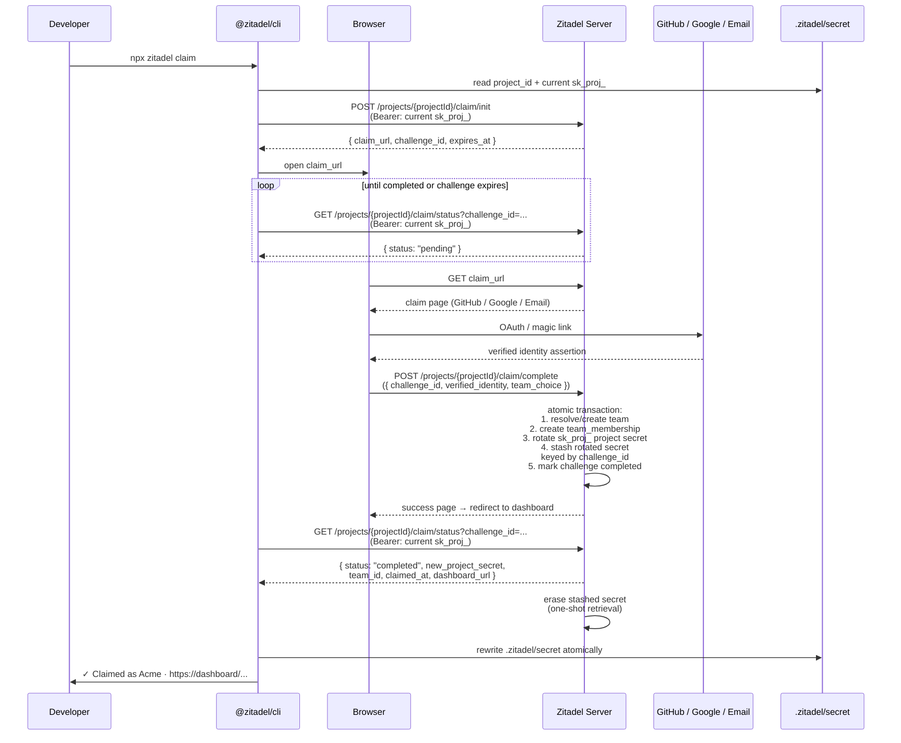

# Claim Flow

> **Status:** Draft
> **See also:** [README](README.md) · [Overview](overview.md) · [Project Secret](secret.md) · [Configuration Surface](configuration-surface.md) · [Claim API](api/claim-api.yaml) · [Glossary](../glossary.md)
>
> **Current implementation note:** This document is the fuller *target* design.
> The MVP claim being built is a deliberately narrower slice, specified in
> **[ADR 046: Claim Lifecycle v2](../../adrs/046-claim-lifecycle-v2.md)**
> (which supersedes the Withdrawn ADR 003). In the MVP, claim is
> **association-only**: it writes a project→team **grant** in the permission
> engine, authenticated on completion by the platform **session cookie**, and
> attaches the project to the claiming user's **pre-existing "Personal Team"**
> (created at platform registration, not here). Identity is **email
> registration and login only** (no SSO/OAuth). Accordingly, the sections below
> on **what authenticates the claim (the GitHub/Google OAuth authenticators)**,
> **secret rotation at claim**, **domain-based team matching / team
> resolution**, and **team creation at claim** describe the future target and
> are **not part of MVP claim**; see ADR 046 for what ships and the accepted
> risks. The MVP is shipped: the server serves
> `/projects/{project_id}/claim/{init,status,complete}` and the CLI provides
> `zitadel claim`.

Claim is the transaction that attaches ownership and accountability to a project. Before claim, the project exists but has no accountable owner. After claim, it belongs to a **team** with at least one accountable human. The transition is atomic — nothing partial.

> **Vocabulary note.** Claim attaches a customer project to a **team in the platform project** — the account that pays Zitadel. Teams also appear inside customer projects (as B2B end-customer tenants). Same resource kind, different project context. See [`../glossary.md`](../glossary.md).

This document specifies what authenticates the claim, the sequence of operations, what changes as a result, how teams are resolved, how failure modes are handled, and why agents cannot claim on behalf of humans.

## Claim is the accountability event

`project_id` has been stable since the server created it at `POST /projects`. Users, factors, sessions, uploaded configs, declared issuers — everything has been bound to `project_id` from day one. What claim *does* is attach a team (and a human, and a billing relationship, and a recovery path) to that project. It does not move identity or rewrite resource bindings.

**This is why agents cannot claim.** An agent has no accountability model. A token issued to an agent can build, configure, and operate — but it cannot become the accountable party for a project in a way that meaningfully attributes actions. Claim requires a human-authenticable method precisely so that post-claim audit trails, recovery flows, and governance decisions point at a human being. Agent-assisted workflows hand the claim URL to the human at the boundary (see [Agent boundary](#agent-boundary)).

## What authenticates the claim

**Default: GitHub OAuth.** One click, high-quality verified identity, email domain available for attribution, aligned with the developer-first audience. Roughly nine out of ten early users will have GitHub accounts.

**Secondary: Google OAuth.** Covers non-GitHub developers and non-technical founders who set up auth themselves.

**Fallback: email + magic link.** For developers who prefer not to link a social account. Magic link, not password — we should not ask developers to create a password for a system whose thesis is passkeys and passwordless.

**Not required at claim time:**

- Credit card
- Phone number
- Company name (inferred from email domain; not required)
- Billing address
- Tax information
- Any other field typical of B2B signup

These become required only when the developer activates a paid capability. Claim itself is free of financial friction.

## Sequence



**Why the CLI polls instead of the browser handing the secret back.** The rotated project secret is a production-grade bearer — we do not want it traversing the browser (where a hostile script on the claim page, a malicious browser extension, or an accidentally-logged response body could exfiltrate it). The CLI already holds the pre-claim `sk_proj_`, which is also the proof-of-possession the server uses to authorize retrieval of the rotated secret: only a poller presenting the exact bearer that initiated the challenge gets the rotated value, and only once. This is the OAuth 2.0 Device Authorization Grant shape (RFC 8628), adapted to a CLI that already has a secret.

The pre-claim `sk_proj_` stays valid until the atomic transaction commits; the server erases the stashed rotated value after a single successful retrieval from `GET /projects/{projectId}/claim/status?challenge_id=...`. If the CLI crashes between "transaction committed" and "wrote `.zitadel/secret`," recovery is `npx zitadel secret restore` (post-claim), which re-authenticates the human and refreshes the local file. See [Recovery](#recovery).

## The atomic transaction

All of the following happen in a single database transaction at the server:

1. **Resolve or create team.** Match the verified email's domain against existing teams (see [Team resolution](#team-resolution)). If a match is found and the human confirms, the project is attached to the existing team. If the human chooses "create new" or the domain is a public-email provider, a new team is created with the human as first owner.
2. **Create team_membership.** The authenticated human becomes a member of the resolved team with owner role.
3. **Rotate the project secret.** The pre-claim `sk_proj_…` secret is invalidated; a new `sk_proj_…` bound to the claimed project + team is issued. The origin-scoped secret is untouched.
4. **Stash the rotated secret** server-side, keyed by `challenge_id` and bound to the hash of the pre-claim secret that initiated the challenge. The CLI retrieves it once via `GET /projects/{projectId}/claim/status?challenge_id=...`; the stashed value is erased on retrieval or at challenge expiry.
5. **Mark challenge completed.** The `challenge_id` from `POST /projects/{projectId}/claim/init` transitions to `completed`; subsequent completion attempts return 410.

If any step fails, the entire transaction rolls back. The project stays unclaimed. The developer retries.

Notably absent from this list: anything that touches `project_id`, users, factors, sessions, uploaded config, or declared issuers. All of those were bound to `project_id` from creation and do not need to move.

## What changes at claim

- **Ownership.** The project transitions from anonymous (no team) to owned (attached to a team with at least one member).
- **Capabilities.** Free-tier capabilities that require a human owner unlock — BYO email configuration, additional team members, the dashboard's billing surface.
- **Billing eligibility.** Adding a card becomes possible. Pro-gated capabilities (managed email, SSO/SCIM/SAML, custom delivery) are now reachable.
- **Audit trail.** Events are emitted and stored from project creation onward
  (including the pre-claim window). List, get, and export stay gated until claim
  succeeds — stored history becomes visible without a backfill (ADR 048 / 049).
- **Recovery options.** Strong — tied to the auth provider used at claim (and any later-linked providers). Pre-claim, recovery was best-effort.
- **Project secret.** Rotated from the pre-claim `sk_proj_…` value to a new claimed credential. Everything else — origin-scoped secret, `project_id`, config, resources — untouched.

**Nothing in the developer's code should need to change as a result of claim.** OIDC client IDs, redirect URIs, declared issuers, SDK configuration, `.env` entries — all stable across the transition. The running preview deploy keeps serving requests; the next request after commit is served by a claimed project without interruption.

## Team resolution

At claim completion, the server inspects the verified email's domain and attempts to match it to an existing team.

### Domain matching with public-email suppression

If the domain is **not** a public email provider, the server checks for an existing team whose primary verified domain matches. If found, the claim flow presents:

> Your email `florian@acme.com` matches the existing team **Acme**.
> Join Acme with this project? *(recommended)*
> Or create a new team.

**Default action: join.** This reverses the industry default of "create new unless told otherwise," and the reverse is correct because in the common case the developer wants to be in the same team as their colleagues.

If the domain **is** a public email provider — Gmail, Yahoo, Outlook, Hotmail, iCloud, Me.com, ProtonMail, AOL, GMX, Live.com, MSN, and similar — the domain matching is **skipped entirely**. The default is a personal workspace owned by the authenticated human. An interstitial offers:

> Claiming for a team? Enter your work email to route to your company's team.
> Or continue with a personal workspace.

Without this guard, domain matching would group every random developer who claims via a GitHub account associated with a Gmail address into a single global "Gmail" team. That failure mode is catastrophic and is blocked at the design level.

The suppression list is maintained explicitly and reviewed periodically. Borderline cases (corporate Google Workspace on custom domains, vanity domains, school emails) default to treating the domain as personal — false positives here are annoying but recoverable via explicit invitation; false negatives are data-leakage disasters.

### Explicit flag

For CI scripts and deterministic agent-driven flows, the CLI accepts `--team acme`:

```
npx zitadel claim --team acme
```

This forces the claim into the specified team. The authenticating human must already be a member of `acme`. This avoids surprise attachment while supporting automation.

### Invitation by owner

Team owners invite members by email via the standard claim flow. The recipient accepts by claiming their own project, which is attached to the inviting team instead of matching by domain. This is the fallback for employees on vanity domains, consultants, or anyone whose auto-matching does not work.

### Membership vs. transfer

Joining a team with a project attaches the project to the team. It does not
transfer lifecycle ownership of the human's user identity. Humans can be members
of multiple teams; projects belong to exactly one team. See
[ADR 024](../../adrs/024-user-team-lifecycle-ownership.md) for the user/team
lifecycle model.

Post-hoc consolidation — transferring a project from one team to another — is supported via a dedicated `project transfer` operation (not via claim). The owner of the source team must also be a member of the destination team. A 30-day undo window applies.

## Failure modes

### Duplicate claim attempt

If the project is already claimed when `POST /projects/{projectId}/claim/init` is called, the server returns HTTP 409 with the existing dashboard URL and team name in the response body:

```json
{
  "error": "already_claimed",
  "message": "This project is already claimed by team Acme.",
  "team_id": "team_acme",
  "dashboard_url": "https://dashboard.zitadel.cloud/team_acme/projects/proj_01hexample"
}
```

The CLI prints a helpful message pointing the developer to their existing project and exits cleanly.

### Team creation race

Two colleagues at the same company each run `npx zitadel claim` within a few seconds on separate projects. Both attempt to create a new team for `acme.com`. The server resolves deterministically:

1. The transaction that commits first wins: it creates team `team_acme`.
2. The losing transaction retries inside a short backoff window. On retry, it finds the team, and the second project joins as an additional project.
3. An internal flag on the losing project records that the creation order was racy; this is surfaced to the team owner's dashboard for manual review if desired.

No user-visible error occurs in the common case. The two projects end up in the same team, which is almost always what the humans wanted.

### Authentication provider failure

If the GitHub OAuth handshake fails mid-flow (provider outage, user cancels on the provider's screen, network drops), the claim challenge remains in `initiated` state, the project secret is unchanged, and the CLI's polling loop times out when the challenge TTL expires (default 10 minutes). The developer retries with `npx zitadel claim` — potentially choosing a different provider from the claim page.

### Partial commit — impossible by design, supported by tooling

A single database transaction guarantees no partial-commit state. There is nonetheless a support-facing tool to force-claim a project to a known human's account, intended only for pathological bugs (data corruption, secret store corruption, etc.). The tool is invoked by support on explicit customer request, is audit-logged, and requires two-person approval on the support side. It is not a customer-accessible operation.

## Recovery

### Post-claim

Once claimed, a project has an accountable human (or multiple, via team membership). Recovery is conventional:

1. **Lost access to primary auth provider** (e.g. GitHub account compromised). Recover via Google if linked at claim or later.
2. **Lost access to all linked providers.** Recover via the email address of any other team member with sufficient role; they can invite the recovering human back.
3. **Lost access to the entire team.** Support-assisted recovery using billing records, DNS ownership verification (for custom domains), and out-of-band identity checks. Documented SLA on the support channel.

### Pre-claim

Unclaimed projects **have no strong recovery guarantee**. See [Project Secret — Failure modes](secret.md#failure-modes). The default CLI messaging emphasizes claiming early when the data matters.

## Agent boundary

The boundary is about **accountability**, not aesthetics. Agents are first-class authors of the platform configuration — they scaffold projects, author flow definitions, edit user schemas, eject and restyle Lit components, author LiquidJS templates, add custom tracking and translations, configure IDPs. All of that is fine. The claim boundary exists to keep a human on the hook for the project, not to constrain what the agent can build.

**What agents can do in unclaimed mode:**

- Run `npx @zitadel/setup` to create a project, scaffold the auth web component, and write `.zitadel/secret`
- Author and modify `zitadel.json` — flows, IDPs, schemas, branding, policies, environments
- Eject Lit components (`npx @zitadel/add sign-in`) and rewrite them freely
- Author LiquidJS templates and translations
- Add analytics, tracking, consent banners, custom markup
- Drive flows programmatically via the `agent` transport of Flow v1 (spec follow-up)
- Read uploaded config back, inspect flow state, debug why a user failed to log in (via MCP)

**What agents cannot do:**

- **Claim.** The claim endpoint requires an interactive human-authenticable method (GitHub OAuth, Google OAuth, or email magic link). An agent cannot programmatically claim on behalf of a user without impersonating the user's session — a bridge we explicitly do not build.
- **Enable paid features.** A token issued to an agent cannot activate managed delivery, upgrade tier, add payment methods, add custom domains, or enable hosted mode for production (hosted for dev/preview is fine). Prevents runaway costs from an agent loop that accidentally sends ten thousand OTP SMS messages in a debug session.
- **Send real email or SMS** while the project is unclaimed. Dev inbox only, regardless of configuration.

**The handoff pattern:** when an agent produces code that includes Zitadel, it produces as part of its output:

> I've set up Zitadel in unclaimed mode. Before deploying, claim it by running:
>
> `npx zitadel claim`

The CLI makes this a frictionless human step — browser opens, one click, done. The agent's work — configuration, components, templates, everything — is preserved in the uploaded config and the running project; the human is the point of attribution.

**Agent-scoped credentials after claim.** Once claimed, the human can issue preview-scoped and CI-scoped tokens:

```
npx zitadel tokens create --scope preview --expires 30d
npx zitadel tokens create --scope ci --environment preview --expires 7d
```

These let agents perform preview deploys, E2E test runs, and similar automation with the owner clearly accountable. The token specification is out of scope for this document; the canonical credential taxonomy lives in [`../api/credentials.md`](../api/credentials.md).

## See also

- [Project Secret](secret.md) — what the project secret is and how it rotates at claim
- [Configuration Surface](configuration-surface.md) — uploaded configs are preserved across claim
- [Claim API](api/claim-api.yaml) — HTTP surface for `/projects/{projectId}/claim/*`
- [Flow Engine — Storage](../flowengine/flow-engine-storage.md) — session storage that must survive reparenting
- [Session API](../flowengine/session-api.md) — session tokens that must remain valid
- [`../api/credentials.md`](../api/credentials.md) — canonical credential taxonomy
- [`../api/authn-and-auth-flows.md`](../api/authn-and-auth-flows.md) — bootstrap challenge disambiguation (per-session nonce vs project creation)
- [`../glossary.md`](../glossary.md) — vocabulary; team as a universal tenant-grouping
