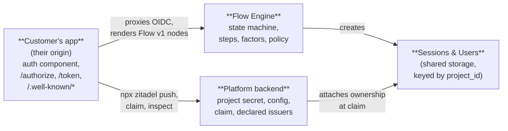

# Platform Overview

> **Status:** Draft
> **See also:** [README](README.md) · [Project Secret](secret.md) · [Configuration Surface](configuration-surface.md) · [Claim Flow](claim-flow.md)
>
> **Current implementation note:** This document describes target platform
> design. The checked-in CLI and server do not currently expose the claim
> lifecycle or a `zitadel claim` command; see ADR 003 for the shipped-state
> decision.

Every identity provider on the market today assumes that identity precedes everything. Before a developer can write their first line of auth code, they must have a tenant, and before a tenant can exist, they must sign up. The signup form is the gate, the tenant is the primitive, and the developer is a downstream consequence of the account.

This is architecturally backwards, and now that agents write software, it is operationally broken. An agent cannot reliably traverse a signup form, an email verification loop, and a plan selection modal to paste a client ID into `.env`. The industry has papered over this with dashboard improvements and faster onboarding wizards, but the underlying assumption — account first, code second — has never been questioned.

The platform design described in this folder questions it.

## Thesis

Three concepts that are usually bundled are separated:

**Creation** — "can I build auth into my app?" — requires no account, no tenant, no signup, no email verification, no plan selection. A developer or an agent goes from `npx @zitadel/setup` to a working passkey flow in under ninety seconds on a laptop.

**Ownership** — "who is accountable for this project?" — is established when attribution matters: a production deploy is imminent, a teammate needs governance, billing needs to begin. Claim is free because attribution is mutually beneficial — the developer gets persistence and governance, Zitadel gets identified signal.

**Payment** — "which production-trust capabilities am I using?" — attaches to operational cost (outbound delivery), enterprise value (SSO, SCIM, SAML), support burden (compliance), or contractual commitment (SLA, residency, MSA). Users are never the monetization boundary. Trust boundaries are.

## Shape of the experience

The following walkthrough is illustrative. Numbers and timings are indicative.

**Monday afternoon.** A developer at a small startup is building a side-project dashboard. They run:

```
npx @zitadel/setup
```

The CLI detects Next.js (or Remix, Astro, Nuxt, SvelteKit, …), installs the SDK, scaffolds the auth web component at `/login`, and writes `.zitadel/secret` containing the project secret and a preview secret. If `vercel` or `netlify` or `wrangler` is installed, the preview secret is uploaded to the deploy platform's env store automatically. The CLI boots `npm run dev` on `localhost:3000`, the developer registers with a passkey, and is looking at their app's authenticated home screen. Seventy seconds elapsed. Zero signup, zero email verification, zero tenant, zero dashboard — and zero Zitadel-owned URLs in the browser bar.

OIDC proxy routes (`/authorize`, `/token`, `/userinfo`, `/.well-known/*`) are not scaffolded yet. They are scaffolded later, when `npx zitadel push` detects one of two signals: an `idps.*` entry in `zitadel.json` (federated login needs a callback route on the customer's origin), or the server-side "OIDC client" capability switching on after the first client is added via API / MCP. See [Configuration Surface — Proxy endpoints](configuration-surface.md#proxy-endpoints-scaffolded-on-demand).

The setup CLI also prints a **scratch dashboard** URL (`https://zitadel.dev/scratch/proj_01hexample`) — a pre-claim inspection surface where the developer can see their config, their registered users, and the dev inbox without running a local UI. See [The scratch dashboard](#the-scratch-dashboard) below.

**Tuesday morning.** They push a branch to Vercel to share with a designer. The preview just works — the preview secret is already in the Vercel env, the auth web component renders on the preview origin, magic-link emails route to the dev inbox. No claim prompt.

**Wednesday.** The developer pushes to `main` with a production `vercel.json`. On first production deploy, the SDK sees a production-environment signal with no claim on record and refuses to start:

> Production deploys require a claimed Zitadel project.
> Claim this project now: `npx zitadel claim`

They run `npx zitadel claim`. Browser opens at `https://zitadel.cloud/claim/proj_01hexample`, GitHub/Google/email. One click on GitHub. Dashboard loads; the project is now owned by a newly-created "Acme" team. Forty seconds. No credit card.

**Two weeks later.** They want password-reset emails in production instead of the dev inbox. The dashboard offers Dev Inbox (default), Bring Your Own Provider, or Zitadel Managed. They pick BYO, connect their existing Resend account, and password-reset emails start flowing from `noreply@acme.com`. Magic-link URLs in the emails render the declared production issuer — `https://acme.com` — because that's what the developer declared in `zitadel.json`'s `environments.production.issuer`.

**Month three.** A customer of Acme (call them Bigco) requires SAML SSO to sign in — Acme will act as a SAML **Service Provider** to Bigco's IdP. The developer adds the capability to `zitadel.json` and runs:

```
npx zitadel push
```

The linter flags:

```
✗ SAML SP capability referenced in zitadel.json:idps.bigco, but not enabled on this project.
  Run: npx zitadel capability enable saml-sp
```

They enable the Pro-gated capability, add a card, configure the SP metadata from Bigco's IdP. Issuer is still `https://acme.com` — no new domain, no cert change, no migration. Nothing in Acme's app or Bigco's IdP breaks.

**The shape to notice.** No signup form anywhere in this story. The first identified moment is claim, triggered by the first production deploy. The first payment is three months later, triggered by a concrete customer need. Every friction point in the current industry standard — signup, email verify, plan selection, card upfront, tenant-first provisioning — has been either deleted or deferred to the moment it pays for itself.

## The scratch dashboard

Before claim, the project has no accountable owner — so it cannot have a "logged-in dashboard" in the usual sense. Instead, `npx @zitadel/setup` prints a **scratch dashboard** URL: `https://zitadel.dev/scratch/<project_id>` (e.g. `https://zitadel.dev/scratch/proj_01hexample`). This is the only piece of Zitadel-hosted UI the developer touches in the MVP.

**What it is.** A browser-session-keyed inspection surface. The first visit drops a signed cookie bound to the project_id; subsequent visits from the same browser see the same view. It is not authenticated against a human identity — there isn't one yet — and it is not shareable in a persistent sense (a teammate opening the URL on their laptop gets a fresh session and sees only what a stranger would see).

**What it shows.** The project's current config (as last uploaded by `npx zitadel push`), recently registered users, the dev inbox (magic-link and OTP payloads that would otherwise have been emailed), config version history with hashes, declared issuer origins per environment, and capability warnings from the most recent upload. Pre-claim, outbound delivery is always dev-inbox-only, so the scratch dashboard *is* where magic links land.

**What it is not.** A multi-member surface (no sharing, no roles — teams do not exist pre-claim). A persistence guarantee (scratch sessions expire; loss of browser state means loss of inspection access, though the underlying project is unaffected as long as `.zitadel/secret` is intact). A production tool.

**At claim time, the scratch URL retires** and the claim-complete flow redirects to the real dashboard at `dashboard.zitadel.cloud/<team>/projects/<project_id>`. The scratch session cookie is invalidated; any future inspection is via the claimed dashboard, authenticated through the team.

The scratch dashboard is also the recovery escape hatch referenced in [Project Secret — Failure modes](secret.md#failure-modes): a developer whose laptop lost `.zitadel/secret` while the project was still unclaimed can, if they still have the scratch session in the same browser, read back the project_id and correlate with support. It is best-effort, not a guarantee — the system-level answer is *claim early*.

## Three orthogonal axes

The design separates three dimensions that product categories often collapse. Keeping them orthogonal makes invariants clean.

| Axis | Values | What it describes |
|---|---|---|
| **Lifecycle** | Unclaimed, Claimed | Who is accountable for this project. Binary. Traversed exactly once. |
| **Tier** | Free, Pro, Enterprise | What entitlements the claimed project has. Applies only post-claim. Moves up and down with needs and payment state. |
| **Environment** | Development, Preview, Production | Deployment context for a running copy of the developer's app. |

Combinations that matter:

| Combination | Supported? | Notes |
|---|---|---|
| Unclaimed × Development | Yes | Default first-run state. `.zitadel/secret` written locally. Dev inbox only. UI and OIDC routes run on `localhost:3000`. |
| Unclaimed × Preview | Yes, via preview secret | Preview secret is origin-scoped to the patterns declared at project creation. No outbound delivery. |
| Unclaimed × Production | No | Production deploys force claim. First attempt blocks with a clear banner. |
| Claimed × Free × Development | Yes | Typical dev loop post-claim. |
| Claimed × Free × Preview | Yes | Preview hibernation applies after 14 days idle (deferred spec). |
| Claimed × Free × Production | Yes | UI and OIDC on the customer's own origin, BYO email, fair-use operational limits. Explicitly viable — the product does not force Pro at production. |
| Claimed × Pro / Enterprise × any | Yes | Pro unlocks managed delivery, SSO/SCIM/SAML, and related operational-cost capabilities. Enterprise adds contractual commitments. |

The invariants:

- **Zitadel is a backend API.** The customer's app serves every user-visible surface on its own origin. Always.
- **Declared issuers are the browser/runtime security boundary.** Browser and origin-bound runtime API requests must present an `Origin` that matches a declared issuer for the active environment. The same allowlist is used for token `iss` claims and magic-link hostname rendering.
- **Unclaimed projects cannot send real email or SMS**, regardless of environment or (hypothetical) tier. Dev inbox only.
- **Previews work without claim**, via the preview secret minted at project creation.
- **Users are free across all tiers.** Identity count is never the monetization boundary.

## Relationship to the flow engine

The [flow engine](../flowengine/README.md) runs the state machine that drives login, registration, and recovery. It decides which step to render next, which factors to require, when a session has met the required assurance level. It knows nothing about whether the project hosting those sessions is claimed, which tier it sits on, or where its configuration came from.

This folder owns the outer scope. It describes how the project came to exist, how it is configured, how it transitions from anonymous capability to owned-by-a-team, and how the customer's app talks to Zitadel's backend. The two meet at three seams:

- **Configuration.** Flow definitions live in `zitadel.json` or the `.zitadel/flows/` directory. `npx zitadel push` uploads them to the server. The flow engine resolves them at runtime.
- **Runtime transport.** The flow engine runs server-side; the auth web component renders on the customer's origin and talks to the flow engine via the customer's own proxy routes. See [Configuration Surface — Proxy endpoints](configuration-surface.md#proxy-endpoints-scaffolded-on-demand).
- **Claim.** Claim attaches ownership to a project. Users, factors, sessions, and uploaded config have been bound to `project_id` from creation — they don't move at claim. Only the project secret rotates.



## Integration levels

The platform supports four **integration levels**, each characterized by a different answer to *"whose infrastructure serves which user-visible surface?"*. Integration level is orthogonal to the pricing tier (Free / Pro / Enterprise) — the two should not be confused.

**Only Level 1 ships in the MVP.** Levels 2–4 are named here so the architecture makes them additive later, not shipped now.

|   | **Level 1 — SSR + in-app** *(MVP)* | **Level 2 — SPA support** | **Level 3 — Hosted login** | **Level 4 — White-label multi-tenant** |
|---|---|---|---|---|
| **Customer runtime** | Server-side (Next.js SSR, Remix, Astro SSR, Nuxt, Express, Rails, Django, …) | Pure static SPA on a CDN, no server code | Any | B2B where each end-customer gets their own auth hostname |
| **Who renders auth UI** | Customer's app | Customer's SPA | Zitadel | Zitadel (builds on Level 3) |
| **Who serves `/authorize`, `/token`, `/userinfo`** | Customer's app (proxy → Zitadel backend) | Zitadel (SPA cannot proxy) | Zitadel | Zitadel |
| **Who sets session cookies** | Customer's server, on customer's origin | Zitadel, on Zitadel subdomain, via CORS | Zitadel, on Zitadel subdomain or custom domain | Zitadel, per-hostname scoped |
| **Domain primitive Zitadel manages** | None — customer owns everything | Zitadel-minted per-project subdomain (dictionary-named) | Customer-chosen custom domain (CNAME + ACME cert + abuse review) | Customer-supplied hostname → tenant map |
| **Token `iss` claim** | Customer's origin per environment | Zitadel subdomain | Customer's custom domain | Matched hostname (per request) |
| **Pricing gate** | Free-viable at production | Free-viable at production | Pro-gated (operational cost) | Pro/Enterprise-gated |
| **Status** | **Ships in MVP** | Deferred follow-up | Deferred follow-up | Deferred follow-up |

### Level 1 — SSR + in-app  *(MVP baseline)*

The default and only MVP model. Zitadel is a backend API. The customer's app handles every user-visible surface — UI, OIDC endpoints, cookies — on the customer's own origin, per environment. Zitadel never hosts anything the user sees. This covers every customer with a server-side runtime, which in 2026 is essentially every framework that matters (Next.js, Remix, Astro, Nuxt, SvelteKit, Express, Fastify, Hono, Cloudflare Workers, Vercel Edge, Rails, Django, Laravel, FastAPI, Go net/http, …).

The rest of the platform docs in this folder specify Level 1 in full. Everything below is deferred.

### Level 2 — SPA support  *(deferred)*

For customers shipping a pure-static SPA on a CDN with no server-side runtime — Create React App on S3+CloudFront, a Vite build on GitHub Pages, an Angular bundle on Azure Static Web Apps without Functions, and similar. The SPA cannot proxy OIDC endpoints and cannot set HttpOnly cookies on its own origin, so Zitadel mints a per-project subdomain (`project-<project_id>.zitadel.app`) that acts as a cookie-setting BFF the SPA calls via CORS + `SameSite=None; Secure`.

Security model is the declared-issuer allowlist from Level 1 plus strict subdomain-naming rules. The SPA code still imports and uses the published auth component from Level 1 — the component is the same; only the cookie-setting origin changes.

### Level 3 — Hosted login  *(deferred)*

For customers who specifically *want* a redirect-to-Zitadel auth pattern — either because it matches their mental model (classic Hosted-UI / Universal-Login style) or because they want a branded `auth.acme.com` surface without maintaining any auth UI code. Zitadel renders the login and serves the OIDC endpoints on a customer-chosen custom domain: CNAME to a Zitadel-provided target, ACME certificate provisioning, brand-abuse review on the chosen subdomain.

Pro-gated because DNS validation, cert rotation, and abuse takedown response all have ongoing operational cost. This is the only level where Zitadel hosts UI under a branded domain on the customer's behalf.

### Level 4 — White-label multi-tenant mapping  *(deferred)*

For B2B customers whose *own* customers each get their own auth hostname (`customer-a.auth.com`, `customer-b.auth.com`, `customer-c.auth.com`, …), with each hostname mapping to a different logical tenant in the customer's data model. Builds on Level 3 (custom domains per hostname) and adds a primitive for hostname-to-tenant resolution at request time.

The primitive is not designed yet — candidates include a new `tenant` or `scope` object, or a reuse of project / app_group / team. The distinguishing requirement is *one-to-many*: a single project owns many hostnames, each routed to different branding + flow configuration. Level 3's custom-domain primitive is one-to-one and does not solve this.

> See also: [`../api/hierarchy.md`](../api/hierarchy.md) for the three-layer Project / Team / User model this folder's lifecycle narrative plays out within.

## Out of scope for this draft pass

The following topics are referenced in the principles and cross-linked from the individual docs, but are not specified in this pass. They are follow-ups.

### Near-term follow-up docs

- **Flow v1 protocol spec.** The named, versioned protocol between UI components and the flow engine — node types, state transitions, `ContinueWith` semantics, dual transport (browser / api / agent). Lives alongside the flow engine docs.
- **Component surface + eject path.** The auth web component library, `npx zitadel add <component>` scaffolding, the protocol-version pin that keeps ejected source compatible with the backend.
- **Proxy-pattern scaffolding.** How per-framework SDK packages (`@zitadel/sdk-next`, `@zitadel/sdk-remix`, etc.) expose `createZitadelProxy()` / `createZitadelHandlers()` helpers that generate OIDC routes on the customer's origin.
- **Lint rules for `npx zitadel push`.** The full list of capability checks, config-reference validations, and reachability hints.

### Level 2, 3, 4 follow-up specs

Each deferred integration level gets its own spec when a concrete customer need is real enough to design against. See [Integration levels](#integration-levels) above.

### Other deferred topics

- **Pricing-tier entitlement enforcement.** How the server gates Pro/Enterprise capabilities (managed delivery, SSO/SCIM/SAML, etc.). Mentioned throughout; dedicated spec is follow-up.
- **Delivery modes full spec.** Dev Inbox, BYO provider, Zitadel Managed — referenced here; full subsystem spec is deferred.
- **Agent delegation in production.** Preview-scoped and CI-scoped tokens for agents are referenced; the full token-exchange and scoping model is deferred.
- **Migration for existing customers.** Zitadel has customers on the current pricing and data model. Grandfathering, migration analyzer, sales-assisted enterprise migration — all post-MVP.

## See also

- [Project Secret](secret.md) — the bearer token that authenticates API calls
- [Configuration Surface](configuration-surface.md) — the `zitadel.json` specification
- [Claim Flow](claim-flow.md) — what changes at claim
- [Flow Engine](../flowengine/README.md) — session-level state machine
- [API Design Guide](../api/README.md) — protocol surface (hierarchy, credentials, auth_attempts)
- [Glossary](../glossary.md) — canonical vocabulary
