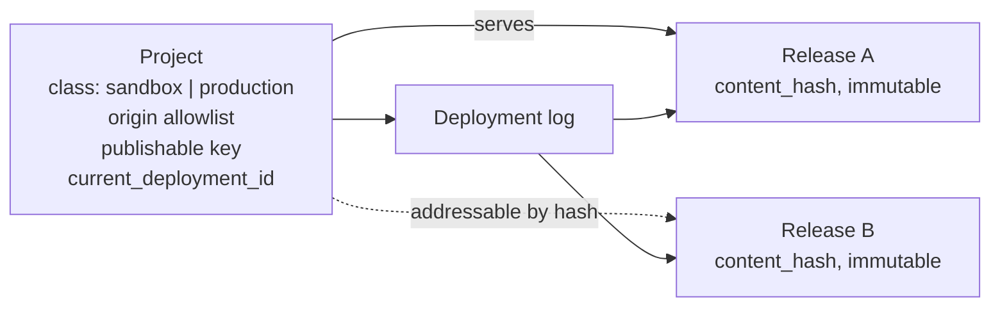

# Releases Without Environments

> **Status:** Spike — [#1389](https://github.com/zitadel/nextgen/issues/1389).
> Design only; nothing here is implemented.
>
> **Question:** can the server drop the environment entity entirely and still
> give a developer somewhere to try a change before it reaches real users?
>
> **Answer this note argues for:** yes. An environment is two separate things
> wearing one name — *which server and project am I talking to*, a client-side
> concern, and *which release am I being served*, a per-request concern. Split
> them and the entity has nothing left to hold.
>
> **Reads against:** [ADR 035](../../adrs/035-configuration-environments.md)
> (releases, environments, deployments),
> [ADR 036](../../adrs/036-api-credential-planes.md) (credential planes, the
> publishable key),
> [ADR 062](../../adrs/062-per-environment-variables-and-secrets.md) (variables
> scoped to an environment),
> [#1311](https://github.com/zitadel/nextgen/issues/1311),
> [#1308](https://github.com/zitadel/nextgen/pull/1308),
> [#536](https://github.com/zitadel/nextgen/issues/536),
> [security and origins](../api/security-and-origins.md),
> [credentials](../api/credentials.md), [project secret](secret.md),
> [configuration surface](configuration-surface.md).

## The claim

ADR 035 defines an environment as a runtime slot that runs one release at a
time. Every job that definition gives an environment is either a pointer (one
release) or a routing rule (which traffic lands here). Neither needs an entity
with a name, a lifecycle, a seeded default set, an expiry, a garbage collector,
and a deployment history of its own.

The two jobs split cleanly:

| Job | Where it goes |
|---|---|
| "Talk to *this* server, about *this* project" | The client, resolved from the process environment and `.env` files. Never travels as a word like `staging`. |
| "Serve *this* release" | The request. The caller names a release by content hash; absent that, the project serves its current release. |

A stage is therefore a `(server, project)` pair that the developer's tooling
already varies per deploy target. A preview is a release hash. The server never
learns the word `production`.

Three things make this cheaper than it sounds.

- **The CLI already has no environments.**
  `apps/cli/src/lib/environment.ts` was deleted in
  [#1286](https://github.com/zitadel/nextgen/pull/1286) — "remove
  `--environment` from the CLI until environments settle" — because its
  `development | preview | production` enum was not the platform's environment
  names and only read a `zitadel.json` key nothing writes.
- **The release content hash already exists.** `domain.Release.ContentHash`
  (`internal/domain/release.go:94-101`) is a SHA-256 over the canonically sorted
  pointer set, versioned `rel-v1`, metadata deliberately excluded, with a unique
  index `uq_releases_project_content_hash` and read-before-insert dedup in
  `internal/service/release.go:92-125`. **The identifier this design needs is
  built and indexed; it is simply not exposed.**
- **The project level of a variable already exists.**
  `domain.VariableOwner.EnvironmentID == ""` *is* the project level — "an
  address of its own rather than a wildcard"
  (`internal/domain/variable.go:160-166`), and it is the default when
  `environment_name` is omitted.

One thing makes it more necessary than it looks: **origin enforcement is
currently vestigial**, and this design is the first thing that would make it
load-bearing. See [the honest state of origins](#the-honest-state-of-origins).

## Three things are called "environment"

Disambiguating these first, because two of them survive and one does not.

| # | Thing | Where | Fate |
|---|---|---|---|
| 1 | **The runtime slot** — `environments` table, `dev`/`staging`/`prod`, `current_deployment_id`, ADR 035 | `internal/domain/environment.go` | **Deleted.** This is the whole of the proposal. |
| 2 | **The project's origin-rule class** — a project-level `development \| preview \| production` flag gating which wildcard origin patterns may be saved | [security-and-origins.md §15-43](../api/security-and-origins.md), "LOCKED", **not implemented** | **Survives, renamed and reduced to two values.** See [Project class](#project-class). It is a posture, not a slot. |
| 3 | **The developer's local stage** — `development`/`preview`/`production` as a label selecting which `.env` files and which target to use | CLI, deleted in #1286; `ZITADEL_ENVIRONMENT` in scaffolds | **Survives, client-only.** Never sent to the server. |

Most of the muddle in the current design space comes from these three sharing a
word. The proposal is: delete 1, rename 2, keep 3 local.

## Model after the change



**Project.** Unchanged as the data boundary. Takes over
`current_deployment_id` — the same denormalised nullable column the environment
row carries today (`internal/storage/environment/schema.go:29-33`, no foreign
key, written only inside the deployment transaction). Moving it from the
environment row to the project row preserves the mechanism exactly: one-row
reads, a single compare for optimistic concurrency, self-healing on a dangling
pointer.

**Release.** Unchanged. `ContentHash` is promoted from an internal dedup key to
the public wire identifier; `rel_<ULID>` stays as the storage primary key, so
[ADR 047](../../adrs/047-dialect-id-generation.md) is untouched.

**Deployment.** Unchanged except that `EnvironmentID` becomes nothing: the
project is the target. `reason` keeps `deploy` and `rollback`; `promote` and
`source_environment_id` go — see
[what promotion becomes](#what-promotion-becomes). The idempotence already
implemented (same release → no write, `Created: false`, 200 instead of 201,
`internal/storage/dialect/sqlite/deployment.go:85-88`) and
`expected_current_deployment_id` both carry over unchanged.

**Deleted:** the `environments` table in all three dialects, `environment.go` in
domain / service / api, `DefaultEnvironmentNames`, `SeedDefaults` and its call
from project creation (`internal/service/project.go:173`), the
`environment.created` event and its payload, `ResourceKindEnvironment`, the
`environment.read` scope, `GET /environments[/{name}]`, the `environment_id`
column on `deployments` and on `variables` (with the `environment_ref` generated
column and its composite FK), the `environment_name` query parameter on the
four variable operations, the read-only `zitadel environments list|get`
commands, and all of [#1311](https://github.com/zitadel/nextgen/issues/1311).

Blast radius is real but bounded: environment appears across domain, three
dialects plus migrations, service, api, and roughly fifteen test files, with
`deployment` and `variable` as the two coupled entities.

## Project class

The project needs one flag, because the hazards this design has to contain are
all properties of a project as a whole rather than of any single origin entry.
An individual `http://localhost:3000` entry is unobjectionable; a project that
serves real users *and* accepts `http://localhost:3000` is the problem, because
any page on any developer's machine can then drive flows against real users.

```
project.class: sandbox | production
```

| | `sandbox` (default) | `production` |
|---|---|---|
| Loopback origins (`http://localhost:*`, `127.0.0.1`, `[::1]`) | Allowed | **Rejected at save** |
| Shared-host wildcards (`*.vercel.app`, `*.netlify.app`, `*.pages.dev`) | Allowed | **Rejected at save** |
| Empty allowlist, meaning allow-all | Allowed | **Rejected** — a non-empty allowlist is mandatory |
| Custom-domain wildcards (`*.acme.com`) | Allowed | Allowed, with domain ownership verification |
| Release pinning by an uncredentialled caller | Allowed | **Rejected** — see below |
| Real email / SMS delivery | Claim-gated, a separate axis ([secret.md](secret.md#capability-matrix)) | Same |

**Two values, not three.** `security-and-origins.md` specifies
`development | preview | production`, but its `development` and `preview` rows
have *identical* origin rules — they differ only in rate limits and dashboard
banners. Rate limiting is its own axis and should not ride on this flag, so the
third value buys nothing and costs a concept.

### Why this flag earns its place: it fixes the capability problem

The uncomfortable admission in
[the release resolver](#the-uncomfortable-part-stated-plainly) is that an
uncredentialled browser caller's release hash functions as a capability. The
class confines that admission to where it does not matter:

- On a **`production`** project, pinning requires a credential — the publishable
  key or the project secret. Serving an arbitrary old release is then an
  authorized operation, not a known-the-hash operation, and the downgrade
  concern goes away.
- On a **`sandbox`** project, pinning is open, because that is what makes
  previews and local development work, and the blast radius is test data on a
  project with no real users by construction.

This is a better answer than anything available without the flag, and it is the
main reason to add it rather than derive the same rules from claim state.

### Consequence: previews live on a sandbox project

A `production` project rejects shared-host wildcards, so a Vercel preview URL
cannot reach it. Previews therefore point at a `sandbox` project — which is also
where [Variables](#variables) already pushed them, since a preview needing its
own IdP client needs its own project. The two constraints agree, which is a good
sign.

The default shape for a team is then three projects, not three environments:

| Project | Class | Origins | Who moves its current release |
|---|---|---|---|
| dev | `sandbox` | loopback, shared by the whole team | nobody — see [the next section](#many-developers-one-shared-server) |
| preview | `sandbox` | `*.vercel.app` or equivalent | CI, per branch, or nobody if every build pins |
| production | `production` | `https://app.acme.com` | CI, on merge |

That is the same three-way split environments were providing, with two
differences that both favour this model: the boundary is a project, so user and
variable isolation is real rather than a documented absence
([#1308](https://github.com/zitadel/nextgen/pull/1308) decided environments share
data); and the count is a developer's choice rather than a seeded default.

> The post-MVP fix `security-and-origins.md` already names — CI injecting the
> exact preview URL into the allowlist at deploy and removing it at teardown —
> would let previews run against a `production` project without wildcards. Worth
> keeping in view, not worth waiting for.

### Transitions

- **`sandbox` → `production`** revalidates every stored origin against the
  `production` column and fails the transition, naming each offender, if any
  violates it. Requires a claimed project: an unclaimed project has no
  accountable owner and should not be serving real users.
- **`production` → `sandbox`** is a downgrade that re-admits loopback origins to
  a project holding real users. It requires explicit confirmation from the claim
  holder and is audited. It is not forbidden — a project can be retired — but it
  is never incidental.

### What this is not

It is not environment #1 under a new name, and the difference is worth being
precise about: there is **one** flag per project, it holds no release pointer, it
has no name of its own, no set to belong to, no deployment history, and no
lifecycle beyond the two transitions above. Nothing resolves *to* it. It
constrains what a project may accept; it never selects what a request is served.

## Release identity on the wire

The existing `ContentHash` becomes the public name of a release.

```
sha256:4a5b6c7d8e9f0a1b2c3d4e5f60718293a4b5c6d7e8f9a0b1c2d3e4f5061728394
```

Short forms accepted down to 12 hex characters, resolved against the project's
releases, ambiguity refused — the git convention. The hash is already unique per
project, so nothing new is needed to enforce that.

Why this matters beyond aesthetics: a content hash is reproducible. The same
`.zitadel/` content posted to two different projects yields the same hash in
both, over different underlying revision ids — because the hash covers
`(kind, handle, revision_id)`… which is precisely where it does **not** hold.
Revision ids are per-project ULIDs, so the same content in two projects produces
**different** hashes today.

That is a real obstacle to the reproducibility argument, and it has a cheap fix:
**hash the content, not the pointers.** A second hash, `rel-v2`, computed over
the canonical bytes of each pinned resource rather than its revision id, is
project-independent by construction. `ContentHash` as it stands is an
*identity* hash (what does this release pin); the new one is an *equivalence*
hash (what does this release mean). Both are cheap to compute at construction.

> **Decision needed.** Expose the existing pointer hash and give up
> cross-project reproducibility, or add a content-equivalence hash and get it.
> The second is what makes [promotion](#what-promotion-becomes) checkable, and
> it is the single most consequential open item in this note.

## The release resolver

The trust assumptions have to come before the rules, because the intuitive
reading of them is wrong.

### What each input actually proves

| Input | Where it comes from today | What it proves |
|---|---|---|
| `project_id` | A **body field** on `POST /flow` — `create-flow-request.yaml:2`, `required: [project_id, purpose]`. The operation is `security: []`. | **Nothing.** An unauthenticated assertion. ADR 036 is already replacing it with the publishable key for exactly this reason. |
| `Origin` | Header, or reconstructed from `X-Forwarded-Proto`/`X-Forwarded-Host` by `WithRequestHostMiddleware` (`internal/api/security.go:176-197`). | That a **browser** is on an allowlisted page. **Nothing** against a non-browser client: `curl` sets any `Origin` it likes, and the forwarded-header fallback is caller-controlled too. |
| publishable key | `configureZitadel({ publishableKey })`. Exists in the domain as `TokenTypeProjectPreview`, read-only (`project.read`), barred from management APIs. | The project, server-side, plus an origin constraint *if* the caller is a browser. Public-safe by construction — an identifier with a constraint, not a secret. |
| project secret | `.zitadel/secret` or a platform secret store. `TokenTypeProjectToken`; the only credential satisfying `HandleOAuth2` with management authority. | The calling software, with full project authority. **The only input here that withstands a non-browser attacker.** |
| release hash | Build-time constant in the caller. | Nothing by itself. Validated against the project's releases. |

The honest summary: **origin checks protect browser users from a malicious page;
they do not protect the server from a malicious client.** Only the project
secret does that. Any rule that treats an allowlisted `Origin` as authorization
for a privileged operation is mistaken about what the header is.

### The honest state of origins

Worth stating because the proposal leans on origins more than the code
currently supports:

- There is **one** enforcement call site: `validateOriginAgainstProject`
  (`internal/api/flow.go:371`), reached only from `SubmitFlowStep`, and only
  when a WebAuthn RP ID can be derived from the origin.
- Matching is **exact string equality**. There is no wildcard matching — so the
  `*.vercel.app`-shaped entries the setup CLI writes into `preview_origins`
  **never match anything**.
- An **empty allowlist means allow-all** (`internal/api/flow.go:373`).
- Failure returns a generic 400 `ErrRequestInvalid`, not the
  `origin_not_allowed` code `security-and-origins.md` specifies.
- There is **no CORS middleware anywhere** in the server. No
  `Access-Control-Allow-Origin` is ever set.

So the origin allowlist specified in `security-and-origins.md` is a design, not
a mechanism. This proposal does not create that gap, but it does make closing it
a prerequisite rather than a nicety: a resolver that lets a caller pick a release
needs the allowlist to actually work.

### Rules

1. **Resolve the project from the credential where one exists** — publishable
   key or project secret. A body `project_id` that disagrees is `403`. Where no
   credential exists (today's `security: []` flow path), the body field stands,
   and that is the path ADR 036 is closing.
2. **No hash named → the project's current release.** Every caller. The ordinary
   path, and the only path an uncredentialled caller gets.
3. **A hash named → that release,** if it belongs to the caller's project and is
   not revoked. Permitted for a caller holding the publishable key or the
   project secret.
4. **Whether an uncredentialled caller may name a hash depends on the
   [project class](#project-class).** On a `production` project it is refused
   (`403`): pinning there requires the publishable key or the project secret. On
   a `sandbox` project it is allowed, because local development and previews
   depend on it and the project holds no real users. This is the rule the class
   exists for.
5. **The hash is resolved once per flow and sealed into the flow state.** This
   follows an existing precedent rather than inventing one: `FlowState` already
   seals `UserSchemaURL` at start time "so a mid-flow default change doesn't
   reshape in-flight data" (`internal/domain/flow_state.go:21-24`), and already
   carries `SessionVersion` / `StepVersion` integrity counters. A sealed release
   hash is the same idea, one level up. This is the one piece of
   [#536](https://github.com/zitadel/nextgen/issues/536) that survives intact.
6. **A hash from another project is `404`,** matching the project-boundary
   convention the rest of the API follows.
7. **A revoked release is `409`.** Revoking the current release is refused —
   move the pointer first.
8. **A project always has a current release.** One is built from
   `packages/config/defaults` at project creation — replacing `SeedDefaults`'
   call site in the project-create transaction — so rule 2 never has to answer
   "nothing is deployed".

**Where the hash rides.** `X-Zitadel-Release`, a request header, as the closed
prototype [#1258](https://github.com/zitadel/nextgen/pull/1258) had it. A header
rather than a body field because resolution must work on endpoints with no body.

Note on the seam: the project id arrives in the **body** of `POST /flow`, so a
`net/http` middleware cannot read it without buffering. The ogen middleware chain
(`cmd/server/server.go:395-397`, alongside `AddOperationIdToContext`) is the only
seam with the decoded request in hand, and is where resolution belongs. Also
note the path is `/flow`, singular — #536's text says `/flows`.

### The uncomfortable part, stated plainly

For a browser SPA, which cannot hold a secret, **the release hash is a
capability: knowing it is what authorizes serving it.** The publishable key
names the project and constrains the origin, but neither stops a non-browser
client holding both values — and the key is public by construction while the
hash ships in the bundle.

[Project class](#project-class) confines this to `sandbox` projects, where there
are no real users to harm; on a `production` project pinning needs a credential
and the problem does not arise. What follows therefore applies to `sandbox`
projects, and is the reason the confinement matters rather than a residual worry
about production:

- **The hash is unguessable**, because it covers ULID revision ids. (A content
  equivalence hash, per the decision above, would be *less* unguessable —
  derivable by anyone who can guess the configuration. That is a genuine
  argument for keeping both hashes and putting the pointer hash on the wire.)
- **`GET /releases` stays on the operator plane.** A listing that leaked hashes
  would undo the previous point.
- **Revocation is the containment tool.** The real risk of arbitrary pinning is a
  downgrade: someone serves an old release whose policy you have since
  tightened. Revocation withdraws it from service without relying on nobody
  still holding its hash.
- **Callers needing a real guarantee route through their own server.** The
  scaffolds already proxy `/__nextgen`; flow traffic behind that proxy with the
  project secret is on the app plane and gets authorization rather than
  capability. A recommendation, not an enforcement.

The alternative — a short-lived server-signed token minted at bootstrap that
encodes the release, which is what the specced-but-unshipped
`POST /bootstrap/challenge` would be for — does **not** fix this, because the
same forged `Origin` gets the token minted. There is no browser-only control
that survives a non-browser attacker. Saying so beats building ceremony that
implies otherwise.

### Errors

| Condition | Status | Code |
|---|---|---|
| `Origin` present, matching no allowlist entry | 403 | `proj.origin_not_allowed` |
| Body `project_id` disagrees with the credential | 403 | `proj.mismatch` |
| Hash names a release of another project, or none | 404 | `rel.not_found` |
| Short hash matches more than one release | 400 | `rel.ambiguous` |
| Release revoked | 409 | `rel.revoked` |
| Uncredentialled caller named a hash on a `production` project | 403 | `rel.pin_not_permitted` |
| Loopback or shared-host wildcard origin saved on a `production` project | 400 | `proj.origin_not_permitted_for_class` |
| `sandbox` → `production` while a stored origin violates the class | 400 | `proj.class_transition_blocked` |

### The two shapes the ask named

**An SPA that cannot hold a secret.** It holds a publishable key and a release
hash, both public, and the browser contributes the `Origin` it cannot forge. No
new credential class is needed: ADR 036's publishable key — already in the
domain as `TokenTypeProjectPreview` — is exactly this. What is new is that the
key must become acceptable on the flow operations, which today take no
credential at all.

**A server-side app that sends no `Origin`.** It holds the project secret, a
strictly stronger claim than an origin, and the credential carries the project.
Origin checks are **skipped** for this class rather than faked. Note that
[secret.md](secret.md#validation-and-revocation) today contemplates falling back
to `Host` "where the runtime cannot send `Origin`"; that fallback should be
dropped — the secret alone suffices and `Host` was never attesting anything.

The symmetry: **one of origin or secret must be present, and either alone is
enough to be served.** Neither present means the current release and nothing
else.

## What promotion becomes

ADR 035's promise is that "the exact artifact that was tried is the one that
moves on", enforced by deploying one release id to several environments. With
environments gone and stages as separate projects, a release id cannot cross a
project boundary — its pointers name revisions that exist in one project only.

Hash equality replaces artifact identity: CI posts the same content to the
staging project and then the production project, and asserts the two hashes
match. **This only works with a content-equivalence hash** — with the existing
pointer hash the two will differ by construction. The guarantee becomes
*verifiable* rather than *structural*: weaker in the registry sense, stronger in
the reproducibility sense.

`zitadel promote` therefore has no server surface left. It either disappears or
becomes sugar for "deploy this commit against the other target and assert the
hash is unchanged".

> **The sharpest trade in the design.** Accepting it means promotion is a
> client-side assertion. The alternative is portable releases — a construction
> endpoint accepting full bundle content and materialising revisions in the
> target project — which restores a registry-like push/pull at the cost of a
> second construction path.

## Many developers, one shared server

Five developers each run the frontend on `http://localhost:3000`, all pointing at
one shared `sandbox` project on a shared server. Each has their own uncommitted
`.zitadel/` edits. This is the ordinary case, and it is the case the environment
model handled worst — it needs an environment per developer, with naming,
expiry and collection, which is most of what
[#1311](https://github.com/zitadel/nextgen/issues/1311) was for.

The origin cannot separate them: all five send the same `Origin`. The release
hash can, because it travels on the request rather than being a property of where
the request came from.

### The mechanism

1. A developer edits `.zitadel/flows/login.json`.
2. The dev-server hook **builds a release and does not activate it** — a
   `POST /releases`-shaped call returning a hash. Content-hash dedup means
   identical content across two developers reuses one row rather than creating a
   second.
3. The hash lands in the local runtime document. This does not need inventing:
   `.zitadel/local/runtime.json` already exists, and
   `standaloneRuntimeResolver` (`cmd/server/console_runtime.go:53-56`) already
   serves a runtime document carrying the default project id and the publishable
   key to console and login. The current hash joins that document.
4. The browser sends it as `X-Zitadel-Release` on flow calls.
5. The shared project's current release is **never touched**. Each developer sees
   their own configuration; none of them can disturb the other four.

### The invariant this establishes

> **In the inner loop, nobody activates.** Building a release is a save;
> activating one is a deploy. Only CI, or an explicit `zitadel deploy`, moves a
> project's current release.

ADR 035 left "inner-loop semantics" explicitly open — "whether every local save
creates a release (Vercel-shaped local dev) or only explicit `zitadel deploy`
does (Terraform-shaped)". This answers it, and the answer is neither of the two
offered: **every save creates a release, no save activates one.** That split is
only available once a release can be served without being the project's current
one, which is exactly what this design adds.

It also generalises ADR 035's existing promise. There, "revisions drafted
outside a release are inert". Here, one level up: *releases that were never
activated are inert to everyone except a caller that names them.*

### Why the hash must come from a runtime document in dev, not the build

A build-time constant is right for a deployed app and wrong for the inner loop: a
developer editing `.zitadel/` expects the next page load to reflect it, not the
next rebuild. In development the hash is read per request from the local runtime
document; in a deployed app it is baked in as `NEXT_PUBLIC_ZITADEL_RELEASE` and
friends. Same header on the wire, two sources.

This is also the honest reason the hash is a header and not something negotiated
once per session: in dev it changes on roughly every file save.

### What it costs

A release row per distinct local content state, per developer, on a shared
project. Content-hash dedup bounds this by distinct content rather than by number
of saves, but it is still a lot of rows, and they are all never-activated.

So **release collection replaces environment collection.** We delete the preview
environment garbage collector and acquire a release one. That trade is worth
stating plainly rather than presenting the deletion as free — but the new
collector is much simpler than the one it replaces: a release that has never
been activated, has not been resolved recently, and is older than some retention
window is collectable. No names to reuse, no origins to orphan, no expiry to
renew, no idempotent-create-renews-TTL semantics. Just unreferenced and cold.

An activated release is never collected while it is in any project's deployment
history, which is what makes rollback meaningful.

### What this does not solve

Five developers share the project, so they share its users, sessions and
variables. A developer who deletes a test user deletes it for everyone. That is
the same trade [#1308](https://github.com/zitadel/nextgen/pull/1308) already
accepted between environments, and the escape hatch is the same as everywhere
else in this design: a developer who needs isolation uses their own project,
which costs them a `ZITADEL_PROJECT_ID` in `.env.local` and nothing else.

## Variables

ADR 062 scopes a variable to `(project_id, environment_id)`, with the primary
key `(name, project_id, environment_id)` and `environment_id = ''` already
meaning the project. Dropping environments means: drop the column, drop the
`environment_ref` generated column and its composite FK, drop the
`environment_name` query parameter from the four operations. The `${{ NAME }}`
format, the five rendering cases, the owner-exact read predicate
(`internal/storage/variable/query.go:20-33`) and the no-inheritance rule are all
untouched. **This is the cheapest part of the proposal** — the surviving
behaviour is already the default path.

Per-stage credential separation does not disappear with the scope level, because
a stage is a separate project: the staging project holds the staging Google
client id, the production project holds the production one. The case ADR 062 was
written for is served by projects rather than by a scope level.

What is genuinely lost: a preview sharing a project with production also shares
its variables, so a preview cannot point at a different IdP client than
production. A developer needing that separation points the preview build at the
staging project. That is a client-side choice, which is the whole thesis.

## The CLI side: target resolution

### What exists

**Server URL** — `resolveServer` (`apps/cli/src/lib/server.ts:43-58`), already a
precedence chain: `--server` → `ZITADEL_API_BASE` → top-level `server` in
`zitadel.json` → `https://api.zitadel.cloud`. Plus the literal `local`.

**Project id** — one source, no chain: `.zitadel/secret` → `project_id`
(`apps/cli/src/lib/project.ts:84-108`). There is no `--project` flag, and
`ZITADEL_PROJECT_ID` is never read by the CLI — only written into the generated
app's `.env.local`.

**Dotenv** — no library; Node's `parseEnv`. Exactly `.env.local` then `.env`,
root-relative, no `.env.<stage>` of any spelling. Only `NEXTGEN_*` values are
forwarded anywhere. No `.env` file feeds `resolveServer` or the project id.

**Credential** — always `project_secret` from `.zitadel/secret`. No env var
supplies it.

### Why that blocks this design

`.zitadel/secret` binds the project id and the project secret into one
gitignored file, so **one repository can address exactly one project.** If a
stage is a project, that is the single blocking constraint.

### What changes

`.zitadel/secret` becomes the *default* target, not the only one. Each value
resolves independently, highest priority first:

1. Explicit flag — `--server`, `--project`
2. `process.env` — so a platform's environment store and CI always beat disk
3. `.env.<stage>.local`
4. `.env.local` — skipped when the stage is `test`
5. `.env.<stage>`
6. `.env`
7. `zitadel.json`, for public-safe values only (server, project id, publishable
   key — never the secret)
8. `.zitadel/secret`, for project id and secret
9. Interactive prompt, TTY only, persisted to `.env.<stage>.local`
10. Error naming the stage resolved, the value missing, and every file consulted

Steps 3–6 are the Next.js precedence developers already hold in their heads,
which is the reason to adopt it rather than invent one. Steps 7–8 keep today's
behaviour as the tail, so nothing that works now stops working.

**Stage detection**, highest priority first — a purely local label selecting
which `.env.<stage>` files to read, never sent to the server:
`--env` → `ZITADEL_ENV` → platform signals already catalogued in
[configuration surface § environment detection](configuration-surface.md#environment-detection)
(`VERCEL_ENV`, `NETLIFY_CONTEXT`, `RAILWAY_ENVIRONMENT`, …) → `NODE_ENV` →
`development`.

### Variable names

| Variable | Status |
|---|---|
| `ZITADEL_API_BASE` | Exists, CLI-only |
| `ZITADEL_URL` | Exists, written to `.env.local`, read by generated apps |
| `ZITADEL_PROJECT_ID` | Written today, read by nobody in the CLI — becomes a real input |
| `ZITADEL_PROJECT_SECRET` | Exists |
| `ZITADEL_RELEASE` | **New** — set by the build, read by the server-side SDK |
| `NEXT_PUBLIC_ZITADEL_RELEASE` / `VITE_…` / `NUXT_PUBLIC_…` | **New** — browser bundle |
| `ZITADEL_ENVIRONMENT` | **Deleted.** Written as the hard-coded literal `"development"`; read only by a renderer marked `not-implemented` and by an `sdk-core` resolver no scaffold wires. Removing it costs nothing. |

`ZITADEL_API_BASE` and `ZITADEL_URL` are two names for the same thing on
opposite sides of the same `.env.local`. Collapsing them (keeping the other as a
deprecated alias) is a small cleanup this design makes more visible, not one it
depends on.

### Two rules that matter more than they look

- **Dotenv never overrides the real process environment.** A platform injecting
  `ZITADEL_PROJECT_ID` must beat a committed `.env`, or a preview deploy
  silently talks to the wrong project. Hence `process.env` at step 2, not 7.
- **Resolution is explainable.** `zitadel env` prints each value, its source, and
  the files consulted in order. "Which `.env` did it pick" is the question this
  design will generate most often.

## SDK changes

- `ZitadelConfig` (`packages/api/src/runtime/config.ts`) gains
  `release?: string` beside `projectId` and `publishableKey`.
- `packages/api/src/runtime/fetch.ts` sends `X-Zitadel-Release` when configured.
  It sets only `authorization` today, so this is the first `X-Zitadel-*` header
  in the client.
- Scaffolds inject `NEXT_PUBLIC_ZITADEL_RELEASE` and the Vite/Nuxt equivalents
  at build time, from `ZITADEL_RELEASE` in the build environment — what
  `zitadel deploy` prints.
- `resolveZitadelRuntimeEnv` (`packages/sdk-core/src/index.ts:41-49`) drops
  `environment` and gains `release`; `ZitadelEnvironment` goes with it.
- `standaloneRuntimeResolver` (`cmd/server/console_runtime.go:53-56`), which
  already serves a default project id plus publishable key to console and login,
  is the natural place for the current release hash to join that document.

## What this costs

- **ADR 035 is amended substantially.** Environments and deployments as
  specified do not survive; releases do, nearly intact.
- **ADR 062's scope section is amended** to drop the environment level.
- **ADR 036 is simplified:** "keys are issued per environment" becomes "per
  project", and allow-all origin lists are gated by
  [project class](#project-class) rather than environment class.
- **One field is added to the project** — `class`, two values, plus the save-time
  origin validation and the two transitions it implies. This is the only new
  concept in the design, and it pays for itself by making release pinning on a
  production project an authorized operation rather than a capability one.
- **Release collection replaces environment collection.** The preview-environment
  garbage collector goes; a simpler never-activated-and-cold release collector
  arrives. Not free, but a smaller mechanism than the one removed.
- **[#1311](https://github.com/zitadel/nextgen/issues/1311) is dropped** rather
  than implemented, and [#1308](https://github.com/zitadel/nextgen/pull/1308)'s
  lifecycle half with it. #1308's data-isolation half survives and is
  strengthened: isolation means a separate project, which is what it decided.
- **[#536](https://github.com/zitadel/nextgen/issues/536) shrinks** to release
  resolution plus sealing the hash into flow state.
- **Origin enforcement becomes a prerequisite.** Today it is one call site, exact
  string matching, allow-all on empty, no CORS. That has to be real before a
  resolver can lean on it.
- **Promotion weakens** from artifact identity to hash equality, and only works
  at all with a content-equivalence hash.
- **A preview shares its project's data and variables.** Already true under
  #1308; worth restating because it is what a developer will be surprised by.
- **Arbitrary release pinning by a browser caller rests on hash
  unguessability** — but only on `sandbox` projects, which is the point of the
  class.

## Open

1. **Pointer hash or content-equivalence hash on the wire.** The hinge. Pointer
   hash: exists today, unguessable, not reproducible across projects, so no
   checkable promotion. Content hash: reproducible, enables promotion-by-equality,
   but guessable by anyone who can guess the configuration — which weakens the
   capability argument the `sandbox` SPA path depends on. Keeping both, exposing
   the pointer hash and using the content hash only for CI assertions, is
   probably the answer; it needs deciding before anything else.
2. **Portable releases or not** — the promotion trade. If releases become
   portable, stages could share a project again and the design gains an escape
   hatch it otherwise lacks.
3. **Whether `current_deployment_id` belongs on the project row** or is derived
   from the newest deployment. The column is what exists; the index for the
   query exists too.
4. **Whether a `production` project's pin rule can be enforced before ADR 036
   lands.** The rule needs a credential on the flow operations, which today take
   none. Either this design waits on ADR 036's publishable-key work, or
   `production`-class projects simply refuse pinning outright until it does —
   which is safe, and costs production previews that have to live on a `sandbox`
   project anyway.
5. **Release retention window and what counts as "resolved recently".** The
   collector needs a last-resolved timestamp on the release, which is a write on
   the hot path — or an approximation that avoids one. Whether a
   never-activated release is collectable after days or weeks is a product
   decision; whether it is tracked precisely is an engineering one.
6. **Whether the class is two values or whether rate limiting wants a third.**
   This note collapses `security-and-origins.md`'s three to two on the grounds
   that `development` and `preview` have identical origin rules. If rate limits
   end up wanting to key on the same flag rather than its own, the third value
   comes back.
7. **Whether `class` should gate anything else already claim-gated.** Real
   email/SMS is gated on claim today. Two near-parallel axes — claimed, and
   `production` — risk drifting. Worth deciding whether `production` requires
   claim (this note says yes) and whether anything else should move onto the
   class.
