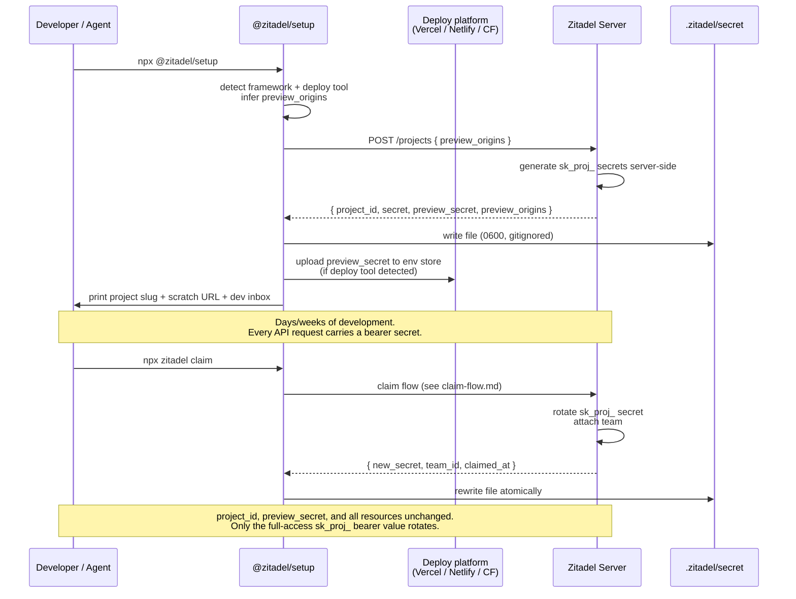

# Project Secret

> **Status:** Draft
> **See also:** [README](README.md) · [Overview](overview.md) · [Configuration Surface](configuration-surface.md) · [Claim Flow](claim-flow.md) · [Claim API](api/claim-api.yaml) · [Glossary](../glossary.md) · [Credentials (canonical taxonomy)](../api/credentials.md)
>
> **Current implementation note:** This document describes the fuller *target*
> platform design. The MVP claim being built is narrower, specified in
> **[ADR 046: Claim Lifecycle v2](../../adrs/046-claim-lifecycle-v2.md)**
> (which supersedes the Withdrawn ADR 003). Crucially, **secret rotation at
> claim is descoped for the MVP**: the pre-claim `sk_proj_` secret **stays valid
> after claim** (an accepted, ADR-documented risk until a dedicated rotation
> epic), `claim/status` is a plain completion signal with no secret handover,
> and the CLI only records `claimed_at` / `team_id` in `.zitadel/secret` without
> changing the secret value. This document's opening description of the secret
> being "rotated to a claimed credential after claim", together with the "What
> changes at claim", rotation, and `secret rotate` / `secret restore` sections
> below, therefore describe the future target, not MVP claim. The checked-in
> CLI and server do not yet expose the claim lifecycle or a `zitadel claim`
> command.

The project secret is a server-issued bearer token that authenticates SDK and CLI calls against a project. Before claim, it is the only authentication on the project. After claim, it is rotated to a **claimed credential** bound to the team that claimed the project. The same file on disk (`.zitadel/secret`) also carries an **origin-scoped project secret** (historically called the "preview secret") — a companion token that the setup CLI hands to the customer's deploy platform (Vercel, Netlify, Cloudflare) so preview builds work before the project is claimed.

This document specifies how the secrets are generated, stored, validated, and rotated — and what each one can and cannot do. For the full credential taxonomy across the API, see [`../api/credentials.md`](../api/credentials.md).

## What this is, briefly

The project secret is a bearer token. It authenticates API calls. That's it. It is not a user identity, not a team membership, not a billing account, not a long-term shared credential for a group of people. Teammates get access via claim and team membership — not by passing `.zitadel/secret` around.

## Generation

Both secrets are **generated server-side** at `POST /projects`. The client does not contribute randomness. Base62-encoded, prefixed by type. All project-scoped secrets share the `sk_proj_` prefix; variants are distinguished by metadata the server records at mint time:

- `sk_proj_<base62>` with `pre_claim: true` — the full-access pre-claim project secret.
- `sk_proj_<base62>` with `origin_patterns: [...]` — the origin-scoped variant (the "preview secret"). Restricted to calls whose `Origin` matches one of the patterns.

The setup CLI sends the desired `preview_origins` patterns (inferred from detected deploy tooling — e.g. `["*.vercel.app"]` when it sees a `vercel.json`, `["*.netlify.app"]` for Netlify, `["*.pages.dev"]` for Cloudflare Pages). The server validates the patterns against an allowed list and rejects anything it doesn't recognize.

Server response from `POST /projects`:

```json
{
  "project_id": "river-8421",
  "project_secret": "sk_proj_7kR2pXq9vN3wLmYhT4cB8A",
  "preview_secret": "sk_proj_c3f7a8b2vL4nYwH6...",
  "preview_origins": ["*.vercel.app", "*.netlify.app"],
  "created_at": "2026-04-21T14:03:11Z"
}
```

The setup CLI maps that response to `.zitadel/secret`:

```json
{
  "project": "river-8421",
  "secret": "sk_proj_7kR2pXq9vN3wLmYhT4cB8A",
  "preview_secret": "sk_proj_c3f7a8b2vL4nYwH6...",
  "preview_origins": ["*.vercel.app", "*.netlify.app"],
  "created_at": "2026-04-21T14:03:11Z",
  "schema_version": 2
}
```

> **Note:** `secret` and `preview_secret` share a prefix (`sk_proj_`). They are distinct keys with distinct scope metadata. The "preview" field name is retained for continuity; canonically it is an origin-scoped `sk_proj_`.

## Storage

`.zitadel/secret` lives at the root of the `.zitadel/` directory:

```
my-app/
├── zitadel.json            (source-controlled — see configuration-surface.md)
├── .zitadel/
│   ├── secret              (gitignored — this file)
│   ├── flows/              (source-controlled)
│   ├── schemas/            (source-controlled)
│   └── ...
└── .gitignore              (setup CLI adds `.zitadel/secret` automatically)
```

**The setup CLI appends `.zitadel/secret` to `.gitignore` automatically on first run.** This is non-negotiable — committing the project secret is equivalent to publishing a root credential. The file is written with `0600` permissions on POSIX (owner read/write only); Windows gets the equivalent ACL.

### Preview secret handoff

After the file is written, the setup CLI looks for a supported deploy platform and uploads the origin-scoped secret to that platform's environment store automatically:

| Detected tool | Command the CLI runs |
|---|---|
| `vercel` CLI or `vercel.json` | `vercel env add ZITADEL_PREVIEW_SECRET preview production` |
| `netlify` CLI or `netlify.toml` | `netlify env:set ZITADEL_PREVIEW_SECRET <value> --context deploy-preview` |
| `wrangler` / Cloudflare Pages | `wrangler secret put ZITADEL_PREVIEW_SECRET` |
| Nothing detected | CLI prints instructions and the value; developer pastes manually |

The origin-scoped secret's origin patterns are enforced server-side on every request, so an accidentally-leaked preview secret still cannot authenticate from `api.acme.com` or any other non-matching origin.

## Validation and revocation

Every SDK request presents the appropriate secret as a bearer token. The server looks up the secret, checks:

1. **Format and existence** — is this a recognized `sk_proj_…` token still on record?
2. **Origin / Host (origin-bound requests)** — for the origin-scoped variant, does the incoming request's `Origin` header (or `Host`, where the runtime cannot send `Origin`) match the patterns captured at mint time? Browser/runtime requests authenticated with the full project secret may also be checked against the declared issuer list for the active environment.
3. **Environment scope** — origin-scoped secrets are implicitly scoped to non-production; they cannot authenticate production-origin requests.

CLI and other direct platform calls authenticated with the full project secret are not expected to present a customer origin; they remain valid without that check.

Mismatches produce HTTP 403 with a structured error and are logged.

Revocation is through rotation: `npx zitadel secret rotate` (post-claim only) issues a new `sk_proj_…` and invalidates the old. The origin-scoped secret can be rotated independently from the dashboard.

## Capability matrix

| Action | Project secret (`sk_proj_…`, pre-claim) | Origin-scoped secret (`sk_proj_…`) | Claimed credential (`sk_proj_…`, post-claim) |
|---|---|---|---|
| Read the project's own configuration | Yes | No | Yes |
| `npx zitadel push` — upload config | Yes | **No** | Yes |
| Read users this project has created | Yes | Yes (scoped to preview environments) | Yes |
| Register new users, authenticate sessions | Yes | Yes (scoped origins) | Yes |
| Send magic links / OTP to the dev inbox | Yes | Yes | Yes |
| Send real email / SMS | **No** | **No** | Yes (Pro for managed; Free with BYO) |
| Read resources of **another project** | No | No | No |
| Create or modify billing state | No | No | Yes (owner role) |
| Add IDP, SSO, SCIM, SAML connections | No | No | Yes (Pro-gated) |
| Invite team members | No (no team exists) | No | Yes (owner role) |
| Claim this project | Requires human auth — secret alone cannot | No | — (already claimed) |

All "No" rows are enforced server-side, not by SDK convention.

## What changes at claim

Claim is specified in [claim-flow.md](claim-flow.md). From the secret's perspective, the operation is:

1. **The `sk_proj_…` project secret is rotated.** The server invalidates the pre-claim value and issues a new `sk_proj_…` bound to the newly attached team. The CLI overwrites `.zitadel/secret` atomically.
2. **The origin-scoped secret is preserved.** Its origin patterns don't change. Any CI pipeline or deploy env using it keeps working.
3. **Nothing else moves.** `project_id` has been stable since creation. Users, factors, sessions, configs, declared issuers — all bound to `project_id` from day one. Claim attaches *project ownership*, not user lifecycle ownership or identity containment.

Post-claim `.zitadel/secret`:

```json
{
  "project": "river-8421",
  "secret": "sk_proj_9f2Hx8LqT4vRmYpN2wCbVa",
  "preview_secret": "sk_proj_c3f7a8b2vL4nYwH6...",
  "preview_origins": ["*.vercel.app", "*.netlify.app"],
  "created_at": "2026-04-21T14:03:11Z",
  "claimed_at": "2026-04-22T09:17:45Z",
  "team_id": "team_acme",
  "schema_version": 2
}
```

## Failure modes

**Laptop swap.** A developer pulls the repo on a second machine; `.zitadel/secret` is gitignored and therefore absent. If `zitadel.json` references a project slug, the SDK prompts:

```
Zitadel is configured in this project but no secret was found on this machine.
  Restore from your Zitadel account:  npx zitadel secret restore
  Create a fresh pre-claim project:   npx zitadel secret new
```

`restore` authenticates the human via the standard claim methods and refreshes both secrets for any project the human owns. It only works post-claim — there is no human to authenticate against while the project is unclaimed.

**Lost secret before claim.** The project has no accountable owner; recovery is best-effort. Support can correlate browser sessions that visited the scratch dashboard, recent CLI backups at `~/.zitadel/secret-backup`, and Git-remote hints. The CLI nudges on every boot:

```
⚠ Unclaimed projects are ephemeral. If you've built something you care about,
  claim it now: npx zitadel claim
```

**Shared repo pull.** Two developers, one repo, neither has the secret. If claimed: both run `npx zitadel secret restore` and both succeed (team membership authenticates them). If unclaimed: only the original creator can recover; everyone else creates a new project or waits for the first person to claim.

## Lifecycle



## CLI surface

Full CLI spec is deferred. The commands that touch `.zitadel/secret`:

| Command | Purpose |
|---|---|
| `npx @zitadel/setup` | Create project, write `.zitadel/secret`, upload preview secret to deploy platform. |
| `npx zitadel secret show` | Print project slug, claim state, declared issuer origins. Never prints the secret values. |
| `npx zitadel secret restore` | Post-claim only. Authenticate as a human; refresh both secrets. |
| `npx zitadel secret new` | Create a fresh pre-claim project, replacing the current secret file. Prompts if one exists. |
| `npx zitadel secret rotate` | Post-claim only. Rotate the project secret without touching `project_id`. Use after a suspected leak. |
| `npx zitadel claim` | See [claim-flow.md](claim-flow.md). |

## See also

- [Claim Flow](claim-flow.md) — what changes when a project is claimed
- [Configuration Surface](configuration-surface.md) — declared issuer origins and the full config that the secret authenticates uploads of
- [Claim API](api/claim-api.yaml) — HTTP surface for project creation and secret lifecycle
- [`../api/credentials.md`](../api/credentials.md) — canonical credential taxonomy across the whole API
- [`../glossary.md`](../glossary.md) — vocabulary
