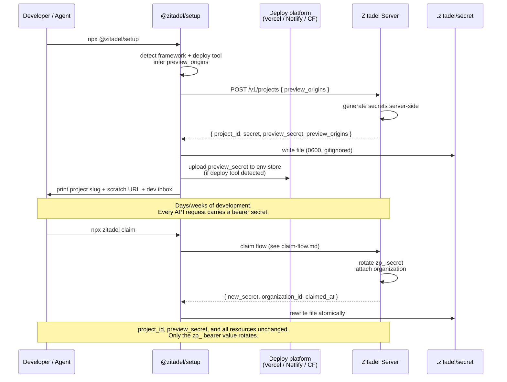

# Project Secret

> **Status:** Draft
> **See also:** [README](README.md) · [Overview](overview.md) · [Configuration Surface](configuration-surface.md) · [Claim Flow](claim-flow.md) · [Claim API](api/claim-api.yaml)

The project secret is a server-issued bearer token that authenticates SDK and CLI calls against a project. Before claim, it is the only authentication on the project. After claim, it is rotated to a **claimed credential** bound to the organization that claimed the project. The same file on disk (`.zitadel/secret`) also carries a **preview secret** — a scoped, origin-restricted companion token that the setup CLI hands to the customer's deploy platform (Vercel, Netlify, Cloudflare) so preview builds work before the project is claimed.

This document specifies how the secrets are generated, stored, validated, and rotated — and what each one can and cannot do.

## What this is, briefly

The project secret is a bearer token. It authenticates API calls. That's it. It is not a user identity, not an organizational membership, not a billing account, not a long-term shared credential for a team. Teammates get access via claim and organization membership — not by passing `.zitadel/secret` around.

## Generation

Both secrets are **generated server-side** at `POST /v1/projects`. The client does not contribute randomness. Base62-encoded, prefixed by type for human recognition:

- `zp_<base62>` — full-access project secret
- `zpp_<base62>` — preview secret (scoped to origin patterns declared at mint time)

The setup CLI sends the desired `preview_origins` patterns (inferred from detected deploy tooling — e.g. `["*.vercel.app"]` when it sees a `vercel.json`, `["*.netlify.app"]` for Netlify, `["*.pages.dev"]` for Cloudflare Pages). The server validates the patterns against an allowed list and rejects anything it doesn't recognize.

```json
{
  "project": "river-8421",
  "secret": "zp_7kR2pXq9vN3wLmYhT4cB8A",
  "preview_secret": "zpp_c3f7a8b2vL4nYwH6...",
  "preview_origins": ["*.vercel.app", "*.netlify.app"],
  "created_at": "2026-04-21T14:03:11Z",
  "schema_version": 2
}
```

## Storage

`.zitadel/secret` lives at the root of the `.zitadel/` directory:

```
my-app/
├── zitadel.json            (source-controlled — see configuration-surface.md)
├── .zitadel/
│   ├── secret              (gitignored — this file)
│   ├── flows/              (source-controlled)
│   ├── schemas/            (source-controlled)
│   └── ...
└── .gitignore              (setup CLI adds `.zitadel/secret` automatically)
```

**The setup CLI appends `.zitadel/secret` to `.gitignore` automatically on first run.** This is non-negotiable — committing the project secret is equivalent to publishing a root credential. The file is written with `0600` permissions on POSIX (owner read/write only); Windows gets the equivalent ACL.

### Preview secret handoff

After the file is written, the setup CLI looks for a supported deploy platform and uploads the preview secret to that platform's environment store automatically:

| Detected tool | Command the CLI runs |
|---|---|
| `vercel` CLI or `vercel.json` | `vercel env add ZITADEL_PREVIEW_SECRET preview production` |
| `netlify` CLI or `netlify.toml` | `netlify env:set ZITADEL_PREVIEW_SECRET <value> --context deploy-preview` |
| `wrangler` / Cloudflare Pages | `wrangler secret put ZITADEL_PREVIEW_SECRET` |
| Nothing detected | CLI prints instructions and the value; developer pastes manually |

The preview secret's origin scope is enforced server-side on every request, so an accidentally-leaked preview secret still cannot authenticate from `api.acme.com` or any other non-matching origin.

## Validation and revocation

Every SDK request presents the appropriate secret as a bearer token. The server looks up the secret, checks:

1. **Format and existence** — is this a recognized `zp_…` or `zpp_…` token still on record?
2. **Origin / Host** — does the incoming request's `Origin` header (or `Host`) match the allowed origins for the secret? For the project secret, the allowed origins are the declared issuer list for the current environment in the customer's `zitadel.json`. For the preview secret, the allowed origins are the patterns captured at mint time.
3. **Environment scope** — preview secrets are implicitly scoped to non-production; they cannot authenticate production-origin requests.

Mismatches produce HTTP 403 with a structured error and are logged.

Revocation is through rotation: `npx zitadel secret rotate` (post-claim only) issues a new `zp_…` and invalidates the old. The preview secret can be rotated independently from the dashboard.

## Capability matrix

| Action | Project secret (`zp_…`, unclaimed) | Preview secret (`zpp_…`) | Claimed credential (`zp_…`, post-claim) |
|---|---|---|---|
| Read the project's own configuration | Yes | Read-only | Yes |
| `npx zitadel push` — upload config | Yes | **No** | Yes |
| Read users this project has created | Yes | Yes (scoped to preview environments) | Yes |
| Register new users, authenticate sessions | Yes | Yes (scoped origins) | Yes |
| Send magic links / OTP to the dev inbox | Yes | Yes | Yes |
| Send real email / SMS | **No** | **No** | Yes (Pro for managed; Free with BYO) |
| Read resources of **another project** | No | No | No |
| Create or modify billing state | No | No | Yes (owner role) |
| Add IDP, SSO, SCIM, SAML connections | No | No | Yes (Pro-gated) |
| Invite organization members | No (no org exists) | No | Yes (owner role) |
| Claim this project | Requires human auth — secret alone cannot | No | — (already claimed) |

All "No" rows are enforced server-side, not by SDK convention.

## What changes at claim

Claim is specified in [claim-flow.md](claim-flow.md). From the secret's perspective, the operation is:

1. **The `zp_…` project secret is rotated.** The server invalidates the unclaimed-era value and issues a new `zp_…` bound to the newly attached organization. The CLI overwrites `.zitadel/secret` atomically.
2. **The preview secret is preserved.** Its origin scope doesn't change. Any CI pipeline or deploy env using it keeps working.
3. **Nothing else moves.** `project_id` has been stable since creation. Users, factors, sessions, configs, declared issuers — all bound to `project_id` from day one. Claim attaches *ownership*, not *identity*.

Post-claim `.zitadel/secret`:

```json
{
  "project": "river-8421",
  "secret": "zp_9f2Hx8LqT4vRmYpN2wCbVa",
  "preview_secret": "zpp_c3f7a8b2vL4nYwH6...",
  "preview_origins": ["*.vercel.app", "*.netlify.app"],
  "created_at": "2026-04-21T14:03:11Z",
  "claimed_at": "2026-04-22T09:17:45Z",
  "organization_id": "org_acme",
  "schema_version": 2
}
```

## Failure modes

**Laptop swap.** A developer pulls the repo on a second machine; `.zitadel/secret` is gitignored and therefore absent. If `zitadel.json` references a project slug, the SDK prompts:

```
Zitadel is configured in this project but no secret was found on this machine.
  Restore from your Zitadel account:  npx zitadel secret restore
  Create a fresh unclaimed project:   npx zitadel secret new
```

`restore` authenticates the human via the standard claim methods and refreshes both secrets for any project the human owns. It only works post-claim — there is no human to authenticate against while the project is unclaimed.

**Lost secret before claim.** The project has no accountable owner; recovery is best-effort. Support can correlate browser sessions that visited the scratch dashboard, recent CLI backups at `~/.zitadel/secret-backup`, and Git-remote hints. The CLI nudges on every boot:

```
⚠ Unclaimed projects are ephemeral. If you've built something you care about,
  claim it now: npx zitadel claim
```

**Shared repo pull.** Two developers, one repo, neither has the secret. If claimed: both run `npx zitadel secret restore` and both succeed (organization membership authenticates them). If unclaimed: only the original creator can recover; everyone else creates a new project or waits for the first person to claim.

## Lifecycle



## CLI surface

Full CLI spec is deferred. The commands that touch `.zitadel/secret`:

| Command | Purpose |
|---|---|
| `npx @zitadel/setup` | Create project, write `.zitadel/secret`, upload preview secret to deploy platform. |
| `npx zitadel secret show` | Print project slug, claim state, declared issuer origins. Never prints the secret values. |
| `npx zitadel secret restore` | Post-claim only. Authenticate as a human; refresh both secrets. |
| `npx zitadel secret new` | Create a fresh unclaimed project, replacing the current secret file. Prompts if one exists. |
| `npx zitadel secret rotate` | Post-claim only. Rotate the project secret without touching `project_id`. Use after a suspected leak. |
| `npx zitadel claim` | See [claim-flow.md](claim-flow.md). |

## See also

- [Claim Flow](claim-flow.md) — what changes when a project is claimed
- [Configuration Surface](configuration-surface.md) — declared issuer origins and the full config that the secret authenticates uploads of
- [Claim API](api/claim-api.yaml) — HTTP surface for project creation and secret lifecycle
