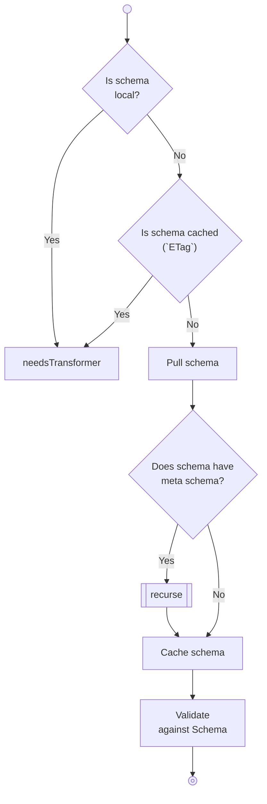

# Schema validation

For validating objects or schemas against a schema/meta schema, we can conclude to following flowchart:

```mermaid
flowchart TD
    isSchemaLocal@{             shape: decision,   label: "Is schema\nlocal?" }
    isSchemaCached@{            shape: decision,   label: "Is schema cached\n(`ETag`)" }
    pullSchema@{                shape: process,    label: "Pull schema" }    
    cacheSchema@{               shape: process,    label: "Cache schema" }
    doesSchemaHaveMetaSchema@{  shape: decision,   label: "Does schema have\nmeta schema?" }
    recurse@{                   shape: subprocess, label: "recurse"}
    validateObject@{            shape: process,    label: "Validate\nagainst Schema" }
    ok@{                        shape: stop }

    start@{shape: start} --> isSchemaLocal

    isSchemaLocal -- Yes --> needsTransformer
    isSchemaLocal -- No  --> isSchemaCached

    isSchemaCached -- Yes --> needsTransformer
    isSchemaCached -- No  --> pullSchema --> doesSchemaHaveMetaSchema
    
    doesSchemaHaveMetaSchema -- Yes --> recurse --> cacheSchema
    doesSchemaHaveMetaSchema -- No --> cacheSchema

    cacheSchema --> validateObject --> ok
```
