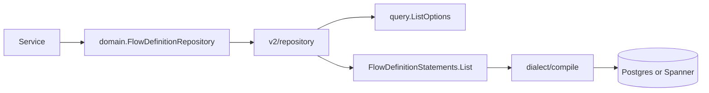

# Storage v2

> **Status:** Sketch (not production path)
> **See also:** [Flow Engine Storage](../flowengine/flow-engine-storage.md)

Storage v2 is the next-generation storage architecture for Zitadel. It keeps the
service-facing `domain.*Repository` seam while moving SQL generation and dialect
differences behind typed statements and per-dialect compilers.

v1 (`internal/storage/database/`) remains the production implementation until
entities are migrated incrementally.

## Goals

- **Dialect isolation** — Postgres and Spanner SQL live in `dialect/postgres` and
  `dialect/spanner`, not in type switches inside repositories.
- **Portable query AST** — filters, ordering, offset pagination, and keyset cursors
  are data in `internal/storage/v2/query/`, compiled per dialect.
- **Deferred execution** — `Execution` and `Query[R]` separate statement construction
  from `Execute(ctx)`.
- **Domain seam unchanged** — services continue to depend on `domain.FlowDefinitionRepository`.

## Package layout

```
internal/storage/v2/
  query/                 # dialect-neutral Filter + ListOptions AST
  database/              # Pool, Statementer, Execution, Query[R] contracts
  dialect/
    postgres/
      compile/           # Filter → SQL ($1 placeholders)
      flowdefinition/    # CRUD + List statements
    spanner/
      compile/           # Filter → SQL (converted to @pN at execution)
      flowdefinition/
  repository/            # domain.*Repository adapters
  example/               # minimal usage samples
```

## Data flow



## Worked example: ListFlowDefinitions

**Domain call:**

```go
result, err := repo.ListFlowDefinitionsPage(ctx, tx, projectID,
    domain.WithFlowDefinitionStatus(domain.FlowDefinitionStatusActive),
    domain.WithFlowDefinitionPurpose(domain.FlowDefinitionPurposeLogin),
    domain.WithSchemaVersion("1.0.0"),
    domain.WithFlowDefinitionLimit(50),
)
```

**Compiled Postgres SQL (simplified):**

```sql
SELECT project_id, id, name, schema_version, status, definition, created_at, updated_at
FROM zitadel_nextgen.flow_definitions
WHERE project_id = $1
  AND status = $2::zitadel_nextgen.flow_definition_states
  AND $3::zitadel_nextgen.flow_definition_purposes = ANY(purposes)
  AND schema_version = $4
ORDER BY created_at DESC, id DESC
LIMIT $5
```

**Compiled Spanner SQL (simplified):**

```sql
SELECT project_id, id, name, schema_version, status, definition, created_at, updated_at
FROM flow_definitions
WHERE project_id = $1
  AND status = $2
  AND $3 IN UNNEST(purposes)
  AND schema_version = $4
ORDER BY created_at DESC, id DESC
LIMIT $5
```

At execution time Spanner placeholders are rewritten to `@p1`, `@p2`, …

## Cursor pagination

Storage exposes `domain.FlowDefinitionListCursor` (created_at + id). The API layer
maps opaque `page_token` values per [ADR 009](../adrs/009-cursor-based-pagination.md);
HMAC signing is not part of the storage sketch.

Keyset predicate for the default sort (`created_at DESC, id DESC`):

```sql
AND (created_at, id) < ($cursor_ts, $cursor_id)
```

## Validation

```sh
# Compiler unit tests
go test ./internal/storage/v2/dialect/postgres/compile/...
go test ./internal/storage/v2/dialect/spanner/compile/...

# Integration tests (requires Docker for embedded Postgres)
go test -tags postgres_integration ./internal/storage/v2/repository/...
```

## Migration path

1. Prove each entity in v2 with integration tests (flow definitions first).
2. Switch `internal/service` wiring entity-by-entity to v2 repository adapters.
3. Remove v1 repository implementations once all callers migrate.
4. Add sqlite/mssql by implementing `dialect/<engine>/compile` + `flowdefinition/`.
